# Exemples de thèmes, de modèles et de données de formulaire dans les composants principaux {#sample-themes-templates-and-data-models}

[!DNL AEM Forms] Les composants principaux fournissent des exemples de thèmes, de modèles et de modèles de données de formulaire prêts à l’emploi pour créer rapidement des formulaires adaptatifs polyvalents. Ils aident également les auteurs de formulaires à apprendre l’extensibilité, l’adaptabilité et la réactivité des [Composants principaux d’AEM Forms](https://experienceleague.adobe.com/docs/experience-manager-core-components/using/adaptive-forms/introduction.html?lang=fr) pour créer facilement des formulaires simples en un rien de temps et des formulaires complexes lors d’une connexion transparente à la base de données.

Les exemples de thèmes, modèles et modèles de données de formulaire inclus dans le module de contenu de référence sont les suivants :

| Modèles | Thèmes | Modèle de données de formulaire |
---------|----------|---------
| [De base](#Basic) | [Canevas](#Canvas) | Microsoft® Dynamics 365 |
| [Vide](#Blank) | [WKND](#WKND) | Salesforce |
| [Nous contacter](#Contact-Us) | [Pâques](#Easel) |  |
| [Mise à jour des détails du contact](#Contact-Details-Update) |   |   |
| [Formulaire de consentement](#Consent-Form) | |  |
| [Requête de service de journal](#Log-Service-Request) |  |  |
| [Envoyer des commentaires](#Give-Feedback) |  |  |
| [Inscription aux avantages](#Benefits-Enrollment) |  |   |
| [Synthèse des avantages des employés](#Employee-Benefits-Summary) |   |   |
| [Demande de relevé de compte](#Request-for-Account-Statement) |   |   |
| [Formulaire d&#39;inspection de sécurité](#Safety-Inspection) |   |   |
| [Inspection du contrôle qualité](#Quality-Control-Inspection) |   |   |
| [Demande d’achat](#Purchase-Request) |  |  |

## Exemples de thèmes {#Sample-Themes}

Les exemples de thèmes de référence aident les auteurs à définir et personnaliser le style des formulaires, les auteurs qui possèdent même une connaissance de base du code CSS peuvent personnaliser le thème selon leurs besoins.

**Comment obtenir ces thèmes ?**
* Pour activer ces thèmes **Forms as a Cloud Service** environnement, [Activation des composants principaux de Forms adaptatif](https://experienceleague.adobe.com/docs/experience-manager-cloud-service/content/forms/setup-configure-migrate/enable-adaptive-forms-core-components.html?lang=fr) et utilisez la fonction [pipeline front-end](https://experienceleague.adobe.com/docs/experience-manager-cloud-service/content/forms/adaptive-forms-authoring/authoring-adaptive-forms-core-components/create-an-adaptive-form-on-forms-cs/using-themes-in-core-components.html) pour déployer ces thèmes.
* Pour mettre ces thèmes sur une **AEM 6.5 Forms** environnement, [Activation des composants principaux de Forms adaptatif](https://experienceleague.adobe.com/docs/experience-manager-65/forms/adaptive-forms-core-components/enable-adaptive-forms-core-components.html) et utilisez la fonction [gestionnaire de modules](https://experienceleague.adobe.com/docs/experience-manager-65/forms/adaptive-forms-core-components/create-or-customize-themes-for-adaptive-forms-core-components) pour déployer ces thèmes.

La variable **prêt à l’emploi** [Composants principaux de formulaire adaptatif](https://experienceleague.adobe.com/docs/experience-manager-core-components/using/adaptive-forms/introduction.html?lang=fr) Les thèmes sont décrits comme suit :

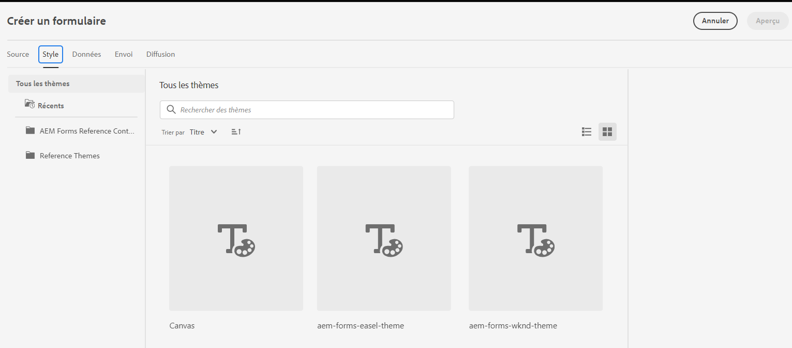

### Canvas  {#Canvas}

Le thème de la zone de travail est le thème par défaut des formulaires et met l’accent sur l’utilisation des couleurs de base, la transparence et les icônes plates. Dans la capture d’écran ci-dessous, vous pouvez voir à quoi ressemble le thème Canvas 

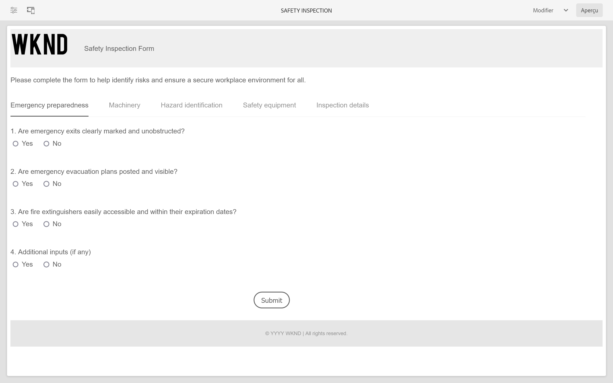

### WKND {#WKND}

Le thème WKND incarne un design vivant, imaginatif et attrayant pour présenter un aspect stylisé à vos formulaires. Le thème est basé sur l’aspect et le style de [Site WKND](https://wknd.site/us/en.html) qui est un site Web de voyage et d&#39;aventure basé sur [Composants principaux d’Adobe Experience Manager](https://experienceleague.adobe.com/docs/experience-manager-core-components/using/adaptive-forms/introduction.html?lang=fr).

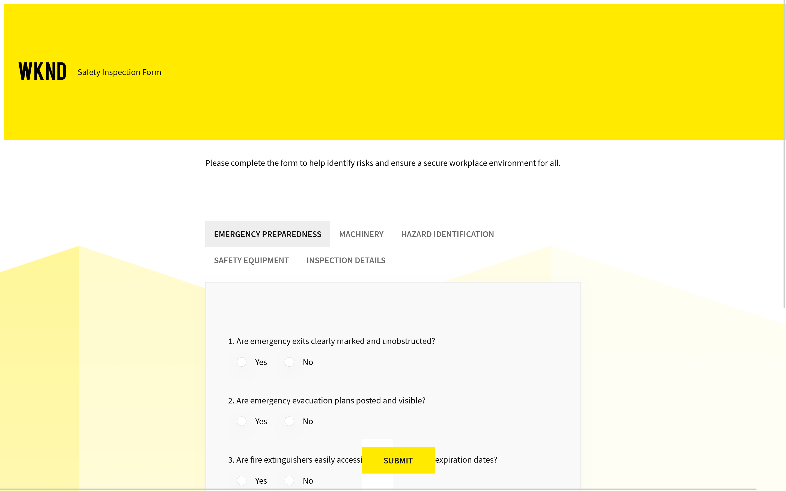

### Pâques {#Easel}

Le thème Pâque permet de créer une apparence de formulaire attrayante et facile à configurer. Il est personnalisé pour plus de simplicité et de convivialité. Le thème de l&#39;Easel est basé sur le concept d&#39;un stand portable utilisé par les artistes pour soutenir une toile pendant qu&#39;ils travaillent sur leurs tableaux.

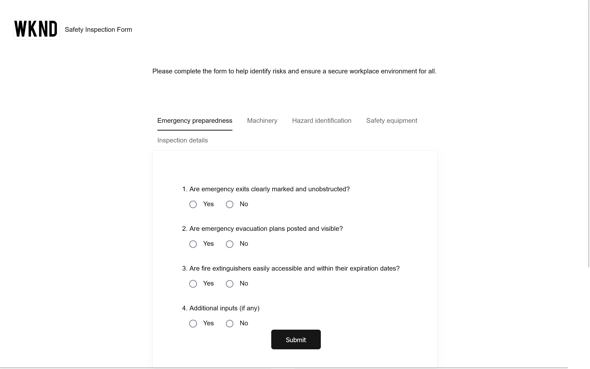

## Exemples de modèles {#Sample-templates}

Les modèles définissent la structure, le contenu et les actions du formulaire initial à répliquer dans votre formulaire ou utilisent une structure de modèle similaire à votre formulaire, par exemple, le formulaire de consentement, le formulaire d’inscription aux avantages et bien d’autres.

**Comment obtenir ces modèles ?**
Vous pouvez obtenir les modèles en déployant un [Projet basé sur AEM Archetype 43 ou version ultérieure](https://github.com/adobe/aem-project-archetype) à votre **AEM Forms as a Cloud Service** ou **AEM 6.5** Environnement Forms.

La variable **prêt à l’emploi** [Composants principaux de formulaire adaptatif](https://experienceleague.adobe.com/docs/experience-manager-core-components/using/adaptive-forms/introduction.html?lang=fr) les modèles sont décrits comme suit :

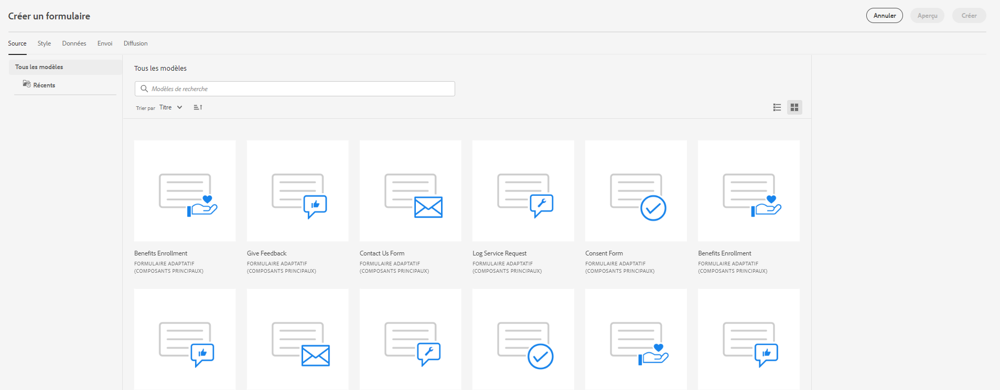

### De base {#Basic}

Le modèle de base vous permet de créer rapidement un formulaire d’expérience d’inscription. Vous pouvez également l’utiliser pour prévisualiser la fonctionnalité d’ [Composants principaux de Forms adaptatif](https://experienceleague.adobe.com/docs/experience-manager-core-components/using/adaptive-forms/introduction.html?lang=fr). Il fournit une disposition d’assistant pour la présentation section par section des données.

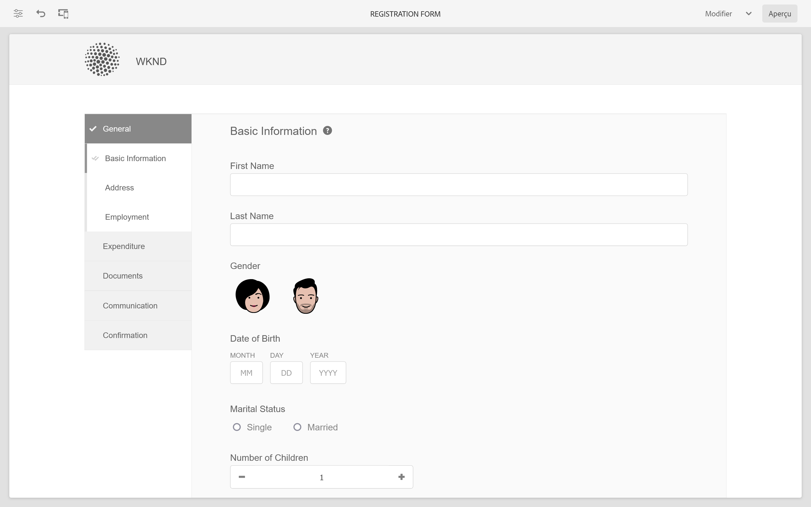

### Vide {#Blank}

Un modèle de canevas vierge est utilisé pour créer entièrement une structure de formulaire adaptatif, du contenu et des règles. Aucun composant de formulaire n’est préincorporé dans le modèle vierge.

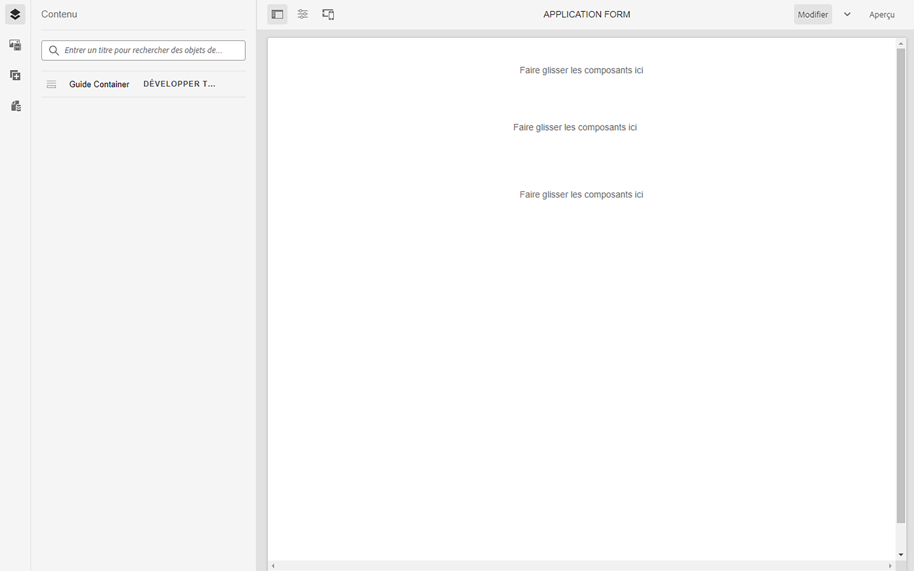

### Nous contacter {#Contact-Us}

Le modèle de formulaire Contact est utilisé pour créer un formulaire afin de faciliter la communication entre les visiteurs du site web et les administrateurs de formulaires. Les utilisateurs peuvent envoyer des requêtes, des commentaires ou des demandes d’assistance par le biais du formulaire.

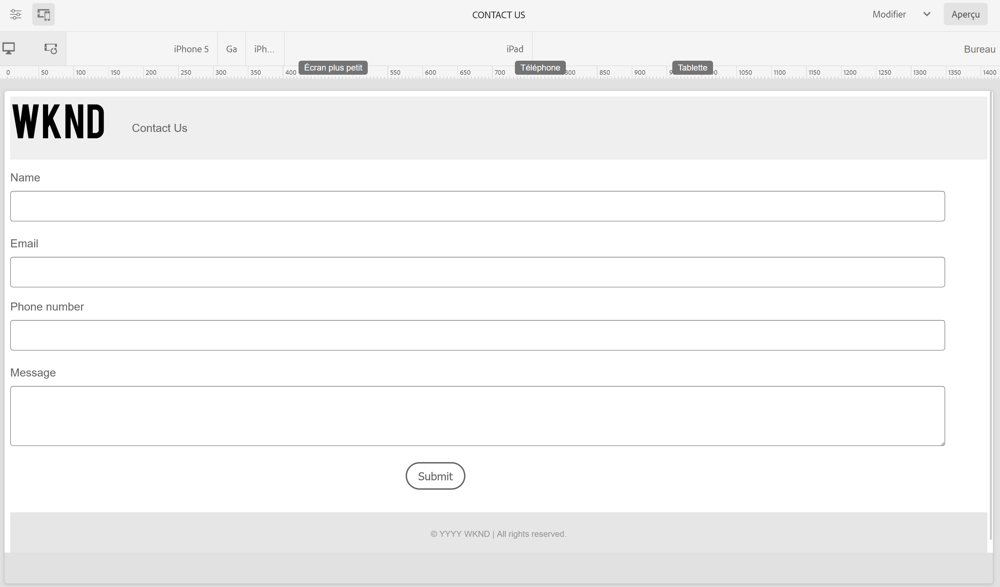

### Mise à jour des détails du contact {#Contact-Details-Update}

Les informations de contact mettent à jour le modèle aident les auteurs à créer un formulaire pour la mise à jour des informations d’adresse et de contact des clients. Le formulaire aide également les clients à mettre à jour les informations personnelles relatives aux abonnements ou aux avantages afin d’assurer une communication transparente et un accès ininterrompu aux services ou aux avantages.

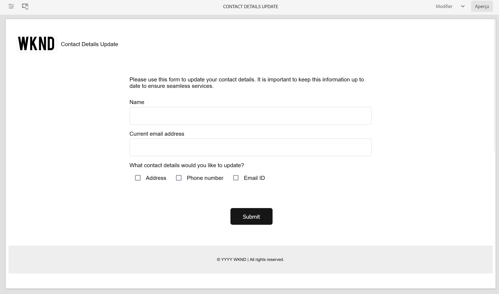

### Formulaire de consentement {#Consent-Form}

Le modèle de formulaire de consentement est utilisé pour créer un formulaire d’obtention d’un document juridique par les participants qui participent à une activité spécifique, une étude de recherche, une procédure médicale ou toute situation où leurs informations personnelles ou leurs droits peuvent être impliqués. Le formulaire garantit la transparence, protège les droits des participants et établit une compréhension claire de ce à quoi l&#39;individu accepte.

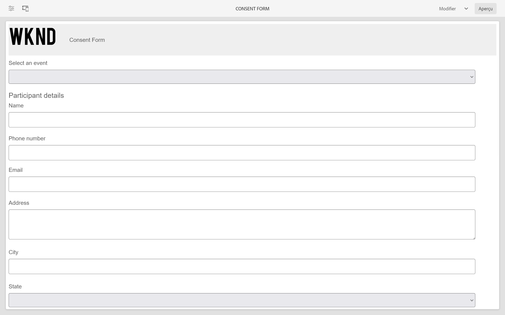

### Requête de service de journal {#Log-Service-Request}

Le modèle de demande de service de journal permet de créer un formulaire qui demande des services de journalisation spécifiques au journal à un fournisseur de services. Le formulaire sert de requête formelle pour créer un ticket pour les événements, les activités ou les données consignées pour le suivi ou le suivi de l’état.

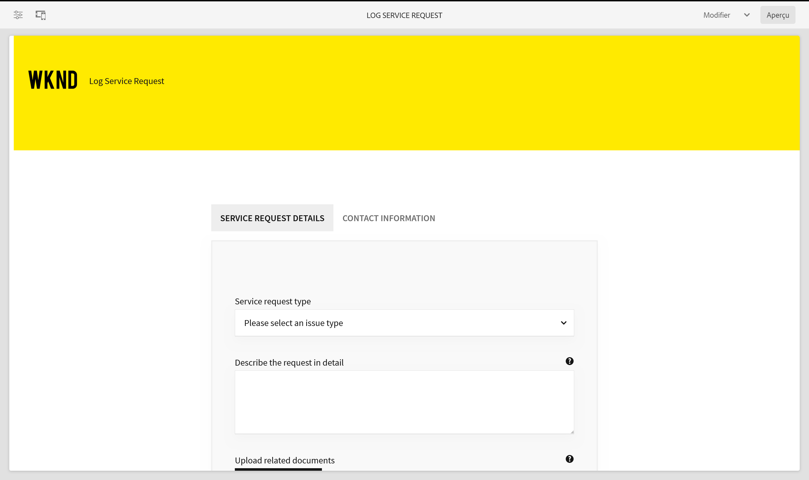

### Donnez vos commentaires {#Give-Feedback}

Le modèle de formulaire de retour permet de créer un formulaire afin de fournir un retour constructif à une autre personne ou à une autre équipe. Le formulaire permet de s’assurer que les commentaires sont clairs, spécifiques et exploitables, ce qui favorise la communication ouverte et l’amélioration.

### Inscription aux avantages {#Benefits-Enrollment}

Le modèle de formulaire d’inscription aux avantages sert à créer un formulaire afin de recueillir des informations essentielles sur les avantages et les options de couverture préférés auprès de leurs employés. Il accompagne généralement la période d’inscription annuelle des avantages.

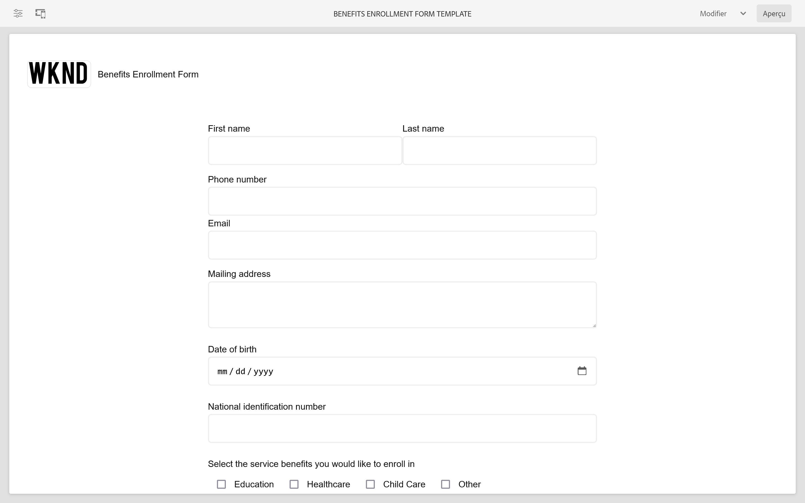

### Résumé des avantages des employés {#Employee-Benefits-Summary}

Le modèle de formulaire de résumé des avantages pour les employés permet de créer un formulaire afin de recueillir des détails essentiels sur les avantages d’un individu. Il permet d’évaluer rapidement et précisément la couverture, offrant ainsi une vue d’ensemble complète pour une assistance et un soutien efficaces.
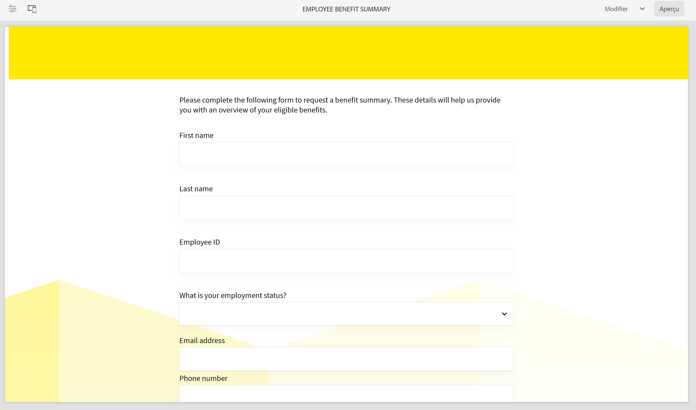

### Demande de relevé de compte {#Request-for-Account-Statement}

Le modèle de demande de relevé de compte permet de créer un formulaire qui initie le processus d’obtention d’une instruction de client exacte et à jour. Le relevé fournit un enregistrement détaillé des transactions financières, des activités ou d’autres informations pertinentes concernant les clients qui utilisent ce formulaire.

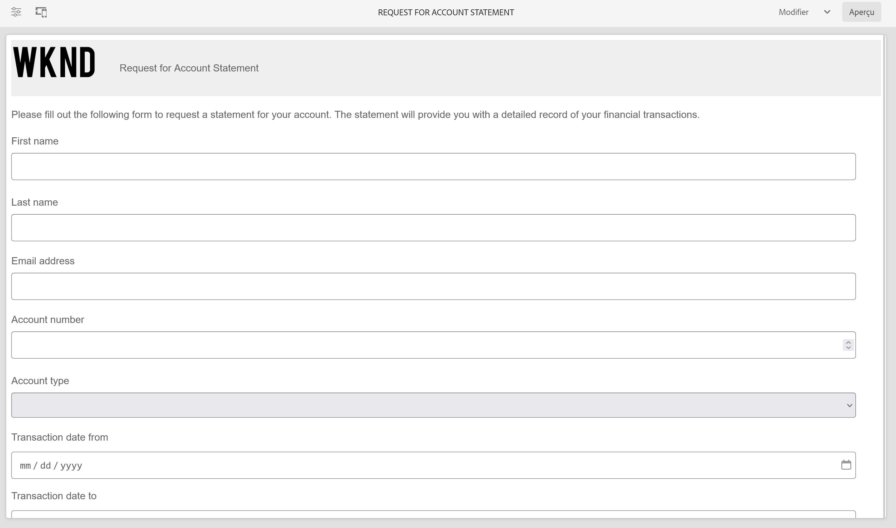

### Inspection de la sécurité {#Safety-Inspection}

Le modèle de formulaire d’inspection de sécurité permet de créer un formulaire permettant de saisir des détails pour un environnement de travail sécurisé. En procédant à des inspections régulières sous cette forme, on peut identifier les dangers potentiels. Le formulaire couvre divers aspects tels que les sorties d’urgence, la sécurité incendie, la sécurité électrique, les matières dangereuses, les équipements de protection personnelle, l’ergonomie du poste de travail pour la sécurité et le bien-être des employés, des visiteurs et des clients.

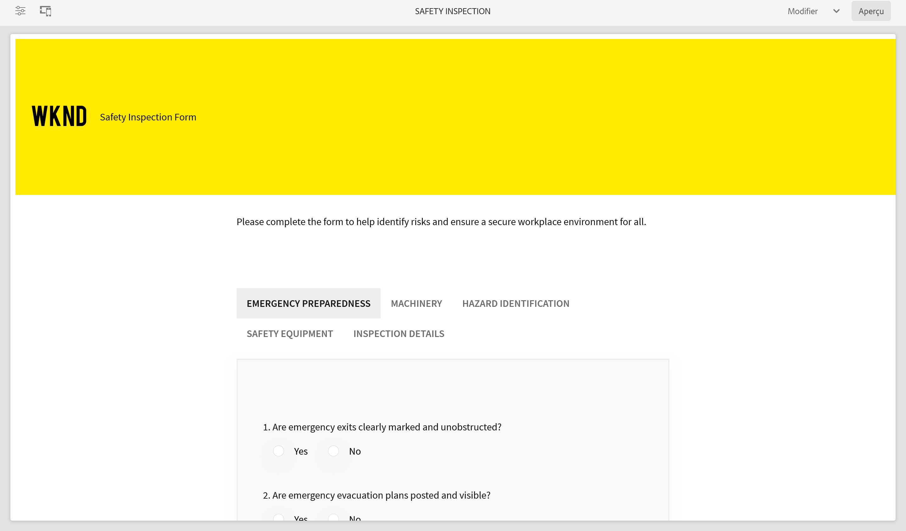

### Inspection du contrôle qualité {#Quality-Control-Inspection}

Le modèle de formulaire d’inspection du contrôle qualité permet de créer un formulaire pour évaluer et documenter l’apparence visuelle, les dimensions, la fonctionnalité, la documentation, les résultats de test et la qualité globale d’un produit ou d’un article. Il permet d’identifier les défauts, les non-conformités et les actions correctives nécessaires pour garantir le respect des normes de qualité.

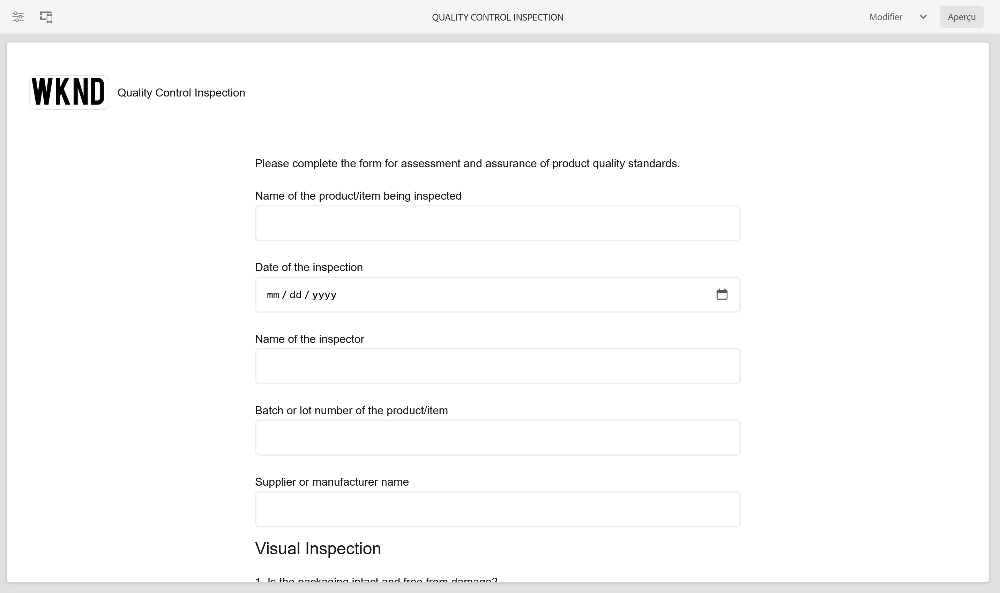

### Demande d’achat {#Purchase-Request}

Le modèle de formulaire de demande d’achat permet de créer un formulaire pour lancer la procédure d’achat et permettre aux employés de formellement demander l’achat de biens ou de services nécessaires à leur travail. Le formulaire capture les détails essentiels tels que la description de l’article, la quantité, le fournisseur préféré (le cas échéant), l’allocation du budget, la justification de l’achat, les informations de diffusion et les validations requises.

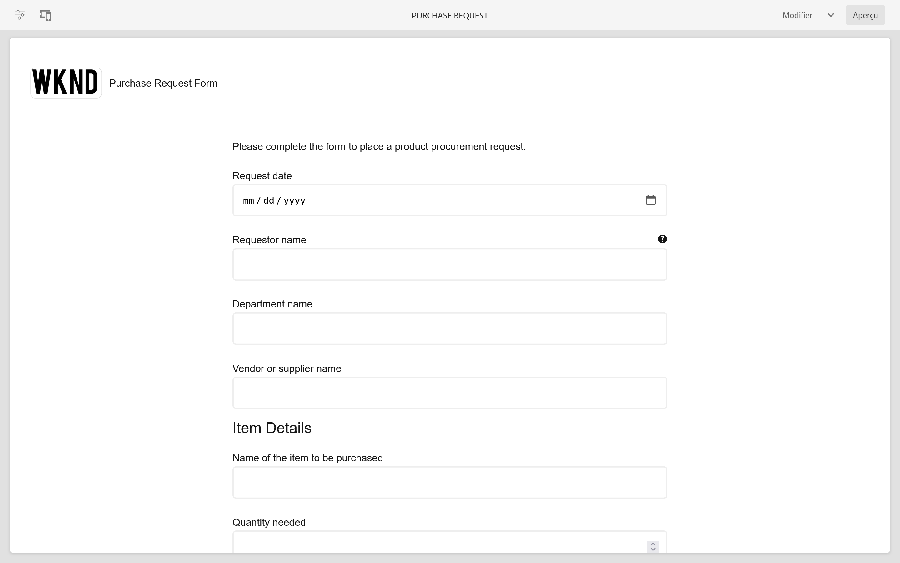

## Modèles de données de formulaire de référence {#reference-models}

Après avoir créé un formulaire adaptatif basé sur [Composant principal](https://experienceleague.adobe.com/docs/experience-manager-core-components/using/adaptive-forms/introduction.html?lang=fr), vous pouvez connecter votre formulaire à la base de données Microsoft® Dynamics 365 et aux serveurs Salesforce pour activer les workflows métier. Par exemple :

* Écrivez des données dans Microsoft® Dynamics 365 et Salesforce lors de l’envoi du formulaire adaptatif.
* Écrivez des données dans Microsoft® Dynamics 365 et Salesforce par le biais d’entités personnalisées définies dans le modèle de données de formulaire et vice versa.
* Query Microsoft® Dynamics 365 et le serveur Salesforce pour les données et préremplissage de Forms adaptatif.
* Lecture des données à partir du serveur Microsoft® Dynamics 365 et Salesforce.

Vous pouvez obtenir les modèles de données de formulaire suivants en installant le [package de contenu de référence](https://experience.adobe.com/#/downloads/content/software-distribution/en/aemcloud.html?package=/content/software-distribution/en/details.html/content/dam/aemcloud/public/aem-forms-reference-content.ui.content-2.1.0.zip) :

* Microsoft® Dynamics 365
* Salesforce

Pour plus d’informations sur l’utilisation de ces modèles, voir [Configuration des services cloud Microsoft® Dynamics 365 et Salesforce](https://experienceleague.adobe.com/docs/experience-manager-cloud-service/content/forms/integrate/use-form-data-model/configure-msdynamics-salesforce.html#configure-dynamics-cloud-service)
