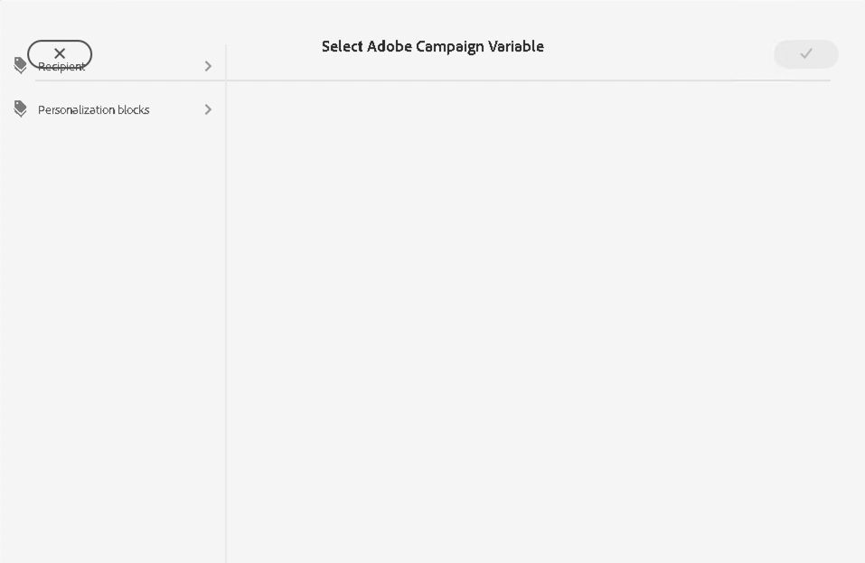
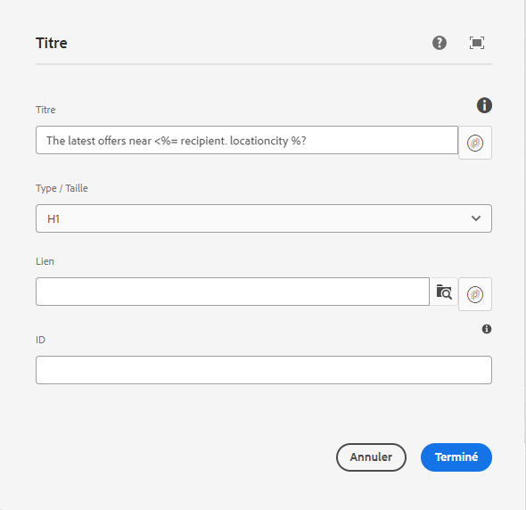

# Variables de campagne {#campaign-variables}

Utilisez des variables de campagne pour composer du contenu d’e-mail personnalisé. Les variables de campagne agissent comme des espaces réservés pour les valeurs Adobe Campaign que vous pouvez insérer dans le contenu de votre e-mail. Lorsque le contenu est envoyé via Adobe Campaign, Campaign remplace ces variables par le contenu personnalisé du destinataire.

## Utilisation {#usage}

Les composants principaux d’e-mail rendent les variables de campagne facilement accessibles via des boutons de personnalisation en regard des champs de texte communs. Lorsque vous appuyez dessus, une boîte de dialogue s’affiche. Vous pouvez alors sélectionner un champ de personnalisation.

La liste des champs de personnalisation disponibles est synchronisée avec votre instance Adobe Campaign. Les champs sont gérés dans Adobe Campaign, dans le schéma `nms:seedMember`. Tous les champs de `nms:seedMember` doivent également être présents dans le tableau des destinataires.

## Boîte de dialogue Sélectionner la variable Adobe Campaign {#dialog}

La boîte de dialogue Sélectionner la variable Adobe Campaign est disponible dans de nombreuses boîtes de dialogue de modification des composants principaux d’e-mail. Pour l’utiliser, cliquez simplement sur l’icône **Sélectionner la variable Adobe Campaign** en regard du champ applicable. Cette icône peut prendre deux formes.

Cliquez sur les deux icônes pour ouvrir la boîte de dialogue **Sélectionner la variable Adobe Campaign**.

Utilisez le mode Colonnes pour localiser la variable que vous souhaitez insérer. Cliquez sur un nœud dans une colonne pour afficher ses enfants dans une nouvelle colonne à droite. Vous pouvez ainsi naviguer dans la structure de contenu de la variable.

Sélectionnez la variable que vous souhaitez insérer, puis cliquez sur la coche en haut à droite de la boîte de dialogue.

La variable est ensuite insérée dans le champ de la boîte de dialogue de modification du composant principal d’e-mail.

Cliquez à tout moment sur le X en haut à gauche de la boîte de dialogue pour annuler et fermer la boîte de dialogue.
