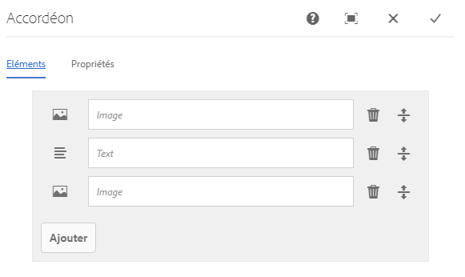
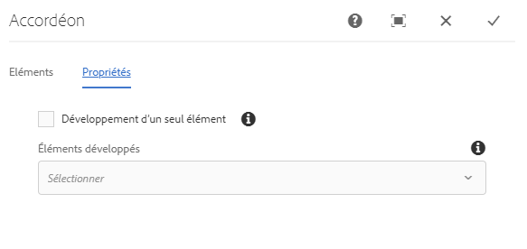
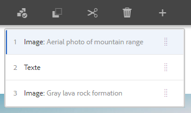
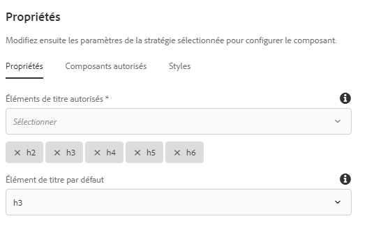

# Composant d’accordéon{#accordion-component}

Le composant d’accordéon des composants principaux permet la création d’un ensemble de panneaux organisés dans un accordéon sur une page.

## Utilisation {#usage}

Le composant d’accordéon des composants principaux permet la création d’un ensemble de composants, présentés sous forme de panneaux, et organisés dans un accordéon sur une page. Semblable au [composant Onglets](tabs.md), il autorise toutefois le développement et la réduction des panneaux.

* Les propriétés de l’accordéon peuvent être définies dans la [boîte de dialogue de configuration](#configure-dialog).
* L’ordre des panneaux de l’accordéon peut être défini dans la boîte de dialogue de configuration, ainsi que dans la [fenêtre contextuelle de sélection d’un panneau](#select-planel.md).
* Les valeurs par défaut du composant d’accordéon lors de son ajout à une page peuvent être définies dans la [boîte de dialogue de conception](#design-dialog).

## Version et compatibilité {#version-and-compatibility}

La version actuelle du composant d’accordéon est v1, qui a été introduite avec la version 2.5.0 des composants principaux en février 2019. Elle est décrite dans ce document.

Le tableau ci-après présente en détail toutes les versions prises en charge du composant, les versions AEM avec lesquelles les versions du composant sont compatibles et les liens vers la documentation pour les versions précédentes.

| Version du composant | AEM 6.3 | AEM 6.4 | AEM 6.5 |
|--- |--- |--- |---|
| v1 | Compatible | Compatible | Compatible |

Pour plus d’informations sur les versions et les publications des composants principaux, voir le document sur les [versions des composants principaux](versions.md).

## Exemple de sortie de composant {#sample-component-output}

Pour tester le composant d’accordéon et obtenir des exemples d’options de configuration, ainsi que des sorties HTML et JSON, consultez la [Bibliothèque de composants](http://opensource.adobe.com/aem-core-wcm-components/library/accordion.html).

## Détails techniques {#technical-details}

La documentation technique la plus récente sur le composant d’accordéon [se trouve sur GitHub](https://github.com/adobe/aem-core-wcm-components/tree/master/content/src/content/jcr_root/apps/core/wcm/components/accordion/v1/accordion).

Vous trouverez plus d’informations sur le développement des composants principaux dans la [documentation destinée aux développeurs de composants principaux](developing.md).

## Boîte de dialogue de configuration {#configure-dialog}

La boîte de dialogue de configuration permet à l’auteur de contenu de définir l’élément d’accordéon, ses panneaux et la façon dont il se comporte et s’affiche pour un visiteur sur la page.

### Onglet Éléments {#items-tab}

Utilisez le bouton **Ajouter** pour ouvrir le sélecteur de composants afin de choisir le composant à ajouter sous forme de panneau. Une fois le composant ajouté, une entrée est ajoutée à la liste qui contient les colonnes suivantes :

* **Icône** : icône du type de composant du panneau pour une identification facile dans la liste. Pointez dessus pour afficher le nom complet du composant sous forme d’info-bulle.
* **Description** : description utilisée comme texte du panneau. Par défaut, il s’agit du nom du composant sélectionné pour le panneau.
* **Supprimer** : appuyez ou cliquez sur cette option pour supprimer le panneau du composant d’accordéon.
* **Réorganiser** : appuyez ou cliquez dessus et faites glisser pour réorganiser l’ordre des panneaux.

>[!TIP]
>
>Si la fenêtre d’affichage de la page est réduite, de sorte que la boîte de dialogue de modification s’affiche en plein écran, le bouton **Ajouter** est masqué. Vous pouvez toujours ajouter des composants au composant d’accordéon en [les faisant glisser depuis l’explorateur de composants et en les déposant ensuite sur le composant d’accordéon dans l’éditeur de page](https://helpx.adobe.com/experience-manager/6-5/sites/authoring/using/editing-content.html#InsertingaComponent).

### Onglet Propriétés {#properties-tab}

* **Développement d’un élément unique** : lorsqu’elle est sélectionnée, cette option force le développement d’un seul élément d’accordéon à la fois. Le développement d’un élément réduit alors tous les autres.
* **Éléments développés** : cette option définit les éléments qui sont développés par défaut lorsque la page est chargée.
   * Lorsque l’option **Développement d’un élément unique** est sélectionnée, un panneau doit être sélectionné. Par défaut, il s’agit du premier panneau.
   * Lorsque l’option **Développement d’un élément unique** n’est pas sélectionnée, cette option propose une sélection multiple et est facultative.

## Fenêtre contextuelle Sélectionner un panneau {#seelct-panel-popover}

L’auteur du contenu peut utiliser l’option **Sélectionner un panneau** de la barre d’outils du composant pour choisir un panneau différent pour l’édition, ainsi que pour réorganiser l’ordre des panneaux au sein de l’accordéon.

Lorsque vous sélectionnez l’option **Sélectionner un panneau** dans la barre d’outils des composants, les panneaux d’accordéon configurés s’affichent sous forme de liste déroulante.

* La liste est triée selon la disposition assignée des panneaux et est répercutée dans la numérotation.
* Le type de composant du panneau est affiché en premier, suivi de la description du panneau en police plus claire.
* Lorsque vous appuyez ou cliquez sur une entrée dans la liste déroulante, la vue est basculée dans l’éditeur vers ce panneau.
* Vous pouvez réorganiser les panneaux statiques à l’aide des poignées de glissement.

## Boîte de dialogue de conception {#design-dialog}

La boîte de dialogue de conception permet à l’auteur du modèle de définir les options disponibles pour l’auteur du contenu qui utilise le composant d’accordéon et les valeurs par défaut définies lors du placement de celui-ci.

### Onglet Propriétés {#properties-tab-design}

* **Éléments d’en-tête autorisés** : cette liste déroulante à sélection multiple définit les éléments HTML d’en-tête de l’élément d’accordéon qui sont autorisés à être sélectionnés par un auteur.
* **Élément d’en-tête par défaut** : cette liste déroulante définit l’élément HTML d’en-tête de l’élément d’accordéon par défaut.

### Onglet Composants autorisés {#allowed-components-tab}

L’onglet **Composants autorisés** permet de définir quels composants peuvent être ajoutés en tant qu’éléments aux panneaux dans le composant d’accordéon par l’auteur du contenu.

L’onglet Composants autorisés fonctionne de la même manière que l’onglet du même nom lors de la [définition de la stratégie et des propriétés d’un conteneur de mises en page dans l’éditeur de modèles](https://helpx.adobe.com/fr/experience-manager/6-5/sites/authoring/using/templates.html).

### Onglet Styles {#styles-tab}

Le composant d’accordéon prend en charge le [système de style](authoring.md#component-styling) AEM.
