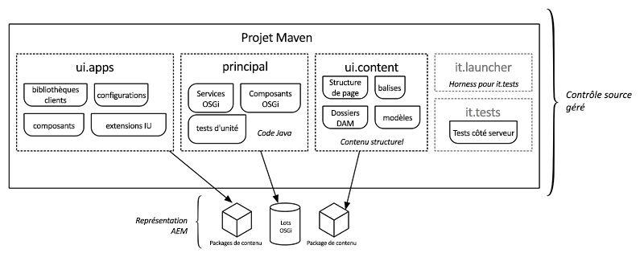

# Archétype de projet AEM {#aem-project-archetype}

L’archétype de projet AEM crée un projet Adobe Experience Manager minimal basé sur les meilleures pratiques comme point de départ pour vos propres projets AEM. Les propriétés à fournir lors de l'utilisation de cet archétype vous permettent de spécifier les noms de toutes les parties de ce projet et de contrôler certaines fonctionnalités facultatives.

>[!NOTE]
>
>Le dernier archétype de projet AEM et des détails techniques complets [sont disponibles sur GitHub](https://github.com/adobe/aem-project-archetype).

>[!NOTE]
>
>Consultez le didacticiel [Prise en main des sites AEM - WKND](https://docs.adobe.com/content/help/en/experience-manager-learn/getting-started-wknd-tutorial-develop/overview.html) dans la documentation AEM pour obtenir un exemple pratique qui vous guide tout au long de l’utilisation de l’archétype pour mettre en oeuvre un projet simple.

## Fonctionnalités {#features}

L’archétype comporte plusieurs fonctions destinées à offrir un point de départ pratique pour les nouveaux projets AEM :

* Pages en anglais et en français avec un exemple de contenu
* Un modèle de contenu basé sur la fonction de modèle modifiable avec un exemple de stratégie de contenu
* Composant de page basé sur le composant principal de page [AEM](page.md)
* Exemples de composants de contenu implémentés avec le modèle de proxy recommandé et un exemple de composant personnalisé helloworld tous basés sur les composants [principaux](introduction.md)AEM.
* Exemples de composants de [formulaire](form-container.md)
* Configurations des émulateurs de périphériques, configuration par glisser-déposer et internationalisation
* Bibliothèques clientes suivant les conventions de dénomination BEM et les styles spécifiques aux composants
* Exemples de lots, notamment modèles, serveurs, filtres et planificateurs
* Tests d’unité, d’intégration et côté client

## Pourquoi utiliser l'archétype {#why-use-the-archetype}

L’utilisation de l’archétype de projet AEM vous permet de vous orienter vers la création d’un projet AEM basé sur les meilleures pratiques avec quelques touches seulement. En utilisant l’archétype, toutes les pièces seront déjà en place afin que, bien que le projet résultant soit minimal, il implémente déjà toutes les fonctionnalités [](#features) clés d’AEM, de sorte que tout ce que vous avez à faire est de construire au-dessus et d’étendre.

Bien sûr, de nombreux éléments entrent dans un projet AEM réussi, mais l’utilisation de l’archétype de projet AEM constitue une base solide et est vivement recommandée pour tout projet AEM.

## Ce que vous obtenez en utilisant l'archétype {#what-you-get}

L’archétype AEM est constitué de modules :

* **[noyau](core.md)**: est un lot Java contenant toutes les fonctionnalités de base, telles que les services OSGi, les écouteurs et les planificateurs, ainsi que le code Java associé aux composants, tels que les servlets et les filtres de requête.
* **[ui.apps](uiapps.md)**: contient les éléments `/apps` et les parties `/etc` du projet, c’est-à-dire les clients JS et CSS, les composants, les modèles, les configurations spécifiques au mode d’exécution, ainsi que les tests Hobbes.
* **[ui.content](uicontent.md)**: contient un exemple de contenu à l’aide des composants du module ui.apps.
* **ui.tests**: est un lot Java contenant des tests JUnit exécutés côté serveur. Ce lot ne doit pas être déployé sur la production.
* **ui.launcher**: contient le code de colle qui déploie le lot ui.tests (et les lots dépendants) sur le serveur et déclenche l’exécution JUnit distante.
* **[ui.frontend](front-end-build.md)**: [facultatif] contient les artefacts requis pour utiliser le module de génération frontale basé sur Webpack.



Les modules de l’archétype AEM représentés dans Maven sont déployés dans AEM en tant que packages de contenu représentant l’application, le contenu et les lots OSGi nécessaires.

## Conditions {#requirements}

La version actuelle de l’archétype requiert les éléments suivants :

* Adobe Experience Manager 6.3.3.0 ou version ultérieure
* Apache Maven (3.3.9 ou version ultérieure)
* Référentiel Adobe Public Maven dans vos paramètres Maven. Consultez cet article de la base de [connaissances pour plus de détails](https://helpx.adobe.com/experience-manager/kb/SetUpTheAdobeMavenRepository.html).

Pour obtenir la liste des versions d’AEM prises en charge des versions d’archétype précédentes, reportez-vous à l’ [historique des versions](https://github.com/adobe/aem-project-archetype/blob/master/VERSIONS.md)d’AEM prises en charge.

## Utilisation de l'archétype {#how-to-use-the-archetype}

Pour utiliser l'archétype, vous devez d'abord créer un projet qui génère les modules dans une structure de fichiers locale comme décrit [précédemment](#what-you-get). Dans le cadre de la génération du projet, plusieurs propriétés de votre projet peuvent être définies, telles que le nom du projet, la version, etc.

La création du projet avec Maven crée les artefacts (packages et lots OSGi) qui peuvent être déployés dans AEM. Des commandes et des profils Maven supplémentaires peuvent être utilisés pour déployer les artefacts du projet sur une instance AEM.

### Création d’un projet {#create-project}

Pour commencer, il vous suffit d’utiliser l’extension [Eclipse](https://helpx.adobe.com/experience-manager/6-5/sites/developing/using/aem-eclipse.html) AEM et de suivre l’assistant Nouveau projet et de choisir **AEM Sample Multi-Module Project** pour utiliser une version publiée de l’archétype.

Bien sûr, vous pouvez aussi appeler Maven directement.

```
mvn archetype:generate \
 -DarchetypeGroupId=com.adobe.granite.archetypes \
 -DarchetypeArtifactId=aem-project-archetype \
 -DarchetypeVersion=XX
```

Où `XX` se trouve le numéro [de](https://github.com/adobe/aem-project-archetype/blob/master/VERSIONS.md) version du dernier archétype de projet AEM.

>[!NOTE]
>
>Il est recommandé d’ajouter le `adobe-public` profil à votre `settings.xml` fichier expert afin d’ajouter automatiquement repo.adobe.com au processus de création expert.
>
>Un exemple de POM [est disponible ici](https://helpx.adobe.com/experience-manager/kb/SetUpTheAdobeMavenRepository.html).

### Propriétés {#properties}

Les propriétés suivantes sont disponibles lors de la création d’un projet à l’aide de l’archétype.

| Nom | Default | Description |
----------------------------|---------|--------------------
| `groupId` |  | Maven de base `groupId` |
| `artifactId` |  | Artefact Maven de baseId |
| `version` |  | Version |
| `package` |  | Package source Java |
| `appsFolderName` |  | `/apps` nom du dossier |
| `artifactName` |  | Nom du projet Maven |
| `componentGroupName` |  | Nom du groupe de composants AEM |
| `contentFolderName` |  | `/content` nom du dossier |
| `confFolderName` |  | `/conf` nom du dossier |
| `cssId` |  | préfixe utilisé dans css généré |
| `packageGroup` |  | Nom du groupe de packages de contenu |
| `siteName` |  | Nom du site AEM |
| `optionAemVersion` | 6.5.0 | Version d’AEM cible |
| `optionIncludeExamples` | y | Inclure un exemple de site de bibliothèque [de](http://opensource.adobe.com/aem-core-wcm-components/library.html) composants |
| `optionIncludeErrorHandler` | n | Inclure une page de réponse 404 personnalisée |
| `optionIncludeFrontendModule` | n | [Inclure un module frontal dédié](front-end-build.md) |

>[!NOTE]
> Si l’archétype est exécuté en mode interactif la première fois, les propriétés avec des valeurs par défaut ne peuvent pas être modifiées (voir [ARCHETYPE-308](https://issues.apache.org/jira/browse/ARCHETYPE-308) pour plus de détails). La valeur peut être modifiée lorsque la confirmation de propriété à la fin est refusée et que le questionnaire est répété, ou en transmettant le paramètre dans la ligne de commande (p. ex. `-DoptionIncludeExamples=n`).

### Profils {#profiles}

Le projet expert généré prend en charge différents profils de déploiement lors de l’exécution `mvn install`.

| ID de profil | Description |
--------------------------|------------------------------
| `autoInstallBundle` | Installation du lot principal avec le maven-sling-plugin sur OSGi |
| `autoInstallPackage` | Installe le package de contenu ui.content et ui.apps avec le plug-in content-package-maven-plugin dans le gestionnaire de packages vers l’instance d’auteur par défaut sur localhost, port 4502. Le nom d’hôte et le port peuvent être modifiés à l’aide des propriétés `aem.host` et `aem.port` définies par l’utilisateur. |
| `autoInstallPackagePublish` | Installez le package de contenu ui.content et ui.apps avec le plug-in content-package-maven-plugin dans le gestionnaire de packages pour que l’instance de publication par défaut sur localhost, port 4503. Le nom d’hôte et le port peuvent être modifiés à l’aide des propriétés `aem.host` et `aem.port` définies par l’utilisateur. |
| `integrationTests` | Exécute les tests d’intégration fournis sur l’instance AEM (uniquement pour la `verify` phase). |

### Création et installation {#building-and-installing}

Pour créer tous les modules exécutés dans le répertoire racine du projet, utilisez la commande expert suivante.

```
mvn clean install
```

Si vous disposez d’une instance AEM en cours d’exécution, vous pouvez créer et assembler l’ensemble du projet et le déployer dans AEM avec la commande expert suivante.

```
mvn clean install -PautoInstallPackage
```

Pour le déployer sur une instance de publication, exécutez cette commande.

```
mvn clean install -PautoInstallPackagePublish
```

Vous pouvez également exécuter cette commande pour effectuer un déploiement sur une instance de publication.

```
mvn clean install -PautoInstallPackage -Daem.port=4503
```

Ou pour déployer uniquement le lot vers l’auteur, exécutez cette commande.

```
mvn clean install -PautoInstallBundle
```

## POM parent {#parent-pom}

La `pom.xml` racine du projet (`<src-directory>/<project>/pom.xml`) est connue sous le nom de POM parent et dirige la structure du projet ainsi que gère les dépendances et certaines propriétés globales du projet.

### Propriétés globales du projet {#global-properties}

La `<properties>` section du POM parent définit plusieurs propriétés globales importantes pour le déploiement de votre projet sur une instance AEM, telles que le nom d’utilisateur/mot de passe, le nom d’hôte/port, etc.

Ces propriétés sont configurées pour être déployées sur une instance AEM locale, car il s’agit de la génération la plus courante que les développeurs feront. Notez qu’il existe des propriétés à déployer sur une instance d’auteur et une instance de publication. C’est également là que les informations d’identification sont définies pour s’authentifier auprès de l’instance AEM. Les informations d’identification admin:admin par défaut sont utilisées.

Ces propriétés sont configurées de manière à pouvoir être remplacées lors du déploiement dans des environnements de niveau supérieur. De cette manière, les fichiers POM n’ont pas à changer, mais des variables comme `aem.host` et `sling.password` peuvent être remplacées par des arguments de ligne de commande :

````
mvn -PautoInstallPackage clean install -Daem.host=production.hostname -Dsling.password=productionpasswd
````

### Structure du module {#module-structure}

La `<modules>` section du POM parent définit les modules que le projet va créer. Par défaut, [le projet crée les modules standard précédemment définis](#what-you-get): core, ui.apps, ui.content, ui.tests et it.launcher. D'autres modules peuvent toujours être ajoutés à mesure qu'un projet évolue.

### Dépendances {#dependencies}

La `<dependencyManagement>` section du POM parent définit toutes les dépendances et versions des API utilisées dans le projet. Les versions doivent être gérées dans le POM parent. Les sous-modules tels que core et ui.apps ne doivent pas inclure d’informations de version.

#### Uber-Jar {#uber-jar}

L’une des dépendances clés est l’uber-jar [AEM](https://helpx.adobe.com/experience-manager/6-5/sites/developing/using/ht-projects-maven.html#ExperienceManagerAPIDependencies). Cela inclut toutes les API AEM avec une seule entrée de dépendance pour la version d’AEM.

>[!NOTE]
>
>Il est recommandé de mettre à jour la version uber-jar pour qu’elle corresponde à la version cible d’AEM. Si, par exemple, vous prévoyez de procéder au déploiement vers AEM 6.4, vous devez mettre à jour la version de uber-jar vers 6.4.0.

#### Composants principaux {#core-components}

L’archétype du projet AEM tire bien sûr parti des composants principaux.

Les composants principaux sont installés automatiquement dans AEM en mode d’exécution par défaut et utilisés par l’exemple de site Web.Retail. En mode d’exécution [de production](https://helpx.adobe.com/experience-manager/6-5/sites/administering/using/production-ready.html) (`nosamplecontent`), les composants principaux ne sont pas disponibles.

Par conséquent, pour tirer parti des composants principaux dans tous les déploiements, il est recommandé de les inclure dans le projet Maven.

>[!NOTE]
>
>Chaque version des composants principaux est généralement suivie d’une version de l’archétype de projet AEM, de sorte que l’archétype le plus récent utilise la dernière version des composants principaux.
>
>Cependant, une nouvelle version de l'archétype peut ne pas suivre directement une nouvelle version des composants principaux. Vous pouvez donc mettre à jour la dépendance des composants principaux vers la dernière version.

>[!NOTE]
>
>Le fichier core.wcm.components.example est un ensemble d’exemples de pages qui illustrent des exemples de composants principaux. En règle générale, lors du déploiement d’un projet en production, vous devez supprimer cette dépendance et cette inclusion de sous-package.

## Tests {#testing}

Il y a trois niveaux de tests contenus dans le projet et parce qu'il s'agit de différents types de tests, ils sont exécutés de différentes manières ou à différents endroits.

* Essai unitaire dans le noyau : Ceci présente les tests unitaires classiques du code contenu dans l’assemblage. Pour tester, exécutez :
   * `mvn clean test`
* Tests d’intégration côté serveur : Ils exécutent des tests de type unité dans l’environnement AEM, c’est-à-dire sur le serveur AEM. Pour tester, exécutez :
   * `mvn clean verify -PintegrationTests`
* Tests Hobbes.js côté client : Il s’agit de tests JavaScript côté navigateur qui vérifient le comportement côté navigateur. Pour tester :
   1. Chargez AEM dans votre navigateur comme vous le feriez pour créer une page.
   1. Open the page in [Developer mode](https://helpx.adobe.com/experience-manager/6-5/sites/developing/using/developer-mode.html)
   1. Ouvrez le panneau de gauche et passez à l’onglet **Tests** .
   1. Recherchez les tests **MyName générés** et exécutez-les.

## Étapes suivantes {#next-steps}

Vous avez donc créé et installé l’archétype du projet AEM. Et maintenant ? Eh bien, l’archétype est petit, mais se compose de nombreux exemples de puissantes fonctionnalités AEM configurées selon les meilleures pratiques recommandées. Utilisez-les pour indiquer comment tirer parti de ces fonctionnalités dans votre projet. Pour tout projet, vous devez probablement :

* [Personnaliser les composants pour étendre les composants principaux existants](customizing.md)
* [Ajout de modèles](https://helpx.adobe.com/content/help/en/experience-manager/6-5/sites/authoring/using/templates.html)
* [Adapter la structure de localisation](https://helpx.adobe.com/experience-manager/6-5/sites/administering/using/tc-prep.html)
* [En savoir plus sur le module de génération frontal](front-end-build.md)
