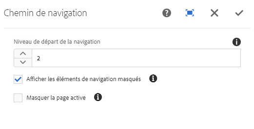

# Composant de chemin de navigation (v 1){#breadcrumb-component-v}

Le composant de navigation Composant principal est un composant de navigation qui crée un chemin de navigation des liens en fonction de l&#39;emplacement de la page dans la hiérarchie du contenu.

## Utilisation {#usage}

Le composant de chemin de navigation affiche la position de la page actuelle dans la hiérarchie du site, ce qui permet aux visiteurs de la page de parcourir la hiérarchie de la page à partir de leur emplacement actuel. Cela est souvent intégré aux en-têtes ou aux pieds de page.

Les options disponibles, telles que le niveau de navigation par défaut et la possibilité d&#39;afficher la page active ou les pages masquées, peuvent être définies par l&#39;auteur du modèle dans la boîte de dialogue [de conception](breadcrumb-v1.md#main-pars_title_1995166862). L&#39;éditeur de contenu peut ensuite choisir si les pages masquées doivent être affichées ou non et le niveau de navigation réel du composant dans la boîte de dialogue [Modifier](breadcrumb-v1.md#main-pars_title).

## Version et compatibilité {#version-and-compatibility}

Ce document décrit la version 1 du composant de chemin de navigation, introduite à l&#39;origine avec la version 1.0.0 des composants principaux avec AEM 6.3.

Le tableau suivant répertorie la compatibilité de la version v 1 du composant de chemin de navigation.

| Version d’AEM | Composant de chemin de navigation v 1 |
|--- |--- |
| 6.3 | Compatible |
| 6.4 | Compatible |

>[!CAUTION]
>
>Ce document décrit la version v 1 du composant de chemin de navigation.
>Pour plus d&#39;informations sur la version actuelle du composant de chemin de navigation, consultez [le document Composant](breadcrumb.md) de chemin de navigation.

## Exemple de sortie de composant {#sample-component-output}

Voici un exemple tiré de [We. Retail](https://helpx.adobe.com/experience-manager/6-4/sites/developing/using/we-retail.html).

### Capture d’écran {#screenshot}


### HTML {#html}

```
<div class="cmp cmp-breadcrumb aem-GridColumn aem-GridColumn--default--12">

<ol class="breadcrumb">
    <li class="breadcrumb-item ">
        <a href="/content/we-retail/us.html">
            United States
        </a>
    </li>

    <li class="breadcrumb-item ">
        <a href="/content/we-retail/us/en.html">
            English
        </a>
    </li>

    <li class="breadcrumb-item active">
        
            Experience
        
    </li>
</ol>
 
</div>
```

### JSON {#json}

```
"breadcrumb": {
              "columnClassNames": "aem-GridColumn aem-GridColumn--default--12",
              ":type": "weretail/components/content/breadcrumb"
            }
```

>[!NOTE]
>
>L&#39;exportation JSON à partir des composants principaux nécessite la version 1.1.0 des composants principaux. Pour plus d&#39;informations, consultez les [informations de compatibilité des composants principaux v 1](versions.md#main-pars_title_236368006) .

## Modifier le dialogue {#edit-dialog}

Le dialogue Modifier permet à l&#39;auteur de contenu de supprimer les pages masquées et actives dans les chemins de navigation ainsi que la profondeur de la hiérarchie qu&#39;elle doit afficher.



* **Niveau de navigation à démarrer** : dans la hiérarchie, le composant de chemin de navigation doit commencer à descendre jusqu&#39;à la page en cours. Par exemple dans We. Retail :

   * 1 commence à `/content/we-retail`
   * 2 commence à `/content/we-retail/<country>`

* **Afficher Masqué** - Afficher les pages marquées comme masquées dans la barre de navigation (elles ne sont pas affichées par défaut)
* **Masquer actuel**- Supprimer la page actuelle dans la barre de navigation (par défaut, elle s&#39;affiche)

## Créer un dialogue {#design-dialog}

Le dialogue de conception permet à l&#39;auteur du modèle de définir les valeurs par défaut des options de suppression des pages masquées et actives dans les chemins de navigation, ainsi que la profondeur de la hiérarchie qu&#39;elle doit afficher.


* **Niveau de navigation à démarrer** : définit la valeur par défaut pour laquelle le composant de chemin de navigation doit commencer à se déplacer jusqu&#39;à la page actuelle lorsque le composant de chemin de navigation est ajouté à une page.
* **Afficher Masqué** : définit la valeur par défaut de l&#39;option **Afficher masqué** lorsque le composant de chemin de navigation est ajouté à une page.

   * Elle n&#39;active pas ou ne désactive pas l&#39;option de l&#39;auteur. Il définit uniquement la valeur par défaut.

* **Masquer actuel** : définit la valeur par défaut de l&#39;option **Masquer le jour** lorsque le composant de chemin de navigation est ajouté à une page.

   * Elle n&#39;active pas ou ne désactive pas l&#39;option de l&#39;auteur. Il définit uniquement la valeur par défaut.

## Détails techniques {#technical-details}

Vous trouverez la documentation technique la plus récente sur le composant [de chemin de navigation sur github](https://github.com/adobe/aem-core-wcm-components/tree/master/content/src/content/jcr_root/apps/core/wcm/components/breadcrumb/v1/breadcrumb).

Le projet de composants principaux peut être téléchargé depuis github.

Vous trouverez plus d&#39;informations sur le développement des composants principaux dans la documentation destinée aux développeurs de composants [principaux](developing.md).
