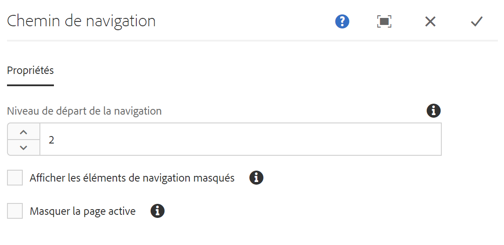
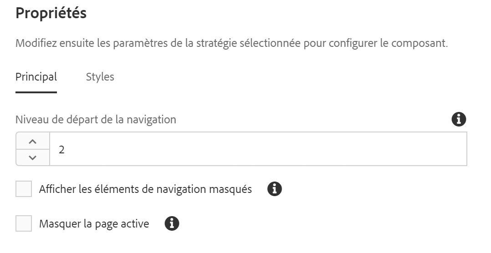

# Composant Chemin de navigation{#breadcrumb-component}

Le composant Chemin de navigation des composants principaux est un composant de navigation qui crée un chemin de navigation des liens en fonction de l’emplacement de la page dans la hiérarchie du contenu.

## Utilisation {#usage}

Le composant Chemin de navigation affiche la position de la page actuelle dans la hiérarchie du site, ce qui permet aux visiteurs de la page de parcourir la hiérarchie de la page à partir de leur emplacement actuel. Cela est souvent intégré aux en-têtes ou aux pieds de page.

Les options disponibles, telles que le niveau de navigation par défaut et la possibilité d’afficher la ou les pages masquées, peuvent être définies par l’auteur du modèle dans la [boîte de dialogue Conception](#design-dialog). L’éditeur de contenu peut ensuite choisir si les pages masquées doivent être affichées ou non et le niveau de navigation réel du composant dans la [boîte de dialogue Modifier](#edit-dialog).

## Version et compatibilité {#version-and-compatibility}

La version actuelle du composant Chemin de navigation est v2, qui a été introduite avec la version 2.0.0 des composants principaux en janvier 2018 et est décrite dans ce document.

Le tableau suivant détaille toutes les versions prises en charge du composant, les versions AEM avec lesquelles les versions du composant sont compatibles et les liens vers la documentation pour les versions précédentes.

| Composant Version | AEM 6.3 | AEM 6.4 | AEM 6.5 |
|--- |--- |--- |--- |
| v2 | Compatible | Compatible | Compatible |
| [v1](breadcrumb-v1.md) | Compatible | Compatible | Compatible |

Pour plus d’informations sur les versions et les mises à jour des composants principaux, consultez le document sur les [versions des composants principaux](versions.md).

## Exemple de sortie de composant {#sample-component-output}

To experience the Breadcrumb Component as well as see examples of its configuration options as well as HTML and JSON output, visit the [Component Library](http://opensource.adobe.com/aem-core-wcm-components/library/breadcrumb.html).

>[!NOTE]
>
>As of Core Components release 2.1.0, the Breadcrumb Component supports [schema.org microdata](https://schema.org/BreadcrumbList).

## Détails techniques {#technical-details}

The latest technical documentation about the Breadcrumb Component [can be found on GitHub](https://github.com/adobe/aem-core-wcm-components/blob/master/content/src/content/jcr_root/apps/core/wcm/components/breadcrumb/v2/breadcrumb).

Vous trouverez plus d’informations sur le développement des composants principaux dans la [documentation destinée aux développeurs de composants principaux](developing.md).

## Boîte de dialogue Modifier {#edit-dialog}

La boîte de dialogue Modifier permet à l’auteur de contenu de supprimer les pages masquées et actives dans les chemins de navigation ainsi que la profondeur de la hiérarchie qu’elle doit afficher.

* **Niveau de début de navigation** - Dans la hiérarchie, le composant Chemin de navigation doit commencer à descendre jusqu’à la page en cours. Par exemple, dans We.Retail :

   * 0 commence à `/content`

   * 1 commence à `/content/we-retail`
   * 2 commence à `/content/we-retail/<country>`

* **Afficher les éléments de navigation masqués** - Affichez les pages marquées comme masquées dans la barre de navigation (elles ne sont pas affichées par défaut).
* **Masquer la page actuelle** - Supprimez la page active dans la barre de navigation (par défaut, elle s’affiche).

## Boîte de dialogue Conception {#design-dialog}

La boîte de dialogue Conception permet à l’auteur du modèle de définir les valeurs par défaut des options de suppression des pages masquées et actives dans les chemins de navigation, ainsi que la profondeur de la hiérarchie qu’elle doit afficher.

### Onglet principal {#main-tab}

* **Niveau de début de navigation** - Définit la valeur par défaut pour laquelle le composant Chemin de navigation doit commencer à se déplacer jusqu’à la page en cours lorsque le composant Chemin de navigation est ajouté à une page.
* **Afficher les éléments de navigation masqués** - Définit la valeur par défaut de l’option **Afficher les éléments de navigation masqués** lorsque le composant Chemin de navigation est ajouté à une page.

   * Cela n’active pas ou ne désactive pas l’option de l’auteur. Cela définit uniquement la valeur par défaut.

* **Masquer la page actuelle** - Définit la valeur par défaut de l’option **Masquer la page actuelle** lorsque le composant Chemin de navigation est ajouté à une page.

   * Cela n’active pas ou ne désactive pas l’option de l’auteur. Cela définit uniquement la valeur par défaut.

### Onglet Styles {#styles-tab}

Le composant Chemin de navigation prend en charge le [système de style AEM](authoring.md#component-styling).