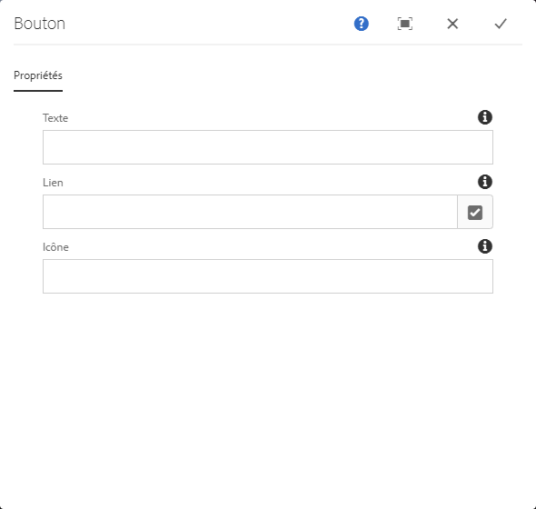

# Button Component{#button-component}

Le composant Button Component Button permet de configurer et d&#39;afficher un élément de bouton sur une page.

## Utilisation {#usage}

Le composant Bouton de composant principal permet l&#39;inclusion d&#39;un bouton sur une page.

* The button&#39;s properties can be selected in the [configure dialog](#configure-dialog).
* Styles for the Button Component can be defined in the [design dialog](#design-dialog).

## Version et compatibilité {#version-and-compatibility}

La version actuelle du composant Button est v 1, qui a été introduite avec la version 2.5.0 des composants principaux de juin 2019 et est décrite dans ce document.

Le tableau suivant détaille toutes les versions prises en charge du composant, les versions AEM avec lesquelles les versions du composant sont compatibles et les liens vers la documentation pour les versions précédentes.

| Composant Version | AEM 6.3 | AEM 6.4 | AEM 6.5 |
|--- |--- |--- |---|
| v1 | Compatible | Compatible | Compatible |

Pour plus d’informations sur les versions et les mises à jour des composants principaux, consultez le document sur les [versions des composants principaux](versions.md).

## Exemple de sortie de composant {#sample-component-output}

To experience the Button Component as well as see examples of its configuration options as well as HTML and JSON output, visit the [Component Library](http://opensource.adobe.com/aem-core-wcm-components/library/button.html).

## Détails techniques {#technical-details}

The latest technical documentation about the Button Component [can be found on GitHub](https://github.com/adobe/aem-core-wcm-components/tree/master/content/src/content/jcr_root/apps/core/wcm/components/button/v1/button).

Vous trouverez plus d’informations sur le développement des composants principaux dans la [documentation destinée aux développeurs de composants principaux](developing.md).

## Boîte de dialogue Configurer {#configure-dialog}

La boîte de dialogue Configurer permet à l&#39;auteur du contenu de définir le bouton et son comportement et d&#39;apparaître pour un visiteur sur la page.

* **Texte** - Texte à afficher sur le bouton
* **Lien** - Lien vers une page de contenu dans AEM, une ressource externe ou une ancre
   * Use the **Selection Dialog** to choose a path within AEM.
* **Icône** - Identificateur pour l&#39;affichage d&#39;une icône dans le bouton

## Boîte de dialogue Conception {#design-dialog}

### Onglet Styles {#styles-tab}

Le composant Image prend en charge le [système de style](authoring.md#component-styling) AEM.
