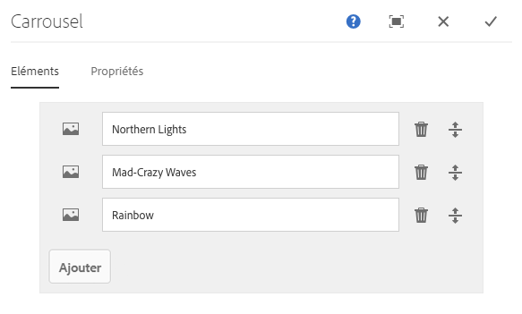
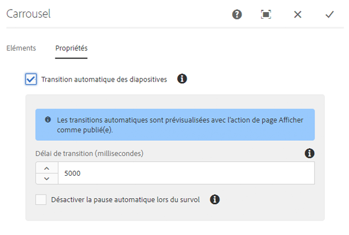
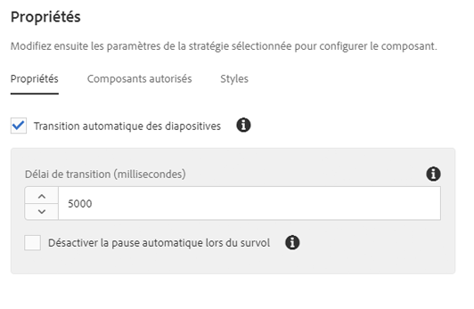

# Composant du carrousel{#carousel-component}

Le composant du carrousel des composants principaux permet à l’auteur de contenu de présenter le contenu dans un carrousel navigable.

## Utilisation {#usage}

En utilisation le composant du carrousel, l’auteur de contenu peut organiser le contenu dans un carrousel de diapositives rotatif.

La [boîte de dialogue de modification](#edit-dialog) permet à l’auteur de contenu de créer, nommer et classer plusieurs diapositives et d’activer la transition automatique avec délai. À l’aide de la [boîte de dialogue de conception](#design-dialog), l’auteur du modèle peut définir quels composants peuvent être ajoutés au carrousel, activer ou désactiver les transitions automatiques et personnaliser les styles.

## Version et compatibilité {#version-and-compatibility}

La version actuelle du composant du carrousel est v1, qui a été introduite avec la version 2.2.0 des composants principaux d’octobre 2018. Elle est décrite dans ce document.

Le tableau ci-après présente en détail toutes les versions prises en charge du composant, les versions AEM avec lesquelles les versions du composant sont compatibles et les liens vers la documentation pour les versions précédentes.

| Version du composant | AEM 6.3 | AEM 6.4 | AEM 6.5 |
|--- |--- |--- |--- |
| v1 | Compatible | Compatible | Compatible |

Pour plus d’informations sur les versions et les publications des composants principaux, voir le document sur les [versions des composants principaux](versions.md).

## Exemple de sortie de composant {#sample-component-output}

Pour tester le composant du carrousel, des exemples d’options de configuration, ainsi que des sorties HTML et JSON, consultez la [bibliothèque de composants](http://opensource.adobe.com/aem-core-wcm-components/library/carousel.html).

### Détails techniques {#technical-details}

Vous trouverez la documentation technique la plus récente sur le composant du carrousel [sur GitHub](https://github.com/adobe/aem-core-wcm-components/blob/master/content/src/content/jcr_root/apps/core/wcm/components/carousel/v1/carousel).

Vous trouverez plus d’informations sur le développement des composants principaux dans la [documentation destinée aux développeurs de composants principaux](developing.md).

## Boîte de dialogue de modification {#edit-dialog}

La boîte de dialogue de modification permet à l’auteur de contenu d’ajouter, de renommer et de réorganiser les diapositives, ainsi que de définir les paramètres de transition automatique.

### Onglet Éléments {#items-tab}

Utilisez le bouton **Ajouter** pour ouvrir le sélecteur de composants afin de choisir le composant à ajouter sous forme d’onglet. Une fois le composant ajouté, une entrée est ajoutée à la liste qui contient les colonnes suivantes :

* **Icône** : icône du type de composant de l’onglet pour une identification facile dans la liste. Pointez dessus pour afficher le nom complet du composant sous forme d’info-bulle.
* **Description** : description utilisée comme texte de l’onglet. Par défaut, il s’agit du nom du composant sélectionné pour l’onglet.
* **Supprimer** : appuyez ou cliquez sur cette option pour supprimer l’onglet du composant Onglets.
* **Réorganiser** : appuyez ou cliquez sur cette option et faites glisser pour classer les onglets.

### Onglet Propriétés {#properties-tab}

Dans l’onglet **Propriétés**, l’auteur du contenu peut définir les diapositives pour la transition automatique.

* **Transition automatique des diapositives** : lorsque cette option est activée, le composant passe automatiquement à la diapositive suivante après un délai spécifié.
* **Délai de transition** : lorsque la transition automatique des diapositives est sélectionnée, cette valeur est utilisée pour définir le délai entre les transitions (en millisecondes).
* **Désactiver la pause automatique lors du survol** : lorsque l’option **Transition automatique des diapositives** est sélectionnée, la transition du carrousel se met automatiquement en pause chaque fois que l’utilisateur survole le carrousel. Sélectionnez cette option pour que la transition ne soit pas interrompue.

>[!NOTE]
>
>Les commandes d’avance de diapositives ne sont pas activées en mode **Édition**. Utilisez le mode [**Aperçu**](https://helpx.adobe.com/experience-manager/6-5/sites/authoring/using/editing-content.html) ou l’option **[Afficher comme publié(e)](https://helpx.adobe.com/experience-manager/6-5/sites/authoring/using/editing-content.html)** pour interagir avec le carrousel en tant que lecteur du contenu publié.
>
>La fonction d’avance automatique n’est pas activée en mode **Édition**. Utilisez l’option **[Afficher comme publié(e)](https://helpx.adobe.com/experience-manager/6-5/sites/authoring/using/editing-content.html)** pour afficher la fonctionnalité d’avance automatique en tant que lecteur du contenu publié.

## Sélectionner un panneau {#select-panel}

L’auteur du contenu peut utiliser l’option **Sélectionner un panneau** de la barre d’outils des composants pour passer à une autre diapositive afin de modifier et de réorganiser facilement l’ordre des diapositives.

Lorsque vous sélectionnez l’option **Sélectionner un panneau** dans la barre d’outils des composants, les diapositives configurées s’affichent sous forme de liste déroulante.

* La liste est triée selon la disposition assignée des diapositives et est répercutée dans la numérotation.
* Le type de composant de la diapositive est affiché en premier, suivi de la description de la diapositive en police plus claire.

* Lorsque vous appuyez ou cliquez sur une entrée dans la liste déroulante, la vue est commutée dans l’éditeur.
* Vous pouvez réorganiser la diapositive en place à l’aide des poignées de glissement.

## Boîte de dialogue de conception {#design-dialog}

La boîte de dialogue de conception permet à l’auteur du modèle de définir les composants qui peuvent être ajoutés en tant que diapositives au composant du carrousel, ainsi que de définir les valeurs par défaut de la transition automatique et les styles personnalisés disponibles pour l’auteur du contenu.

### Onglet Propriétés {#properties-tab-1}

L’onglet **Propriétés** permet de définir les paramètres par défaut des transitions de diapositives lorsqu’un auteur de contenu ajoute le composant du carrousel à une page.

* **Transition automatique des diapositives** : définit si par défaut l’option permettant d’avancer automatiquement le carrousel à la diapositive suivante est activée lorsque l’auteur du contenu ajoute le composant du carrousel à une page.
* **Délai de transition** : définit la valeur par défaut du délai de transition entre les diapositives (en millisecondes) lorsqu’un auteur de contenu ajoute le composant du carrousel à une page.
* **Désactiver la pause automatique lors du survol** : définit si par défaut l’option de désactivation de la pause automatique de la diapositive est activée lorsque l’option **Transition automatique des diapositives** est activée par l’auteur du contenu.

### Onglet Composants autorisés {#allowed-components-tab}

L’onglet **Composants autorisés** permet de définir les composants pouvant être ajoutés en tant que diapositives au composant du carrousel par l’auteur du contenu.

L’onglet Composants autorisés fonctionne de la même manière que l’onglet du même nom lors de la [définition de la stratégie et des propriétés d’un conteneur de mises en page dans l’éditeur de modèles.](https://helpx.adobe.com/experience-manager/6-5/sites/authoring/using/content-targeting-touch.html)

### Onglet Styles {#styles-tab}

Le composant du carrousel prend en charge le [système de style](authoring.md#component-styling) AEM.