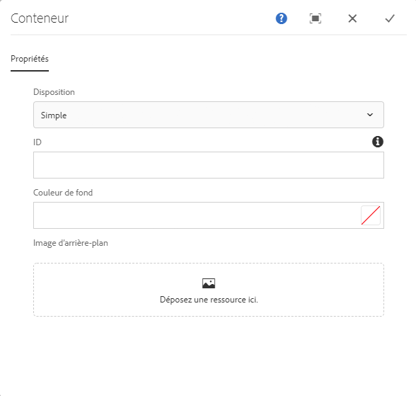
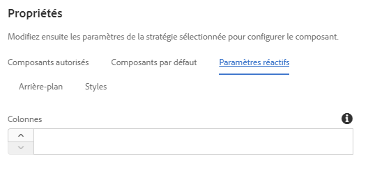
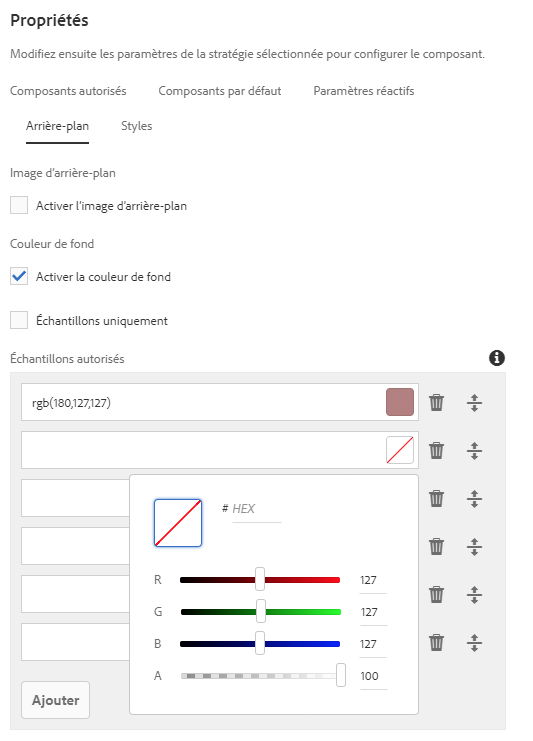

# Container Component{#container-component}

Le composant Conteneur de composants principaux permet la création d&#39;un conteneur pour plusieurs composants supplémentaires sur une page.

## Utilisation {#usage}

Le composant Conteneur de composants principaux permet la création d&#39;un conteneur pour plusieurs composants supplémentaires sur une page et peut servir à regrouper d&#39;autres composants et à appliquer un style ou une mise en page commun.

* The container&#39;s properties can be selected in the [configure dialog](#configure-dialog).
* Defaults for the Container Component when adding it to a page can be defined in the [design dialog](#design-dialog).

## Version et compatibilité {#version-and-compatibility}

La version actuelle du composant Conteneur est v 1, qui a été introduite avec la version 2.5.0 des composants principaux en juin 2019 et est décrite dans ce document.

Le tableau suivant détaille toutes les versions prises en charge du composant, les versions AEM avec lesquelles les versions du composant sont compatibles et les liens vers la documentation pour les versions précédentes.

| Composant Version | AEM 6.3 | AEM 6.4 | AEM 6.5 |
|--- |--- |--- |---|
| v1 | Compatible | Compatible | Compatible |

Pour plus d’informations sur les versions et les mises à jour des composants principaux, consultez le document sur les [versions des composants principaux](versions.md).

## Exemple de sortie de composant {#sample-component-output}

To experience the Container Component as well as see examples of its configuration options as well as HTML and JSON output, visit the [Component Library](http://opensource.adobe.com/aem-core-wcm-components/library/container.html).

## Détails techniques {#technical-details}

The latest technical documentation about the Container Component [can be found on GitHub](https://github.com/adobe/aem-core-wcm-components/tree/master/content/src/content/jcr_root/apps/core/wcm/components/container/v1/container).

Vous trouverez plus d’informations sur le développement des composants principaux dans la [documentation destinée aux développeurs de composants principaux](developing.md).

## Boîte de dialogue Configurer {#configure-dialog}

La configuration de la boîte de dialogue permet à l&#39;auteur du contenu de définir l&#39;élément du conteneur et son comportement et d&#39;apparaître pour un visiteur sur la page.

* **Disposition** : cette option définit le comportement ou le comportement de mise en page du composant Conteneur.
   * **Simple** : définit un conteneur en tant que collection simple de composants
   * **Grille réactive** : définit un conteneur comme grille réactive [AEM](https://helpx.adobe.com/experience-manager/6-5/sites/authoring/using/responsive-layout.html)
* **ID** - Utilisez cette option pour définir l&#39;attribut HTML ID à appliquer au composant.
* **Couleur d&#39;arrière-plan** - Définissable comme valeurs RVB de forme libre ou en utilisant le sélecteur de couleurs [, selon la configuration](#background-tab)
* **Image d&#39;arrière-plan** : définit une couleur d&#39;arrière-plan pour le conteneur [, selon la configuration](#background-tab)

## Boîte de dialogue Conception {#design-dialog}

Le dialogue de conception permet à l&#39;auteur du modèle de définir les options disponibles pour l&#39;auteur du contenu qui utilise le composant Conteneur.

### Onglet Composants autorisés {#allowed-components-tab}

The **Allowed Components** tab is used to define which components can be added as items to the Container Component by the content author.

L’onglet Composants autorisés fonctionne de la même manière que l’onglet du même nom lors [de la définition de la stratégie et des propriétés d’un conteneur de dispositions dans l’éditeur de modèles.](https://helpx.adobe.com/experience-manager/6-5/sites/authoring/using/templates.html)

### Default Components Tab {#default-components-tab}

The Default Components tab is used to define which component is added to the component when a particular asset type is dropped on the container, similar to [how default components are defined on the page template](https://helpx.adobe.com/experience-manager/6-5/sites/authoring/using/templates.html#EditingTemplatesTemplateAuthors).

### Responsive Settings Tab {#responsive-settings-tab}

* **Colonnes** : définit le nombre de colonnes dans la grille du conteneur résultant.

### Background Tab {#background-tab}

* **Image d’arrière-plan**
   * **Activer l&#39;image d&#39;arrière-plan** : sélectionnez cette option pour permettre à l&#39;auteur de contenu de définir une image d&#39;arrière-plan pour le conteneur.
* **Couleur de fond**
   * **Activer la couleur d&#39;arrière-plan** : sélectionnez cette option pour permettre à l&#39;auteur du contenu de définir une couleur d&#39;arrière-plan pour le conteneur.
   * **Echantillons uniquement** : sélectionnez cette option pour autoriser uniquement l&#39;auteur de contenu à sélectionner des échantillons de couleurs prédéfinis pour la couleur d&#39;arrière-plan du conteneur.
      * Only available when **Enable background color** is selected
* **Échantillons autorisés** : définir des couleurs prédéfinies à partir desquelles l&#39;auteur du contenu peut sélectionner la couleur d&#39;arrière-plan du conteneur
   * Use the **Add** button to add a pre-defined color swatch. Une fois ajouté, une entrée est ajoutée à la liste qui contient les colonnes suivantes :
   * **Valeur** : définissez manuellement la couleur via les valeurs RVB.
      * Appuyez ou cliquez sur le sélecteur de couleurs pour sélectionner plus facilement une couleur en réglant les valeurs RVB individuelles ou en définissant une valeur hexadécimale.
   * **Supprimer** - Appuyez ou cliquez sur pour supprimer une nuance.
   * **Réorganiser** : appuyez sur ou cliquez et faites glisser pour réorganiser l&#39;ordre des échantillons.

### Onglet Styles {#styles-tab}

The Container Component supports the AEM [Style System](authoring.md#component-styling).
