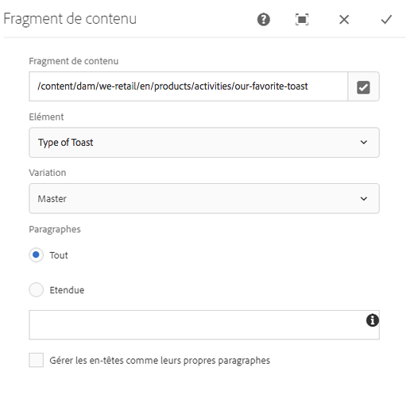
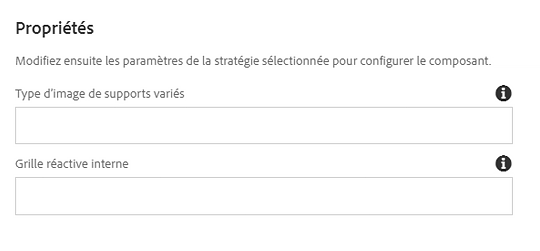

# Composant de fragment de contenu{#content-fragment-component}

Le composant Fragment de contenu de composant principal permet l&#39;affichage d&#39;un fragment [de contenu](https://helpx.adobe.com/experience-manager/6-5/assets/using/content-fragments.html).

>[!NOTE]
>
>Avant la version 2.4.0 des composants principaux, le composant Fragment de contenu était disponible en tant qu&#39;extension aux composants principaux et doit être téléchargé séparément et explicitement activé.

## Utilisation {#usage}

Le composant Fragment de contenu de composant principal permet l&#39;inclusion d&#39;un fragment [de contenu](https://helpx.adobe.com/experience-manager/6-5/assets/using/content-fragments.html) sur une page.

* Le fragment et ses propriétés peuvent être sélectionnés dans la [boîte de dialogue Configurer](#configure-dialog).
* Les types de ressource qui permettent de gérer certaines images et grilles peuvent être définis dans la boîte de dialogue [de conception](#design-dialog).
* L&#39;option de modification ouvre le fragment sélectionné dans l&#39;éditeur de fragments [de contenu](https://helpx.adobe.com/content/help/en/experience-manager/6-5/assets/using/content-fragments.html).

## Version et compatibilité {#version-and-compatibility}

La version actuelle du composant Fragment de contenu est v 1, qui a été introduite avec la version 1.1.0 des composants principaux d&#39;octobre 2017 et est décrite dans ce document.

Le tableau suivant détaille toutes les versions prises en charge du composant, les versions AEM avec lesquelles les versions du composant sont compatibles et les liens vers la documentation pour les versions précédentes.

| Version du composant | AEM 6.3 | AEM 6.4 | AEM 6.5 |
|--- |--- |--- |---|
| v1 | Compatible | Compatible | Compatible |

Pour plus d&#39;informations sur les versions et les versions des composants principaux, consultez les versions des composants de Document [principaux](versions.md).

## Exemple de sortie de composant {#sample-component-output}

Pour tester le composant Fragment de contenu ainsi que des exemples d&#39;options de configuration, ainsi que des sorties HTML et JSON, consultez la bibliothèque [de composants](http://opensource.adobe.com/aem-core-wcm-components/library/content-fragment.html).

## Détails techniques {#technical-details}

Vous trouverez la documentation technique la plus récente sur le composant [de fragment de contenu sur github](https://github.com/adobe/aem-core-wcm-components/tree/master/content/src/content/jcr_root/apps/core/wcm/components/contentfragment/v1/contentfragment).

Vous trouverez plus d&#39;informations sur le développement des composants principaux dans la documentation destinée aux développeurs de composants [principaux](developing.md).

## Configurer le dialogue {#configure-dialog}

La boîte de dialogue Configurer permet à l&#39;auteur de contenu de définir le fragment de contenu et les éléments de ce fragment à inclure.

* **Fragment de contenu**

   * Chemin d&#39;accès au fragment de contenu souhaité
   * Vous **pouvez utiliser le dialogue** de sélection pour localiser le fragment

* **Elément** : élément du fragment de contenu à inclure
* **Variation** - Which variation of the content fragment to use (defaults to **Master**)

* **Paragraphes**

   * **Tous** - Afficher tous les paragraphes
   * **Étendue**

      * Spécifiez les plages de paragraphes qui doivent être affichées, séparées par un point-virgule.
      * Pour inclure `1;3-5;7;9-*` les 1 st, les 3 ème, les 7 et les 9 pour les paragraphes finaux

* **Gérer le titre comme ses propres paragraphes**

## Créer un dialogue {#design-dialog}

Le dialogue de conception permet à l&#39;auteur du modèle de définir les types de ressource utilisés pour traiter les images de supports mixtes et les grilles adaptées.

* **Type d’image de supports variés**

   * Type de ressource Sling utilisé pour le rendu des images de supports variés

* **Grille réactive interne**

   * Type de ressource Sling utilisé pour la grille réactive interne