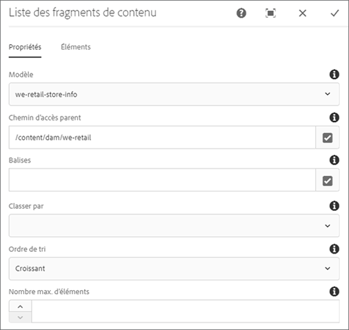

# Composant de liste de fragments de contenu{#content-fragment-list-component}

The Core Component Content Fragment List component allows for the display of a list of [content fragments](https://helpx.adobe.com/experience-manager/6-5/assets/using/content-fragments.html).

## Utilisation {#usage}

The Core Component Content Fragment List Component allows for the inclusion of a list of [content fragments](https://helpx.adobe.com/experience-manager/6-5/assets/using/content-fragments.html) on a page based on a Content Fragment model. This can be especially useful for creating [headless content](https://helpx.adobe.com/experience-manager/6-5/sites/developing/user-guide.html?topic=/experience-manager/6-5/sites/developing/morehelp/headless.ug.js) that can be easily consumed by other applications.

* La liste et ses propriétés peuvent être sélectionnées dans la [boîte de dialogue de configuration](#configure-dialog).
* Des styles peuvent être appliqués au composant dans la [boîte de dialogue de conception](#design-dialog).

## Version et compatibilité {#version-and-compatibility}

La version actuelle du composant de fragment de contenu est v1, qui a été introduite avec la version 2.4.0 des composants principaux en mai 2019. Elle est décrite dans ce document.

Le tableau ci-après présente en détail toutes les versions prises en charge du composant, les versions AEM avec lesquelles les versions du composant sont compatibles et les liens vers la documentation pour les versions précédentes.

| Version du composant | AEM 6.3 | AEM 6.4 | AEM 6.5 |
|--- |--- |--- |---|
| v1 | Compatible | Compatible | Compatible |

Pour plus d’informations sur les versions et les publications des composants principaux, voir le document sur les [versions des composants principaux](versions.md).

## Exemple de sortie de composant {#sample-component-output}

Pour tester le composant de liste de fragments de contenu et voir des exemples d’options de configuration et de sortie HTML et JSON, consultez la [bibliothèque de composants](http://opensource.adobe.com/aem-core-wcm-components/library/content-fragment-list.html).

## Détails techniques {#technical-details}

The latest technical documentation about the Content Fragment List Component can be found on GitHub.

Vous trouverez plus d’informations sur le développement des composants principaux dans la [documentation destinée aux développeurs de composants principaux](developing.md).

## Boîte de dialogue de configuration {#configure-dialog}

La boîte de dialogue de configuration permet à l’auteur du contenu de définir les fragments de contenu compris dans la liste et les éléments de ces fragments à inclure.

### Onglet Propriétés

L’onglet **Propriétés** définit les fragments de contenu inclus dans la liste. Cela repose principalement sur un modèle de fragment de contenu sélectionné, mais il existe d’autres options de filtrage disponibles.

* **Modèle** : chemin d’accès au modèle de fragment de contenu sur lequel repose la liste.
   * Par défaut, tous les fragments de contenu du modèle définis comme **chemin d’accès au modèle** sont inclus dans la liste.
* **Chemin d’accès parent** : chemin d’accès parent à partir duquel la liste doit être créée.
   * Les fragments de contenu reposant sur le **chemin d’accès au modèle** sélectionné sont filtrés sur ceux du **chemin d’accès parent** spécifié.
      * Cliquez ou appuyez sur le bouton **Boîte de dialogue Ouvrir la sélection** à droite du champ pour spécifier le chemin.
* **Balises** : seuls les fragments de contenu avec les balises spécifiées seront inclus dans la liste.
   * Cliquez ou appuyez sur le bouton **Boîte de dialogue Ouvrir la sélection** à droite du champ pour spécifier les balises.
   * Cliquez ou appuyez sur le X à côté des balises sélectionnées pour les supprimer.
* **Order By - Field of the content fragment model by which the list will be ordered**
   * Seuls les champs de texte (y compris les champs numériques, de date et d’heure) peuvent être sélectionnés.
* **Ordre** de tri - Mode de tri de la liste par le champ **Ordre par**
   * Ascending or descending
* **Nombre maximum d’éléments** - Nombre maximal d’éléments à afficher dans la liste
   * Aucune valeur ne renverra tous les éléments.

>[!NOTE]
>Les options **Ordre par**, Ordre de **tri** et Éléments **** max. ont été introduites avec la version 2.7.0 des composants principaux.

### Onglet Éléments

Par défaut, tous les éléments du modèle de fragment de contenu seront inclus dans la liste (sauf si le champ Éléments **** max. est limité). The **Elements** tab allows you to specify only specific elements to include.

* **Éléments** : seuls les éléments des fragments de contenu figurant dans la liste spécifiée apparaissent.
   * Cliquez ou appuyez sur le bouton **Ajouter** pour ajouter un nouvel élément..
   * Click or tap the **Delete** button to remove a selected element.
   * Faites glisser la poignée **Ordre** pour réorganiser l’ordre des éléments.

## Boîte de dialogue de conception {#design-dialog}

La boîte de dialogue de conception permet à l’auteur du modèle de définir les styles appliqués au composant de liste de fragments de contenu.
