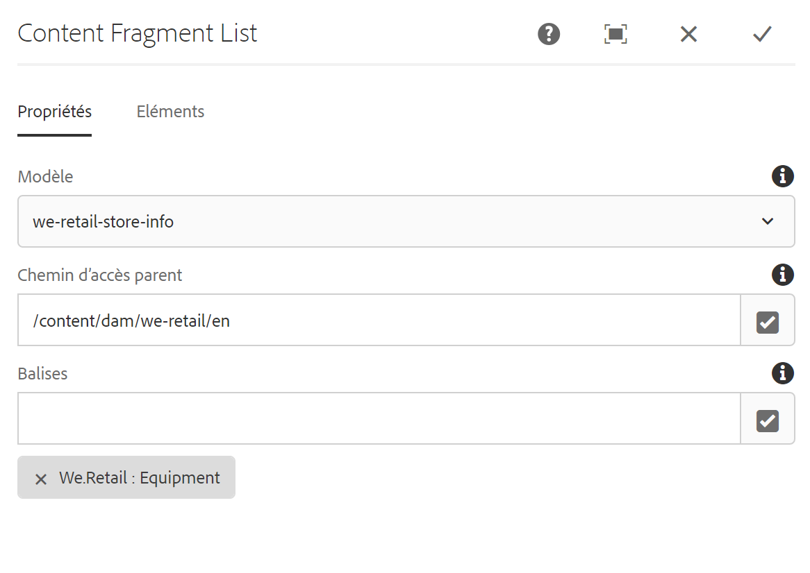
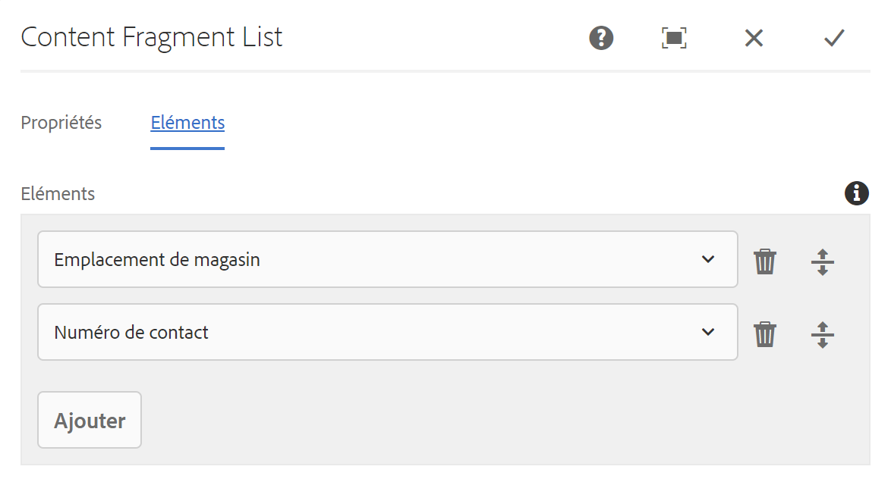

# Composant Liste de fragments de contenu{#content-fragment-list-component}

Le composant Liste de fragments de contenu de composant principal permet l&#39;affichage d&#39;une liste de fragments [de contenu](https://helpx.adobe.com/experience-manager/6-5/assets/using/content-fragments.html).

## Utilisation {#usage}

Le composant Liste de fragments de contenu de composant principal permet l&#39;inclusion d&#39;une liste de fragments [de contenu](https://helpx.adobe.com/experience-manager/6-5/assets/using/content-fragments.html) sur une page basée sur un modèle de fragment de contenu. Cela peut être particulièrement utile pour créer [un contenu](https://helpx.adobe.com/experience-manager/6-5/sites/developing/user-guide.html?topic=/experience-manager/6-5/sites/developing/morehelp/headless.ug.js) sans affichage qui peut facilement être utilisé par d&#39;autres applications.

* La liste et ses propriétés peuvent être sélectionnées dans la [boîte de dialogue Configurer](#configure-dialog).
* Les styles peuvent être appliqués au composant dans la boîte de dialogue [de conception](#design-dialog).

## Version et compatibilité {#version-and-compatibility}

La version actuelle du composant Fragment de contenu est v 1, qui a été introduite avec la version 2.4.0 des composants principaux en mai 2019 et est décrite dans ce document.

Le tableau suivant détaille toutes les versions prises en charge du composant, les versions AEM avec lesquelles les versions du composant sont compatibles et les liens vers la documentation pour les versions précédentes.

| Version du composant | AEM 6.3 | AEM 6.4 | AEM 6.5 |
|--- |--- |--- |---|
| v1 | Compatible | Compatible | Compatible |

Pour plus d&#39;informations sur les versions et les versions des composants principaux, consultez les versions des composants de Document [principaux](versions.md).

## Exemple de sortie de composant {#sample-component-output}

Pour tester le composant Liste de fragments de contenu ainsi que des exemples d&#39;options de configuration, ainsi que des sorties HTML et JSON, consultez la bibliothèque [de composants](http://opensource.adobe.com/aem-core-wcm-components/library/content-fragment-list.html).

## Détails techniques {#technical-details}

Vous trouverez la documentation technique la plus récente sur le composant [de liste de fragments de contenu sur github](https://github.com/adobe/aem-core-wcm-components/blob/master/content/src/content/jcr_root/apps/core/wcm/components/contentfragmentlist/v1/contentfragmentlist).

Vous trouverez plus d&#39;informations sur le développement des composants principaux dans la documentation destinée aux développeurs de composants [principaux](developing.md).

## Configurer le dialogue {#configure-dialog}

La boîte de dialogue Configurer permet à l&#39;auteur de contenu de définir les fragments de contenu comprenant la liste et les éléments de ces fragments à inclure.

### Onglet Propriétés

L&#39;onglet **Propriétés** définit les fragments de contenu inclus dans la liste. Cela repose principalement sur un modèle de fragment de contenu sélectionné, mais il existe d&#39;autres options de filtrage disponibles.

* **Modèle** - Chemin d&#39;accès au modèle de fragment de contenu sur lequel repose la liste.
   * Par défaut, tous les fragments de contenu du modèle défini comme **chemin** du modèle sont inclus dans la liste.
* **Chemin parent** - Chemin parent à partir duquel la liste doit être créée.
   * Les fragments de contenu basés sur le chemin **du modèle** sélectionné seront filtrés sur ceux du chemin **parent spécifié**.
   * Cliquez ou appuyez sur le **bouton Ouvrir la boîte de dialogue** de sélection à droite du champ pour spécifier le chemin.
* **Balises** - Seuls les fragments de contenu avec les balises spécifiées seront inclus dans la liste.
   * Cliquez ou appuyez sur le **bouton Ouvrir la boîte de dialogue** de sélection à droite du champ pour spécifier les balises.
   * Cliquez ou appuyez sur le X en regard des balises sélectionnées pour les supprimer.

### Onglet Eléments

Par défaut, tous les éléments du modèle de fragment de contenu seront inclus dans la liste. **Les éléments** vous permettent de spécifier uniquement des éléments spécifiques à inclure.

* **Eléments** - Seuls les éléments des fragments de contenu figurant dans la liste spécifiée apparaissent.
   * Cliquez ou appuyez sur le **bouton Ajouter** pour ajouter un nouvel élément.
   * Cliquez ou appuyez sur le **bouton Supprimer** pour supprimer un élément sélectionné.
   * Faites glisser la poignée **Ordre** pour réorganiser l&#39;ordre des éléments.

## Créer un dialogue {#design-dialog}

Le dialogue de conception permet à l&#39;auteur du modèle de définir les styles appliqués au composant de liste de fragments de contenu.