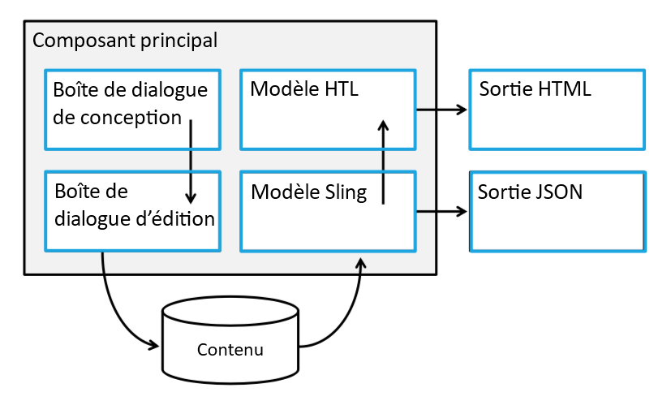

# Personnalisation des composants principaux{#customizing-core-components}

Les composants [principaux](developing.md) implémentent plusieurs modèles permettant une personnalisation facile, du style simple à la réutilisation avancée des fonctionnalités.

## Architecture souple {#flexible-architecture}

Les composants principaux ont été conçus au début pour être souples et extensibles. Une analyse de leur architecture révèle l&#39;emplacement de personnalisation.



* [Le dialogue de conception](authoring.md#edit-and-design-dialogs) définit ce que les auteurs peuvent ou ne peuvent pas faire dans la boîte de dialogue Modifier.
* [Le dialogue Modifier](authoring.md#edit-and-design-dialogs) affiche les auteurs uniquement les options qu&#39;ils sont autorisés à utiliser.
* [Le modèle Sling](#customizing-the-logic-of-a-core-component) vérifie et prépare le contenu pour la vue (modèle).
* [Le résultat du modèle Sling](#customizing-the-logic-of-a-core-component) peut être sérialisé dans les cas d&#39;utilisation JSON pour les applications monopages.
* [Le code HTL effectue le rendu du côté](#customizing-the-markup) serveur HTML pour le rendu classique côté serveur.
* [La sortie HTML](#customizing-the-markup) est sémantique, accessible, optimisée pour le moteur de recherche et facile à mettre en forme.

Et tous les composants principaux implémentent le [système de style](customizing.md).

## Modèles de personnalisation {#customization-patterns}

### Personnalisation des dialogues {#customizing-dialogs}

Il peut être souhaitable de personnaliser les options de configuration disponibles dans un dialogue de composant principal, qu&#39;il s&#39;agisse de [la boîte de dialogue Conception ou de la boîte de dialogue Modifier le dialogue](authoring.md).

Chaque dialogue possède une structure de nœud cohérente. Il est recommandé de répliquer cette structure dans un composant héritant de sorte que [Sling Resource Fusion](https://helpx.adobe.com/experience-manager/6-4/sites/developing/using/sling-resource-merger.html) et [Hide puissent](https://helpx.adobe.com/experience-manager/6-5/sites/developing/using/hide-conditions.html) servir à masquer, remplacer ou réorganiser les sections de la boîte de dialogue d&#39;origine. La structure à répliquer est définie comme tout élément jusqu&#39;au niveau de nœud de l&#39;élément de tabulation.

Pour être entièrement (compatible avec toutes les modifications apportées à une boîte de dialogue sur sa version actuelle), il est important que les structures sous le niveau de l&#39;élément de tabulation ne soient pas touchées (masquées, ajoutées, remplacées, réorganisées, etc.). À la place, un élément de tabulation du parent doit être masqué via `sling:hideResource` la propriété (voir [Propriétés de fusion des ressources Sling](https://helpx.adobe.com/experience-manager/6-5/sites/developing/using/sling-resource-merger.html)) et de nouveaux éléments de tabulation ajoutés contiennent les champs de configuration personnalisés. `sling:orderBefore` peut être utilisé pour réorganiser les éléments de tabulation si nécessaire.

Le dialogue ci-dessous illustre la structure de dialogue recommandée et explique comment masquer et remplacer un onglet hérité comme décrit ci-dessus :

<!-- 

Comment Type: annotation
Last Modified By: ims-author-CE1E2CE451D1F0680A490D45@AdobeID
Last Modified Date: 2017-04-17T17:43:20.265-0400

Should we provide guidance on how to name their CSS classes, etc. to align to component re-usability best-practices? We tout that we follow bootstrap css naming, should we be counseling customers to align similarly? .cmp- 
<component name="">
  -- 
 <element>
   - 
  <element descriptor="">
    ? 
  </element> 
 </element> 
</component>

 -->

```xml
<?xml version="1.0" encoding="UTF-8"?>
<jcr:root xmlns:sling="https://sling.apache.org/jcr/sling/1.0"
          xmlns:jcr="https://www.jcp.org/jcr/1.0"
          xmlns:nt="https://www.jcp.org/jcr/nt/1.0"
          xmlns:granite="https://www.adobe.com/jcr/granite/1.0"
          jcr:primaryType="nt:unstructured">
    <content jcr:primaryType="nt:unstructured">
        <items jcr:primaryType="nt:unstructured">
            <tabs jcr:primaryType="nt:unstructured">
                <items jcr:primaryType="nt:unstructured">
                        <originalTab
                                jcr:primaryType="nt:unstructured"
                                sling:hideResource="true"/>
                        </originalTab>
                        <myTab
                               jcr:primaryType="nt:unstructured"
                               jcr:title="My Tab"
                               sling:resourceType="granite/ui/components/coral/foundation/container"/>
                               <!-- myTab content -->
                        </myTab>
                </items>
            </basic>
        </items>
    </content>
</jcr:root>
```

### Personnalisation de la logique d&#39;un composant principal {#customizing-the-logic-of-a-core-component}

La logique métier des composants principaux est implémentée dans les modèles Sling. Cette logique peut être étendue à l&#39;aide d&#39;un modèle de délégation Sling.

Par exemple, le composant principal Titre utilise `jcr:title` la propriété de la ressource demandée pour fournir le texte du titre. Si aucune `jcr:title` propriété n&#39;est définie, une reprise au titre de la page en cours est implémentée. Nous voulons modifier le comportement de sorte que le titre de la page active soit toujours affiché.

L&#39;implémentation des modèles de composants principaux étant privée, elles doivent être étendues avec un modèle de délégation.

```java
@Model(adaptables = SlingHttpServletRequest.class,
       adapters = Title.class,
       resourceType = "myproject/components/pageHeadline")
public class PageHeadline implements Title {
    @ScriptVariable private Page currentPage;
    @Self @Via(type = ResourceSuperType.class)
    private Title title;
    @Override public String getText() {
        return currentPage.getTitle();
    }
    @Override public String getType() {
        return title.getType();
    }
}
```

Pour plus d&#39;informations sur le modèle de délégation, voir le modèle de délégation github Wiki Pattern [Délégation for Sling Models](https://github.com/adobe/aem-core-wcm-components/wiki/Delegation-Pattern-for-Sling-Models).

### Personnalisation des annotations {#customizing-the-markup}

La mise en forme avancée requiert parfois une structure d&#39;annotation différente du composant.

Cela peut facilement être réalisé en copiant les fichiers HTL qui doivent être modifiés du composant principal dans le composant proxy.

En reprenant l&#39;exemple du composant de chemin de navigation principal, pour personnaliser sa sortie de balisage, `breadcrumb.html` le fichier doit être copié dans le composant spécifique au site dont a `sling:resourceSuperTypes` pointe vers le composant de chemin de navigation principal.

<!-- 

Comment Type: annotation
Last Modified By: ims-author-CE1E2CE451D1F0680A490D45@AdobeID
Last Modified Date: 2017-04-17T17:43:20.265-0400

Should we provide guidance on how to name their CSS classes, etc. to align to component re-usability best-practices? We tout that we follow bootstrap css naming, should we be counseling customers to align similarly? .cmp- 
<component name="">
  -- 
 <element>
   - 
  <element descriptor="">
    ? 
  </element> 
 </element> 
</component>

 -->

### Style des composants {#styling-the-components}

La première forme de personnalisation consiste à appliquer des styles CSS.

Pour faciliter cette opération, les composants principaux affichent les annotations sémantiques et suivent une convention d&#39;affectation de nom normalisée inspirée par [l&#39;amorçage](https://getbootstrap.com/). De plus, pour cibler et namespace facilement les styles pour les composants individuels, chaque composant principal est encapsulé dans un élément DIV avec les classes `cmp`«  » et «  `cmp-<name>` ».

Par exemple, en examinant le fichier HTL du composant de chemin de navigation principal v 1 : [breadcrumb.html](https://github.com/adobe/aem-core-wcm-components/blob/master/content/src/content/jcr_root/apps/core/wcm/components/breadcrumb/v2/breadcrumb/breadcrumb.html), nous voyons que la hiérarchie des éléments est la suivante `ol.breadcrumb > li.breadcrumb-item > a`. Pour vous assurer qu&#39;une règle CSS affecte uniquement la classe de chemin de navigation de ce composant, toutes les règles doivent être nommément appelées comme illustré ci-dessous :

```shell
.cmp-breadcrumb .breadcrumb {}  
.cmp-breadcrumb .breadcrumb-item {}  
.cmp-breadcrumb a {}
```

De plus, chacun des composants principaux utilise la fonctionnalité Système [de style AEM](https://helpx.adobe.com/experience-manager/6-5/sites/authoring/using/style-system.html) qui permet aux auteurs de modèles de définir des noms de classe CSS supplémentaires qui peuvent être appliqués au composant par les auteurs de pages. Cela permet de définir chaque modèle une liste de styles de composants autorisés et précise si l&#39;un d&#39;eux doit s&#39;appliquer par défaut à tous les composants de ce type.

## Compatibilité de la mise à niveau des personnalisations {#upgrade-compatibility-of-customizations}

Trois types de mise à niveau sont possibles :

* mise à niveau de la version d&#39;AEM
* mise à niveau des composants principaux vers une nouvelle version mineure
* mise à niveau des composants principaux vers une version majeure

En règle générale, la mise à niveau d&#39;AEM vers une nouvelle version n&#39;affectera pas les composants principaux ou les personnalisations, à condition que les versions des composants prennent également en charge la nouvelle version AEM qui est migrée et que les personnalisations n&#39;utilisent pas les API [obsolètes ou supprimées](https://helpx.adobe.com/experience-manager/6-5/release-notes/deprecated-removed-features.html).

La mise à niveau des composants principaux sans passer à une version majeure plus récente ne devrait pas affecter les personnalisations tant que les modèles de personnalisation décrits sur cette page sont utilisés.

Le passage à une nouvelle version majeure des composants principaux est compatible uniquement avec la structure de contenu, mais il est possible que des personnalisations doivent être recomposées. Effacer les journaux des modifications sera publié pour chaque version de composant afin de mettre en évidence les modifications qui affecteraient le type de personnalisations décrit sur cette page.

## Prise en charge des personnalisations {#support-of-customizations}

À l&#39;instar d&#39;un composant AEM, il existe un certain nombre de points à prendre en compte concernant les personnalisations :

1. **Ne modifiez jamais directement le code des composants principaux.**

   Cela ne les rendrait pas entièrement prises en charge et les mises à jour ultérieures des composants sont douloureuses. Utilisez plutôt les méthodes de personnalisation décrites sur cette page.

1. **Le code personnalisé est votre propre responsabilité.**

   Notre programme de support ne couvre pas le code personnalisé et les problèmes signalés qui ne peuvent pas être reproduit avec les composants de base Vanille [utilisés comme documentés](using.md) ne sont pas qualifiés.

1. **Regardez les fonctionnalités obsolètes et supprimées.**

   Chaque nouvelle version d&#39;AEM étant mise à niveau vers, assurez-vous que toutes les API utilisées restent d&#39;actualité en observant la page Obsolète et [Supprimer les fonctionnalités](https://helpx.adobe.com/experience-manager/6-5/release-notes/deprecated-removed-features.html) supprimées.

Voir aussi la section [Prise en charge](developing.md#core-component-support) des composants principaux.

**À lire aussi :**

* [Utilisation des composants](using.md) principaux - Soyez opérationnel avec les composants principaux de votre propre projet.
* [Instructions sur les composants](guidelines.md) - pour connaître les schémas d&#39;implémentation des composants principaux.
