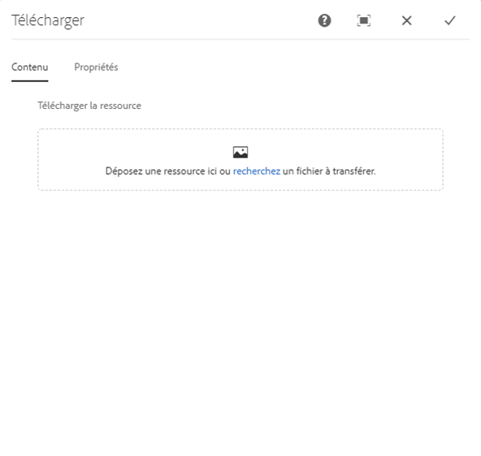
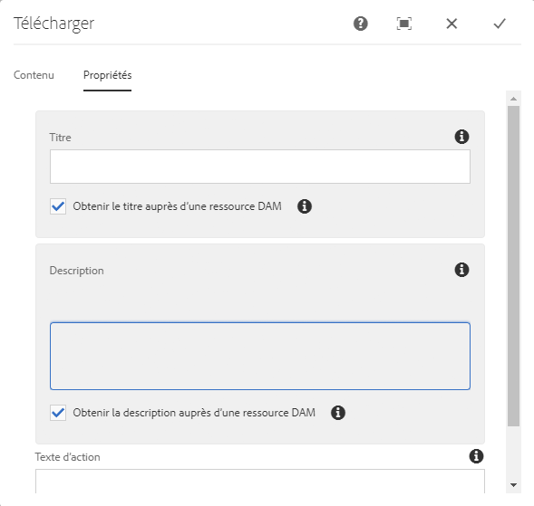
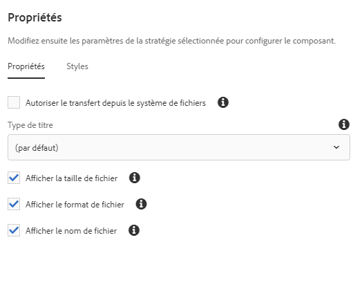

# Download Component{#download-component}

Le composant Téléchargement de composant principal permet la création d&#39;une option de téléchargement sur une page.

## Utilisation {#usage}

Le composant Téléchargement de composant principal permet l&#39;inclusion d&#39;une option de téléchargement et de son fichier associé sur une page.

* The download option&#39;s properties can be selected in the [configure dialog](#configure-dialog).
* Defaults for the download component can be defined in the [design dialog](#design-dialog).

## Version et compatibilité {#version-and-compatibility}

La version actuelle du composant Télécharger est v 1, qui a été introduite avec la version 2.5.0 des composants principaux en juin 2019 et est décrite dans ce document.

Le tableau suivant détaille toutes les versions prises en charge du composant, les versions AEM avec lesquelles les versions du composant sont compatibles et les liens vers la documentation pour les versions précédentes.

| Composant Version | AEM 6.3 | AEM 6.4 | AEM 6.5 |
|--- |--- |--- |---|
| v1 | Compatible | Compatible | Compatible |

Pour plus d’informations sur les versions et les mises à jour des composants principaux, consultez le document sur les [versions des composants principaux](versions.md).

## Exemple de sortie de composant {#sample-component-output}

To experience the Download Component as well as see examples of its configuration options as well as HTML and JSON output, visit the [Component Library](http://opensource.adobe.com/aem-core-wcm-components/library/download.html).

## Détails techniques {#technical-details}

The latest technical documentation about the Download Component [can be found on GitHub](https://github.com/adobe/aem-core-wcm-components/tree/master/content/src/content/jcr_root/apps/core/wcm/components/download/v1/download).

Vous trouverez plus d’informations sur le développement des composants principaux dans la [documentation destinée aux développeurs de composants principaux](developing.md).

## Boîte de dialogue Configurer {#configure-dialog}

La configuration de la boîte de dialogue permet à l&#39;auteur du contenu de définir l&#39;élément de téléchargement et son comportement et d&#39;apparaître pour un visiteur sur la page.

### Onglet Ressources {#asset-tab}

The selection of a download asset is very similar to the functionality of the [Image Component](image.md) and likewise leverages AEM&#39;s DAM.

* **Télécharger la ressource**
   * Drop an asset from the [asset browser](https://helpx.adobe.com/experience-manager/6-5/sites/authoring/using/author-environment-tools.html) or tap the **browse** option to upload from a local file system.
   * Appuyez ou cliquez sur **Effacer** pour désélectionner l’image actuellement sélectionnée.
   * Tap or click **Edit** to [mange the renditions of the asset](https://helpx.adobe.com/experience-manager/6-5/assets/using/managing-assets-touch-ui.html) in the asset editor.

### Onglet Propriétés {#properties-tab}

* **Titre** - S&#39;affiche comme titre de l&#39;article de téléchargement
   * **Obtenir le titre de la ressource** DAM : lorsqu&#39;il est sélectionné, le titre est automatiquement renseigné avec le titre du fichier DAM.
* **Description** - S&#39;affiche sous forme de sous-titre descriptif de l&#39;élément de téléchargement
   * **Obtenir la description de la ressource** DAM : lorsqu&#39;elle est sélectionnée, la description est automatiquement renseignée avec la description du fichier DAM.
* **Texte de l&#39;action** : affiche le texte d&#39;action pour l&#39;élément de téléchargement
   * Ce champ est requis lors du transfert d&#39;un fichier à partir du système de fichiers.
   * **Afficher en ligne** : lorsque le texte d&#39;action fourni **est sélectionné, le texte** d&#39;action fourni s&#39;affiche en ligne.

## Boîte de dialogue Conception {#design-dialog}

Le dialogue de conception permet à l&#39;auteur du modèle de définir les options disponibles pour l&#39;auteur du contenu qui utilise le composant Télécharger.

### Onglet Propriétés {#properties-tab-design}

* **Texte d&#39;action par défaut** : définit le texte **d&#39;action par défaut** fourni lorsqu&#39;un auteur ajoute le composant Télécharger à une page.
* **Autoriser le téléchargement à partir du système** de fichiers : permet à l&#39;auteur du contenu de télécharger un fichier depuis son système de fichiers local comme actif de téléchargement.
   * La valeur par défaut est désélectionnée.
* **Type de titre** : élément HTML utilisé pour le titre du composant Télécharger.
   * Si aucune valeur n&#39;est sélectionnée, la valeur par défaut est H 3.
* **Taille du fichier d&#39;affichage** : lorsque la taille du fichier est sélectionnée, la taille du fichier est affichée dans le composant de téléchargement.
   * La valeur par défaut est sélectionnée.
* **Format du fichier d&#39;affichage** : lorsqu&#39;il est sélectionné, le format de fichier du fichier s&#39;affiche dans le composant de téléchargement.
   * La valeur par défaut est sélectionnée.
* **Afficher le nom de fichier** : lorsqu&#39;il est sélectionné, le nom de fichier du fichier s&#39;affiche dans le composant de téléchargement.
   * La valeur par défaut est sélectionnée.

### Onglet Styles {#styles-tab}

Le composant Image prend en charge le [système de style](authoring.md#component-styling) AEM.
