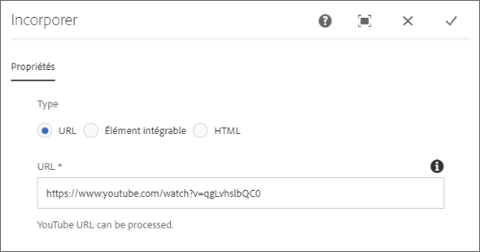
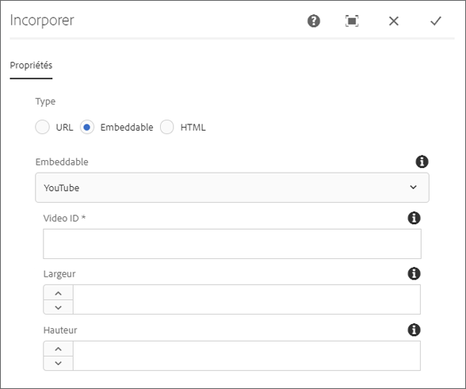
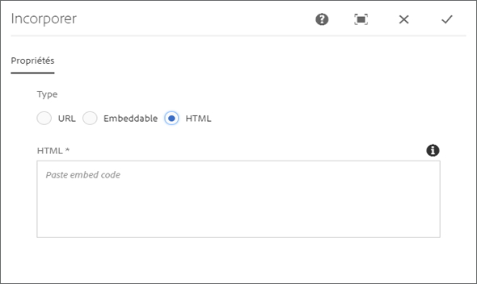
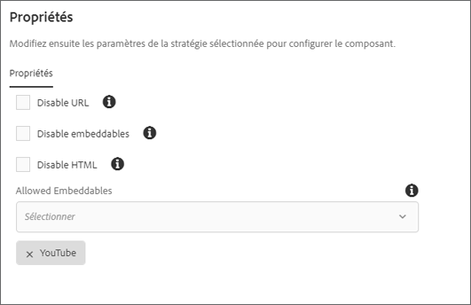

# Composant Incorporer{#embed-component}

Le composant Incorporer des composants principaux permet d’incorporer du contenu externe dans une page de contenu AEM.

## Utilisation {#usage}

Le composant Incorporer des composants principaux permet à l’auteur de contenu de définir le contenu externe sélectionné à incorporer dans une page de contenu AEM. En outre, une option permet de définir du code HTML de forme libre à incorporer.

* Les propriétés du composant peuvent être définies dans la [boîte de dialogue de configuration](#configure-dialog).
* Les valeurs par défaut du composant lors de son ajout à une page peuvent être définies dans la [boîte de dialogue de conception](#design-dialog).

## Version et compatibilité {#version-and-compatibility}

La version actuelle du composant Incorporer est v1, qui a été introduite avec la version 2.7.0 des composants principaux en septembre 2019. Elle est décrite dans ce document.

Le tableau ci-après présente en détail toutes les versions prises en charge du composant, les versions AEM avec lesquelles les versions du composant sont compatibles et les liens vers la documentation pour les versions précédentes.

| Version du composant | AEM 6.3 | AEM 6.4 | AEM 6.5 |
|--- |--- |--- |---|
| v1 | Compatible | Compatible | Compatible |

Pour plus d’informations sur les versions et les publications des composants principaux, voir le document sur les [versions des composants principaux](versions.md).

## Exemple de sortie de composant {#sample-component-output}

Pour tester le composant Incorporer et obtenir des exemples d’options de configuration, ainsi que des sorties HTML et JSON, consultez la [Bibliothèque de composants](http://opensource.adobe.com/aem-core-wcm-components/library/embed.html).

## Détails techniques {#technical-details}

La documentation technique la plus récente sur le composant Incorporer [se trouve sur GitHub](https://github.com/adobe/aem-core-wcm-components/tree/master/content/src/content/jcr_root/apps/core/wcm/components/embed/v1/embed).

Vous trouverez plus d’informations sur le développement des composants principaux dans la [documentation destinée aux développeurs de composants principaux](developing.md).

## Boîte de dialogue de configuration {#configure-dialog}

La boîte de dialogue de configuration permet à l’auteur de contenu de définir la ressource externe à incorporer dans la page. Sélectionnez d’abord le type de ressource à incorporer :

* [URL](#url)
* [Élément intégrable](#embeddable)
* [HTML](#html)

### URL {#url}

L’incorporation la plus simple se fait par le biais d’une URL. Il vous suffit de coller l’URL de la ressource à incorporer dans le champ **URL**. Le composant tente d’accéder à la ressource. Si le rendu peut être effectué par l’un des processeurs, il affiche un message de confirmation sous le champ **URL**. Si ce n’est pas le cas, le champ sera indiqué comme étant dans un état d’erreur.

Le composant Incorporer est fourni avec des processeurs pour les types de ressources suivants :

* les ressources conformes à la [norme oEmbed](https://oembed.com/), notamment Facebook Post, Instagram, SoundCloud, Twitter et YouTube ;
* Pinterest.

Les développeurs peuvent ajouter d’autres processeurs d’URL en [consultant la documentation sur le composant Incorporer destinée aux développeurs.](https://github.com/adobe/aem-core-wcm-components/tree/master/content/src/content/jcr_root/apps/core/wcm/components/embed/v1/embed#extending-the-embed-component)

### Élément intégrable {#embeddable}

Les éléments intégrables permettent une plus grande personnalisation de la ressource incorporée, qui peut être paramétrée et inclure des informations supplémentaires. Un auteur peut effectuer un choix parmi des éléments intégrables approuvés préconfigurés. De plus, le composant est fourni avec un élément intégrable YouTube prêt à l’emploi.

Le champ **Élément intégrable** définit le type de processeur que vous souhaitez utiliser. Dans le cas de l’élément intégrable YouTube, vous pouvez ensuite définir les éléments suivants :

* **ID de la vidéo** : identifiant vidéo unique de YouTube de la ressource que vous souhaitez incorporer.
* **Largeur** : largeur de la vidéo incorporée.
* **Hauteur** : hauteur de la vidéo incorporée.

D’autres éléments intégrables proposent des champs similaires et peuvent être définis par un développeur en [consultant la documentation sur le composant Incorporer destinée aux développeurs.](https://github.com/adobe/aem-core-wcm-components/tree/master/content/src/content/jcr_root/apps/core/wcm/components/embed/v1/embed#extending-the-embed-component)

>[!NOTE]
>Pour être accessibles à l’auteur de la page, les éléments intégrables doivent être activés au niveau du modèle au moyen de la [boîte de dialogue de conception](#design-dialog).

### HTML {#html}

Vous pouvez ajouter du code HTML de forme libre à votre page à l’aide du composant Incorporer.

>[!NOTE]
>Les balises non sécurisées, telles que les scripts, sont filtrées à partir du code HTML entré et ne sont pas affichées sur la page obtenue.

#### Sécurité {#security}

Les balises HTML que l’auteur peut entrer sont filtrées à des fins de sécurité pour éviter toute attaque de script entre sites qui pourrait permettre aux auteurs d’obtenir des droits d’administration, par exemple.

*En règle générale,* tous les scripts et les éléments`style`, ainsi que tous les attributs `on*` et `style` sont supprimés de la sortie.

Toutefois, les règles sont plus complexes, car le composant Incorporer suit l’ensemble de règles de filtrage de la structure d’assainissement HTML AntiSamy d’AEM, qui se trouve à l’adresse `/libs/cq/xssprotection/config.xml`. Cela peut être superposé pour une configuration spécifique au projet par un développeur, si nécessaire.

Des informations de sécurité supplémentaires sont disponibles dans la [documentation AEM destinée aux développeurs](https://helpx.adobe.com/fr/experience-manager/6-5/sites/developing/using/security.html).

>[!NOTE]
>Bien que les règles de structure d’assainissement AntiSamy puissent être configurées en superposant `/libs/cq/xssprotection/config.xml`, ces modifications ont un impact sur l’ensemble du comportement HTL et JSP et pas seulement sur le composant principal Incorporer.

## Boîte de dialogue de conception {#design-dialog}

La boîte de dialogue de conception permet à l’auteur du modèle de définir les options disponibles pour l’auteur du contenu qui utilise le composant Incorporer et les valeurs par défaut définies lors du placement de celui-ci.

* **URL de désactivation** : lorsque cette option est sélectionnée, elle désactive l’option **URL** pour l’auteur de contenu.
* **Désactiver les éléments intégrables** : lorsque cette option est sélectionnée, elle désactive l’option **Élément intégrable** pour l’auteur de contenu, quels que soient les processeurs intégrables autorisés.
* **Désactiver HTML** : lorsque cette option est sélectionnée, elle désactive l’option **HTML** pour l’auteur de contenu.
* **Éléments intégrables autorisés** : sélection multiple qui définit les processeurs intégrables accessibles à l’auteur de contenu, à condition que l’option **Élément intégrable** soit active.
