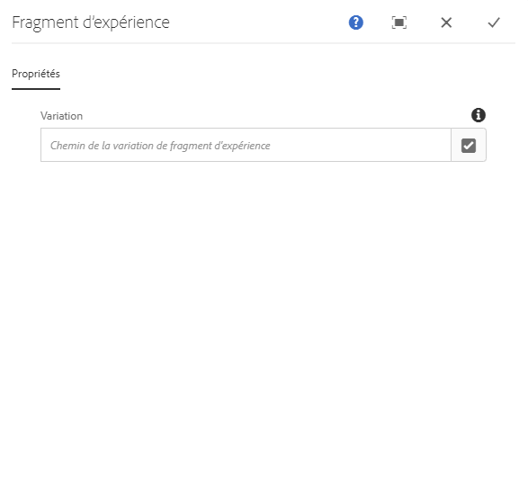
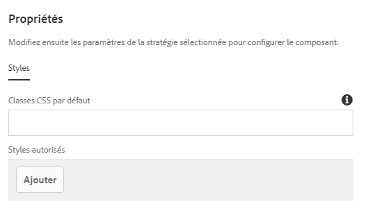

# Composant Fragment d'expérience{#experience-fragment-component}

Le composant Fragment d'expérience de composant principal permet à l'auteur du contenu de placer une variation de fragment d'expérience sur une page tout en prenant en charge une structure localisée localisée.

## Utilisation {#usage}

Le composant Fragment d'expérience de composant principal permet à l'auteur du contenu de sélectionner à partir des varations de fragments d'expérience existantes et de le placer dans la page de contenu. Le composant Fragment d'expérience prend également en charge une structure localisée de site.

* The components's properties can be defined in the [configure dialog](#configure-dialog).
* Defaults for the component when adding it to a page can be defined in the [design dialog](#design-dialog).

## Prise en charge de la structure localisée du site {#localized-site-structure}

Le composant Fragment d'expérience est adapté aux structures localisées du site et effectue le rendu du fragment d'expérience approprié en fonction de la localisation de la page. Pour ce faire, le fragment d'expérience doit respecter les conditions suivantes.

* Le composant Fragment d'expérience est ajouté à un modèle.
* Ce modèle est utilisé pour créer une page de contenu qui fait partie d'une structure localisée ci-dessous `/content/<site>`.
* Le fragment d'expérience référencé sur une page de contenu fait partie d'une structure de fragments d'expérience localisée ci-dessous `/content/experience-fragments` , qui suit les mêmes modèles que le site ci-dessous `/content/<site>` , y compris l'utilisation des mêmes noms de composant.

Dans ce cas, le fragment avec la même localisation (langue, plan directeur ou live copy) que la page active est rendu dans le modèle.

Ce comportement est limité aux composants de fragments d'expérience ajoutés aux modèles. Les composants de fragments d'expérience ajoutés aux pages de contenu individuelles affichent les rendus de fragments d'expérience exacts configurés dans le composant.

### Exemple {#example}

Imaginons que votre contenu ressemble à ceci :

```
/content
+-- experience-fragments
   \-- we-retail
      +-- language-masters
      +-- us
         +-- en
            +-- footerTextXf
            \-- headerTextXf
         \-- es
            +-- footerTextXf
            \-- headerTextXf
      \-- ch
         +-- de
            +-- footerTextXf
            \-- headerTextXf
         +-- fr
            +-- footerTextXf
            \-- headerTextXf
         \-- it
            +-- footerTextXf
            \-- headerTextXf
+-- we-retail
   +-- language-masters
   +-- us
      +-- en
      \-- es
   +-- ch
      +-- de
      +-- fr
      \-- it
+-- wknd-events
\-- wknd-shop
```

La structure ci-dessous `/content/experience-fragments/we-retail` reflète la structure de `/content/we-retail`.

Dans ce cas, si le composant Fragment d'expérience `/content/experience-fragments/we-retail/us/en/footerTextXf` est placé sur un modèle, les pages localisées créées à partir de ce modèle afficheront automatiquement le fragment d'expérience localisé correspondant à la page de contenu localisée.

Ainsi, si vous accédez à une page de contenu sous `/content/we-retail/ch/de` qui utilise le même modèle, `/content/experience-fragments/we-retail/ch/de/footerTextXf` sera rendu au lieu `/content/experience-fragments/we-retail/us/en/footerTextXf`de.

### Secours {#fallback}

Le composant Fragment d'expérience tentera de trouver un composant localisé correspondant dans l'ordre suivant.

1. Ffirst tente de trouver une racine de langue.
1. S'il est introuvable, il tente de trouver un plan directeur.
1. S'il est introuvable, il tente de trouver une copie dynamique.
1. S'il est introuvable, il correspond par défaut au fragment d'expérience configuré dans le composant.

## Version et compatibilité {#version-and-compatibility}

La version actuelle du composant de fragment d'expérience est v 1, qui a été introduite avec la version 2.6.0 des composants principaux d'août 2019 et est décrite dans ce document.

Le tableau ci-après présente en détail toutes les versions prises en charge du composant, les versions AEM avec lesquelles les versions du composant sont compatibles et les liens vers la documentation pour les versions précédentes.

| Version du composant | AEM 6.3 | AEM 6.4 | AEM 6.5 |
|--- |--- |--- |---|
| v1 | Compatible | Compatible | Compatible |

Pour plus d’informations sur les versions et les publications des composants principaux, voir le document sur les [versions des composants principaux](versions.md).

## Exemple de sortie de composant {#sample-component-output}

To experience the Experience Fragment Component as well as see examples of its configuration options as well as HTML and JSON output, visit the [Component Library](http://opensource.adobe.com/aem-core-wcm-components/library/experience-fragment.html).

## Détails techniques {#technical-details}

Vous trouverez la documentation technique la plus récente sur le composant [de fragment d'expérience sur github](https://github.com/adobe/aem-core-wcm-components/tree/master/content/src/content/jcr_root/apps/core/wcm/components/experience-fragment/v1/experience-fragment).

Vous trouverez plus d’informations sur le développement des composants principaux dans la [documentation destinée aux développeurs de composants principaux](developing.md).

## Boîte de dialogue de configuration {#configure-dialog}

La boîte de dialogue Configurer permet à l'auteur de contenu de sélectionner la variation de fragment d'expérience qui doit être générée sur la page.



Utilisez le bouton **Ouvrir la boîte de dialogue** de sélection pour ouvrir le sélecteur de composants afin de choisir la variation de composant de fragment d'expérience à ajouter à la page de contenu.

Si vous ajoutez le composant Fragment d'expérience à un modèle, notez qu'il sera automatiquement localisé à condition que les fragments d'expérience soient localisés. Ainsi, ce qui est généré sur la page peut différer du composant que vous sélectionnez explicitement. [Pour plus d'informations, reportez-vous à l'exemple ci-dessus](#example) .

## Boîte de dialogue de conception {#design-dialog}

Le dialogue de conception permet à l'auteur du modèle de définir les options disponibles pour l'auteur du contenu qui utilise le composant de fragment d'expérience et les valeurs par défaut définies lors de l'importation du composant de fragment d'expérience.



The Experience Fragment Component supports the AEM [Style System](authoring.md#component-styling).
