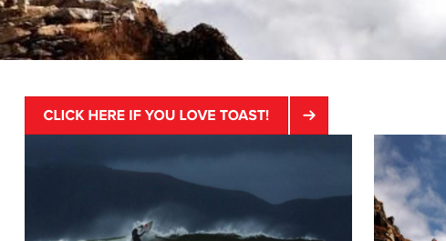
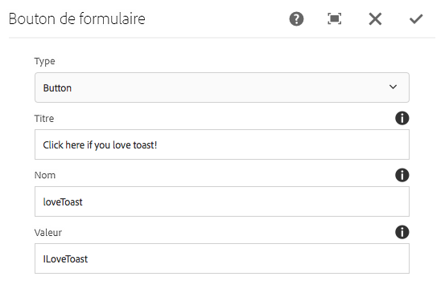

# Composant Bouton de formulaire (v 1){#form-button-component-v}

Le composant Bouton de formulaire principal permet l&#39;inclusion d&#39;un champ de bouton dans un formulaire pour déclencher une action.

## Utilisation {#usage}

Le composant Bouton de formulaire principal permet la création de champs de bouton, souvent pour déclencher l&#39;envoi du formulaire et est destiné à être utilisé avec le composant de conteneur [de formulaires](form-container.md).

Les propriétés de bouton peuvent être définies par l&#39;éditeur de contenu dans [la boîte de dialogue Configurer](form-button-v1.md#main-pars_title).

## Version et compatibilité {#version-and-compatibility}

Ce document décrit la version v 1 du composant Bouton de formulaire, introduite à l&#39;origine avec la version 1.0.0 des composants principaux avec AEM 6.3.

Le tableau suivant répertorie la compatibilité de la version v 1 du composant Bouton de formulaire.

| Version d’AEM | Composant Bouton de formulaire v 1 |
|--- |--- |
| 6.3 | Compatible |
| 6.4 | Compatible |

>[!CAUTION]
>
>Ce document décrit la version v 1 du composant Bouton de formulaire.
>
>Pour plus d&#39;informations sur la version actuelle du composant Bouton de formulaire, [voir le document Composant](form-button.md) Form Button.

## Exemple de sortie de composant {#sample-component-output}

Voici un exemple tiré de [We. Retail](https://helpx.adobe.com/experience-manager/6-4/sites/developing/using/we-retail.html).

### Capture d’écran {#screenshot}



### HTML {#html}

```
<div class="cmp cmp-button aem-GridColumn aem-GridColumn--default--12">
    <div class="cmp cmp-button">
        <button type="BUTTON" class="btn btn-action btn-primary" name="loveToast" value="ILoveToast">
            Click here if you love toast!
        </button>
    </div>
</div>
```

### JSON {#json}

```
"container": {
              "columnClassNames": "aem-GridColumn aem-GridColumn--default--12",
              "columnCount": 12,
              "gridClassNames": "aem-Grid aem-Grid--12 aem-Grid--default--12",
              ":items": {
                "button": {
                  "columnClassNames": "aem-GridColumn aem-GridColumn--default--12",
                  ":type": "weretail/components/form/button",
                  "name": "loveToast",
                  "jcr:title": "Click here if you love toast!",
                  "type": "submit",
                  "value": "ILoveToast"
                }
              },
              ":itemsOrder": [
                "button"
              ],
              ":type": "weretail/components/form/container"
            }
```

>[!NOTE]
>
>L&#39;exportation JSON à partir des composants principaux nécessite la version 1.1.0 des composants principaux. Pour plus d&#39;informations, consultez les [informations de compatibilité des composants principaux v 1](versions.md#main-pars_title_236368006) .

## Configurer le dialogue {#configure-dialog}

La boîte de dialogue Configurer permet à l&#39;auteur de contenu de définir les paramètres du bouton.



* **Type**
   * **Bouton**
   * **Envoyer**

* **Titre** - Texte affiché sur le bouton
   * Si aucune valeur n&#39;est définie par défaut sur le type de bouton

* **Nom** : nom du bouton qui est envoyé avec les données du formulaire.
* **Valeur** - Valeur du bouton qui est envoyée avec les données du formulaire.

## Créer un dialogue {#design-dialog}

Il n&#39;existe pas de dialogue de conception pour le composant Bouton de formulaire.

## Détails techniques {#technical-details}

Vous trouverez la documentation technique la plus récente sur le composant [Form Button sur github](https://github.com/adobe/aem-core-wcm-components/tree/master/content/src/content/jcr_root/apps/core/wcm/components/form/button/v1/button).

Le projet de composants principaux peut être téléchargé depuis github.

Vous trouverez plus d&#39;informations sur le développement des composants principaux dans la documentation destinée aux développeurs de composants [principaux](developing.md).
