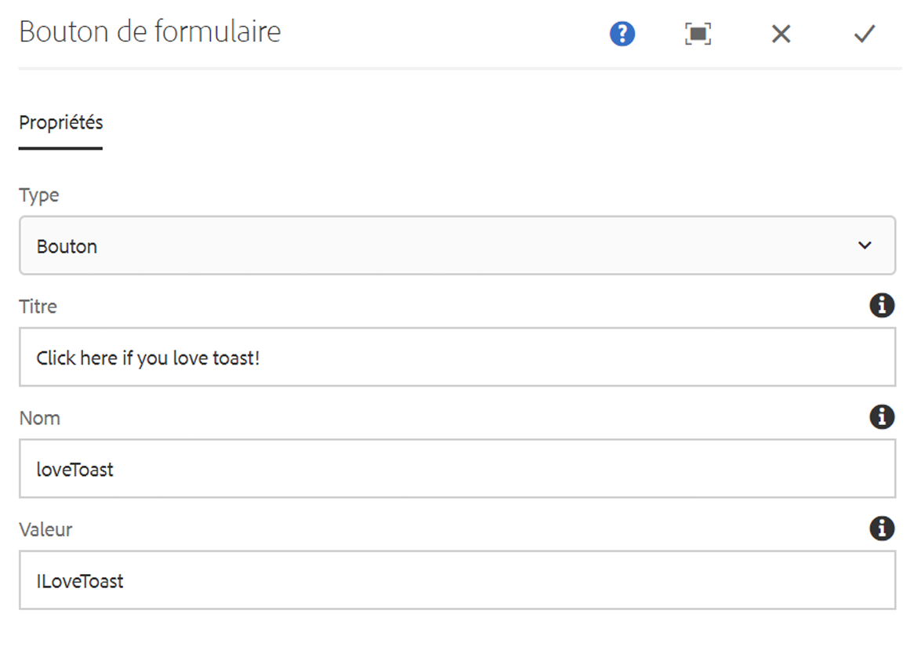

# Composant de bouton de formulaire{#form-button-component}

Le composant de bouton de formulaire des composants principaux permet l’inclusion d’un bouton pour déclencher une action sur une page.

## Utilisation {#usage}

Le composant de bouton de formulaire des composants principaux permet la création de champs de bouton, souvent pour déclencher l’envoi du formulaire et est destiné à être utilisé avec le [composant de conteneur de formulaires](form-container.md).

Les propriétés de bouton peuvent être définies par l’éditeur de contenu dans la [boîte de dialogue de configuration](form-button.md).

## Version et compatibilité {#version-and-compatibility}

La version actuelle du composant de bouton de formulaire est v2, qui a été introduite avec la version 2.0.0 des composants principaux en janvier 2018. Elle est décrite dans ce document.

Le tableau ci-après présente en détail toutes les versions prises en charge du composant, les versions AEM avec lesquelles les versions du composant sont compatibles et les liens vers la documentation pour les versions précédentes.

| Version du composant | AEM 6.3 | AEM 6.4 | AEM 6.5 | AEM en tant que service cloud |
|--- |--- |--- |--- |---|
| v2 | Compatible | Compatible | Compatible | Compatible |
| [v1](form-button-v1.md) | Compatible | Compatible | Compatible | - |

Pour plus d’informations sur les versions et les publications des composants principaux, voir le document sur les [versions des composants principaux](versions.md).

## Exemple de sortie de composant {#sample-component-output}

Voici un exemple extrait de [We.Retail](https://helpx.adobe.com/experience-manager/6-5/sites/developing/using/we-retail.html).

### Capture d’écran {#screenshot}


### HTML {#html}

```
<div class="container responsivegrid aem-GridColumn aem-GridColumn--default--12">
<form method="POST" action="/content/we-retail/us/en/experience.html" id="new_form" name="new_form" enctype="multipart/form-data" class="cmp-form aem-Grid aem-Grid--12 aem-Grid--default--12">
    <input type="hidden" name=":formstart" value="/content/we-retail/us/en/experience/jcr:content/root/responsivegrid/container">
    
    <div class="button aem-GridColumn aem-GridColumn--default--12">
<button type="BUTTON" class="cmp-form-button" name="loveToast" value="ILoveToast">Click here if you love toast!</button>
</div>

</form>
</div>
```

### JSON {#json}

```
"button":{  
                           "columnClassNames":"aem-GridColumn aem-GridColumn--default--12",
                           ":type":"core/wcm/sandbox/components/form/button/v2/button",
                           "name":"loveToast",
                           "jcr:title":"Click here if you love toast!",
                           "type":"button",
                           "value":"ILoveToast"
                        }
```

### Détails techniques {#technical-details}

The latest technical documentation about the Form Button Component [can be found on GitHub](https://adobe.com/go/aem_cmp_tech_form_button_v2).

Vous trouverez plus d’informations sur le développement des composants principaux dans la [documentation destinée aux développeurs de composants principaux](developing.md).

## Boîte de dialogue de configuration {#configure-dialog}

La boîte de dialogue de configuration permet à l’auteur de contenu de définir les paramètres du bouton.

### Onglet Propriétés {#properties-tab}



* **Type**

   * **Bouton**
   * **Envoyer**

* **Titre** : texte affiché sur le bouton.

   * Si aucun titre n’est défini, le type de bouton est utilisé par défaut.

* **Nom** : nom du bouton qui est envoyé avec les données de formulaire.
* **Valeur** : valeur du bouton qui est envoyée avec les données de formulaire.

## Boîte de dialogue de conception {#design-dialog}

### Onglet Styles {#styles-tab}

Le composant de bouton de formulaire prend en charge le [système de style](authoring.md#component-styling) AEM.
