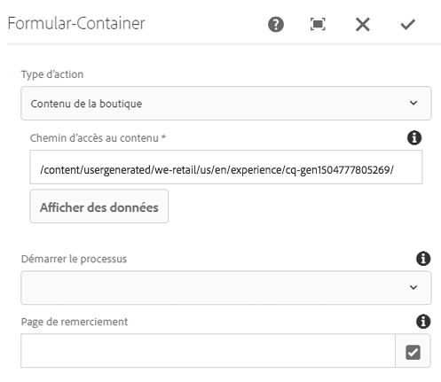
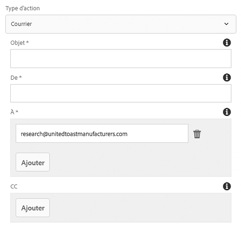
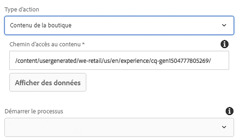

# Composant de conteneur de formulaires (v1){#form-container-component-v}

Le composant de conteneur de formulaires des composants principaux permet la création de formulaires d’envoi simples.

## Utilisation {#usage}

Le composant de conteneur de formulaires a permis la création de formulaires et de fonctionnalités d’envoi d’informations simples en prenant en charge les formulaires WCM simples et en utilisant une structure imbriquée pour autoriser des composants de formulaire supplémentaires.

En utilisant la [boîte de dialogue de paramètres](form-container-v1.md#main-pars_title), l’éditeur de contenu peut définir le type d’action déclenché par l’envoi du formulaire, l’emplacement de stockage du contenu envoyé et si un workflow doit être déclenché. L’auteur du modèle peut utiliser la [boîte de dialogue de conception](form-container-v1.md#main-pars_title_1995166862) pour définir les composants autorisés et leurs mappages similaires à la boîte de dialogue de conception du [conteneur de mises en page standard dans l’éditeur de modèles](https://helpx.adobe.com/experience-manager/6-4/sites/authoring/using/templates.html#main-pars_title_1754153843).

## Version et compatibilité {#version-and-compatibility}

Ce document décrit la version v1 du composant de conteneur de formulaires, introduite à l’origine avec la version 1.0.0 des composants principaux avec AEM 6.3.

Le tableau ci-après répertorie la compatibilité de la version v1 du composant de conteneur de formulaires.

| Version d’AEM | Composant de conteneur de formulaires v1 |
|--- |--- |
| 6.3 | Compatible |
| 6.4 | Compatible |

>[!CAUTION]
>
>Ce document décrit la version v1 du composant de conteneur de formulaires.
>
>Pour plus d’informations sur la version actuelle du composant de conteneur de formulaires, voir le document [Composant de conteneur de formulaires](form-container.md).

## Boîte de dialogue de paramètres {#settings-dialog}

La boîte de dialogue de paramètres permet à l’auteur de contenu de définir les actions entreprises lors de l’envoi du composant.

Selon le **type d’action** sélectionné, les options disponibles dans le conteneur changent. Les types d’actions disponibles sont les suivants :

* [Courrier](form-container-v1.md#main-pars_title_966511656)
* [Stocker le contenu](form-container-v1.md#main-pars_title_2065985840)
* [Envoyer la commande](form-container-v1.md#main-pars_title_686874527)
* [Mettre à jour la commande](form-container-v1.md#main-pars_title_410109286)

Quel que soit le type, il existe des [paramètres généraux](form-container-v1.md#main-pars_title_375403046) qui s’appliquent à chaque action.

### Courrier {#mail}

Lorsque le formulaire est envoyé, le type d’action courrier envoie un e-mail aux destinataires désignés.

* **Objet** : objet de l’e-mail qui sera envoyé lors de l’envoi du formulaire.
* **De** : adresse e-mail de l’expéditeur de l’e-mail qui sera envoyé lors de l’envoi du formulaire.
* **À** : adresse des destinataires qui recevront un e-mail lors de l’envoi du formulaire.
   * Appuyez ou cliquez sur le bouton **Ajouter** pour ajouter d’autres adresses.
   * Appuyez ou cliquez sur le bouton **Supprimer** pour supprimer une adresse e-mail.
* **Cc** : adresses des destinataires qui recevront une copie carbone de l’e-mail envoyé lors de l’envoi du formulaire.
   * Appuyez ou cliquez sur le bouton **Ajouter** pour ajouter d’autres adresses.
   * Appuyez ou cliquez sur le bouton **Supprimer** pour supprimer une adresse e-mail.

### Stocker le contenu {#store-content}

Lorsque le formulaire est envoyé, le contenu du formulaire est stocké dans un emplacement de référentiel désigné.

* **Chemin d’accès au contenu** : chemin d’accès au référentiel de contenu où le contenu envoyé est stocké.
* **Afficher les données** : appuyez ou cliquez sur cette option pour afficher les données envoyées stockées sous la forme JSON.
* **Démarrer le processus** : configurez cette option pour démarrer un workflow avec le contenu stocké comme charge utile lors de l’envoi du formulaire.

### Envoyer la commande {#submit-order}

Lorsque le formulaire est envoyé, la commande est envoyée.

### Mettre à jour la commande {#update-order}

Lorsque le formulaire est envoyé, la commande est mise à jour.

### Paramètres généraux {#general-settings}

Quelle que soit le type d’action sélectionné, une page de remerciement peut toujours être définie.

L’utilisateur est redirigé vers la page spécifiée une fois l’envoi du formulaire terminé.

* Utilisez la boîte de dialogue de sélection pour sélectionner une ressource dans AEM.
* Si la page de remerciement ne figure pas dans AEM, indiquez l’URL absolue. Les URL non absolues seront interprétées par rapport à AEM.
* Laissez vide pour réafficher le formulaire après envoi.

## Boîte de dialogue de conception {#design-dialog}

La boîte de dialogue de conception permet à l’auteur du modèle de définir les composants autorisés et leurs mappages pour le conteneur similaires à la boîte de dialogue de conception du [conteneur de mises en page standard dans l’éditeur de modèles](https://helpx.adobe.com/experience-manager/6-4/sites/authoring/using/templates.html#main-pars_title_1754153843).

## Détails techniques {#technical-details}

Vous trouverez la documentation technique la plus récente sur le composant de conteneur de formulaires [sur GitHub](https://github.com/adobe/aem-core-wcm-components/tree/master/content/src/content/jcr_root/apps/core/wcm/components/form/container/v1/container).

Le projet sur les composants principaux peut être téléchargé depuis GitHub.

Vous trouverez plus d’informations sur le développement des composants principaux dans la [documentation destinée aux développeurs de composants principaux](developing.md).
