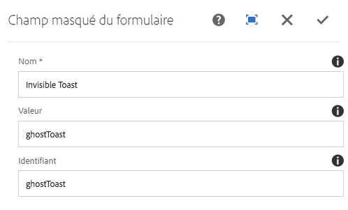

# Composant Masqué du formulaire{#form-hidden-component}

Le composant Masqué du formulaire des composants principaux permet l’affichage d’un champ masqué.

## Utilisation {#usage}

Le composant Masqué du formulaire des composants principaux permet la création de champs masqués pour transmettre des informations sur la page actuelle à AEM. Il est destiné à être utilisé avec le [composant de conteneur de formulaires](form-container.md).

Les propriétés de champ peuvent être définies par l’éditeur de contenu dans la [boîte de dialogue de configuration](form-hidden.md).

## Version et compatibilité {#version-and-compatibility}

La version actuelle du composant Masqué du formulaire est v2, qui a été introduite avec la version 2.0.0 des composants principaux en janvier 2018. Elle est décrite dans ce document.

Le tableau ci-après présente en détail toutes les versions prises en charge du composant, les versions AEM avec lesquelles les versions du composant sont compatibles et les liens vers la documentation pour les versions précédentes.

| Version du composant | AEM 6.3 | AEM 6.4 | AEM 6.5 |
|--- |--- |--- |--- |
| v2 | Compatible | Compatible | Compatible |
| [v1](form-hidden-v1.md) | Compatible | Compatible | Compatible |

Pour plus d’informations sur les versions et les publications des composants principaux, voir le document sur les [versions des composants principaux](versions.md).

## Exemple de sortie de composant {#sample-component-output}

Voici un exemple tiré de [We.Retail](https://helpx.adobe.com/experience-manager/6-5/sites/developing/using/we-retail.html).

### HTML {#html}

```
<div class="cmp cmp-form aem-GridColumn aem-GridColumn--default--12">
 <form method="POST" action="/content/we-retail/us/en/experience.html" id="new_form" name="new_form" enctype="multipart/form-data" class="aem-Grid aem-Grid--12 aem-Grid--default--12 ">
  <input type="hidden" name=":formstart" value="/content/we-retail/us/en/experience/jcr:content/root/responsivegrid/container">
   <div class="visible aem-GridColumn aem-GridColumn--default--12">
    <input type="hidden" id="ghostToast" name="Invisible Toast" value="ghostToast">
   </div>
 </form>
</div>
```

### JSON {#json}

```
"container": {
              "columnClassNames": "aem-GridColumn aem-GridColumn--default--12",
              "columnCount": 12,
              "gridClassNames": "aem-Grid aem-Grid--12 aem-Grid--default--12",
              ":items": {
                "hidden": {
                  "columnClassNames": "aem-GridColumn aem-GridColumn--default--12",
                  ":type": "weretail/components/form/hidden",
                  "name": "Invisible Toast",
                  "id": "ghostToast",
                  "value": "ghostToast"
                }
              },
              ":itemsOrder": [
                "hidden"
              ],
              ":type": "weretail/components/form/container"
            }
```

### Détails techniques {#technical-details}

Vous trouverez la documentation technique la plus récente sur le composant Masqué du formulaire [sur GitHub](https://github.com/adobe/aem-core-wcm-components/blob/master/content/src/content/jcr_root/apps/core/wcm/components/form/hidden/v2/hidden).

Vous trouverez plus d’informations sur le développement des composants principaux dans la [documentation destinée aux développeurs de composants principaux](developing.md).

## Boîte de dialogue de configuration {#configure-dialog}

La boîte de dialogue de configuration permet à l’auteur de contenu de définir les paramètres du champ masqué.



* **Nom**
Nom du champ qui est envoyé avec les données de formulaire.
* **Valeur**
Valeur du champ qui est envoyée avec les données de formulaire.
* **Identifiant**
L’identifiant doit être unique sur la page et peut être utilisé pour lier les scripts à ce champ de formulaire.

Étant donné que le composant Masqué du formulaire ne comporte normalement aucun attribut visible, l’espace réservé du composant dans l’éditeur affiche les valeurs des champs **Nom** et **Valeur** si elles sont affectées pour aider l’auteur à identifier le composant Masqué du formulaire approprié.


## Boîte de dialogue de conception {#design-dialog}

Il n’existe pas de boîte de dialogue de conception pour le composant Masqué du formulaire.