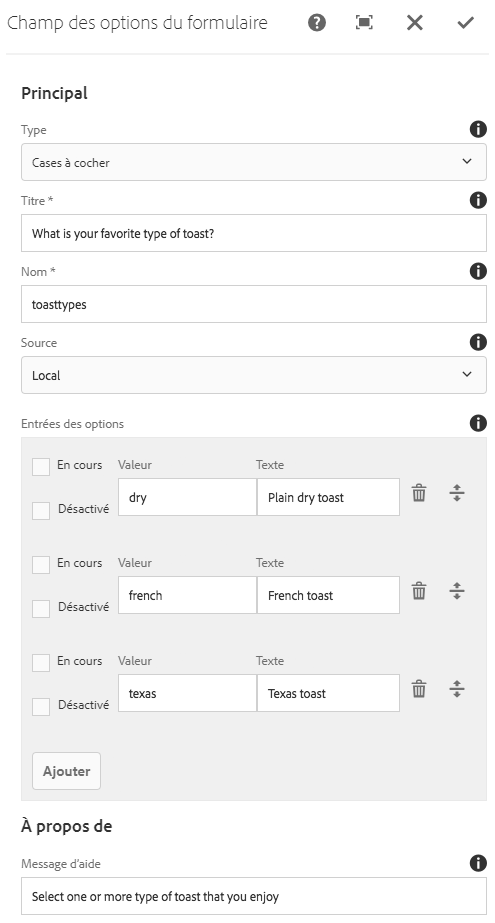

# Composant Options de formulaire (v 1){#form-options-component-v}

Le composant des options Formulaire de base permet la sélection d&#39;options prédéfinies dans divers formats.

## Utilisation {#usage}

Le composant Options de formulaire de composant principal permet l&#39;envoi de différents types d&#39;options présentés de différentes manières et destinées à être utilisés avec le composant de conteneur [de formulaires](form-container.md).

La présentation des options, des étiquettes et des options individuelles peut être définie par l&#39;éditeur de contenu dans [la boîte de dialogue Configurer](form-options-v1.md#main-pars_title).

## Version et compatibilité {#version-and-compatibility}

Ce document décrit la version v 1 du composant Options de formulaire, introduite à l&#39;origine avec la version 1.0.0 des composants principaux avec AEM 6.3.

Le tableau suivant répertorie la compatibilité de la version v 1 du composant Options de formulaire.

| Version du composant | AEM 6.3 | AEM 6.4 |
|--- |--- |--- |
| v2 | Compatible | Compatible |
| v1 | Compatible | Compatible |

>[!CAUTION]
>
>Ce document décrit la version v 1 du composant Options de formulaire.
>
>Pour plus d&#39;informations sur la version actuelle du composant Options de formulaire, voir [le document Composant](form-options.md) Options de formulaire.

## Exemple de sortie de composant {#sample-component-output}

Voici un exemple tiré de [We. Retail](https://helpx.adobe.com/experience-manager/6-4/sites/developing/using/we-retail.html).

### Capture d’écran {#screenshot}


### HTML {#html}

```
<div class="cmp cmp-form aem-GridColumn aem-GridColumn--default--12">
<form method="POST" action="/content/we-retail/us/en/experience.html" id="new_form" name="new_form" enctype="multipart/form-data" class="aem-Grid aem-Grid--12 aem-Grid--default--12 ">
    <input type="hidden" name=":formstart" value="/content/we-retail/us/en/experience/jcr:content/root/responsivegrid/container">
    
    <div class="cmp cmp-options aem-GridColumn aem-GridColumn--default--12">

    <fieldset class="form-group checkbox">
        <legend>What is your favorite type of toast?</legend>
        
        <div class="checkbox-item">
            <label>
              <input type="checkbox" name="toasttypes" value="dry">
              Plain dry toast
            </label>
        </div>
<div class="checkbox-item">
            <label>
              <input type="checkbox" name="toasttypes" value="french">
              French toast
            </label>
        </div>
<div class="checkbox-item">
            <label>
              <input type="checkbox" name="toasttypes" value="texas">
              Texas toast
            </label>
        </div>

    </fieldset>
    
</div>
    
</form></div>
```

### JSON {#json}

```
"container": {
              "columnClassNames": "aem-GridColumn aem-GridColumn--default--12",
              "columnCount": 12,
              "gridClassNames": "aem-Grid aem-Grid--12 aem-Grid--default--12",
              ":items": {
                "options": {
                  "columnClassNames": "aem-GridColumn aem-GridColumn--default--12",
                  ":type": "weretail/components/form/options",
                  "name": "toastTypes",
                  "jcr:title": "What is your favorite type of toast?",
                  "source": "local",
                  "type": "checkbox"
                }
              },
              ":itemsOrder": [
                "options"
              ],
              ":type": "weretail/components/form/container"
            }
```

>[!NOTE]
>
>L&#39;exportation JSON à partir des composants principaux nécessite la version 1.1.0 des composants principaux. Pour plus d&#39;informations, consultez les [informations de compatibilité des composants principaux v 1](versions.md#main-pars_title_236368006) .

## Configurer le dialogue {#configure-dialog}

La boîte de dialogue Configurer permet à l&#39;auteur de contenu de définir le type d&#39;options qui doivent être présentées, les étiquettes et les options disponibles.



* **Types**
de présentation des options

   * **Cases à cocher**
   * **Boutons radio**
   * **Liste déroulante**
   * **Liste déroulante à sélection multiple**

* **Titre** - Titre qui s&#39;affiche comme libellé pour les options
* **Nom** : nom du champ envoyé avec les données du formulaire.
* **Source** - Définition des options

   * **Local** - Défini dans le composant
      * Appuyez ou cliquez sur le bouton **Ajouter** pour ajouter une valeur, **Supprimer** pour supprimer une valeur.
      * **Valeur** - valeur enregistrée lorsque cette option est sélectionnée lors de l&#39;envoi du formulaire
      * **Texte** - Libellé de l&#39;option affichée sur le formulaire
      * **Actif** : l&#39;option est marquée comme étant sélectionnée lors du chargement du formulaire
      * **Désactivé** - L&#39;option n&#39;est pas sélectionnable mais toujours affichée
      * **Liste** - Une liste statique définie ailleurs dans AEM est utilisée pour l&#39;option
         * **Liste** - Chemin d&#39;accès de la liste statique dans AEM
            * Utilisez le bouton Parcourir pour localiser la ressource de liste
      * **Source de données** : une source de données est utilisée pour les options
         * **Source de données** - type de ressource de la source de données
* **Message d&#39;aide** - Conseil de l&#39;utilisateur pour ce qui peut être saisi dans le champ

## Créer un dialogue {#design-dialog}

Il n&#39;existe pas de dialogue de conception pour le composant Options de formulaire.

## Détails techniques {#technical-details}

Vous trouverez la documentation technique la plus récente sur le composant [Options de formulaire sur github](https://github.com/adobe/aem-core-wcm-components/tree/master/content/src/content/jcr_root/apps/core/wcm/components/form/options/v1/options).

Le projet de composants principaux peut être téléchargé depuis github.

Vous trouverez plus d&#39;informations sur le développement des composants principaux dans la documentation destinée aux développeurs de composants [principaux](developing.md).
