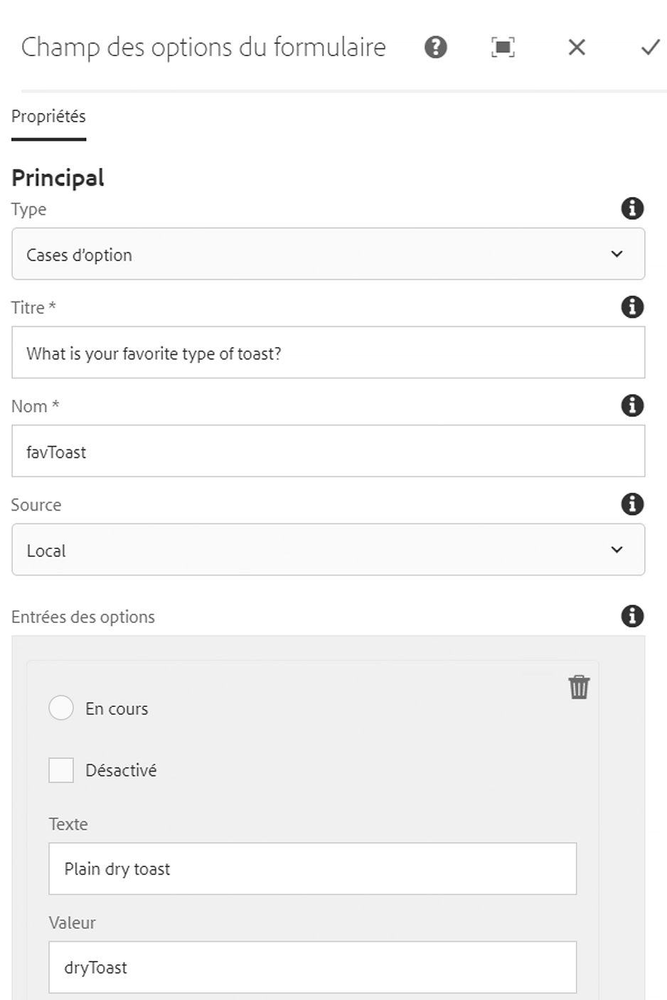

# Composant Options de formulaire{#form-options-component}

Le composant Options de formulaire de composant principal permet la sélection d&#39;options prédéfinies dans divers formats.

## Utilisation {#usage}

Le composant Options de formulaire de composant principal permet l&#39;envoi de différents types d&#39;options présentés sous diverses formes et est conçu pour être utilisé avec le composant Conteneur [de formulaires](form-container.md).

La présentation des options, des étiquettes et des options individuelles peut être définie par l&#39;éditeur de contenu dans [la boîte de dialogue Configurer](#configure-dialog).

## Version et compatibilité {#version-and-compatibility}

La version actuelle du composant Options de formulaire est v 2, qui a été introduite avec la version 2.0.0 des composants principaux en janvier 2018 et est décrite dans ce document.

Le tableau suivant détaille toutes les versions prises en charge du composant, les versions AEM avec lesquelles les versions du composant sont compatibles et les liens vers la documentation pour les versions précédentes.

| Version du composant | AEM 6.3 | AEM 6.4 | AEM 6.5 |
|--- |--- |--- |--- |
| v2 | Compatible | Compatible | Compatible |
| [v1](form-options-v1.md) | Compatible | Compatible | Compatible |

Pour plus d&#39;informations sur les versions et les versions des composants principaux, consultez les versions des composants de Document [principaux](versions.md).

## Exemple de sortie de composant {#sample-component-output}

Voici un exemple tiré de [We. Retail](https://helpx.adobe.com/experience-manager/6-5/sites/developing/using/we-retail.html).

### Capture d’écran {#screenshot}


### HTML {#html}

```
<form method="POST" action="/content/we-retail/us/en/experience.html" id="new_form" name="new_form" enctype="multipart/form-data" class="cmp-form aem-Grid aem-Grid--12 aem-Grid--default--12">
    <input type="hidden" name=":formstart" value="/content/we-retail/us/en/experience/jcr:content/root/responsivegrid/container">
    
    <div class="hidden aem-GridColumn aem-GridColumn--default--12">
<input type="hidden" id="form-hidden-66464844" name="hidden">

</div>
<div class="hidden aem-GridColumn aem-GridColumn--default--12">
<input type="hidden" id="form-hidden-858231075" name="hidden">

</div>
<div class="hidden aem-GridColumn aem-GridColumn--default--12">
<input type="hidden" id="form-hidden-862566768" name="hidden">

</div>
<div class="container responsivegrid aem-GridColumn aem-GridColumn--default--12">

    <input type="hidden" name=":formstart" value="/content/we-retail/us/en/experience/jcr:content/root/responsivegrid/container/container">
    
    <div class="options aem-GridColumn aem-GridColumn--default--12">

    <fieldset class="cmp-form-options">
        
            <legend class="cmp-form-options__legend">What is your favorite type of toast?</legend>
            <label class="cmp-form-options__field-label">
                <input class="cmp-form-options__field cmp-form-options__field--radio" type="radio" name="favToast" value="dryToast">
                Plain dry toast
            </label>
<label class="cmp-form-options__field-label">
                <input class="cmp-form-options__field cmp-form-options__field--radio" type="radio" name="favToast" value="frenchToast">
                French Toast
            </label>
<label class="cmp-form-options__field-label">
                <input class="cmp-form-options__field cmp-form-options__field--radio" type="radio" name="favToast" value="texasToast">
                Texas Toast
            </label>

    </fieldset>

</div>

</div></form>
```

### JSON {#json}

```
"container":{  
                           "columnClassNames":"aem-GridColumn aem-GridColumn--default--12",
                           "columnCount":12,
                           "gridClassNames":"aem-Grid aem-Grid--12 aem-Grid--default--12",
                           ":items":{  
                              "options_816658469":{  
                                 "columnClassNames":"aem-GridColumn aem-GridColumn--default--12",
                                 "id":"form-options-269951232",
                                 "title":"What is your favorite type of toast?",
                                 "name":"favToast",
                                 "type":"RADIO",
                                 "items":[  
                                    {  
                                       "value":"dryToast",
                                       "text":"Plain dry toast",
                                       "selected":false,
                                       "disabled":false
                                    },
                                    {  
                                       "value":"frenchToast",
                                       "text":"French Toast",
                                       "selected":false,
                                       "disabled":false
                                    },
                                    {  
                                       "value":"texasToast",
                                       "text":"Texas Toast",
                                       "selected":false,
                                       "disabled":false
                                    }
                                 ],
                                 ":type":"core/wcm/sandbox/components/form/options/v2/options"
                              }
                           },
                           ":itemsOrder":[  
                              "options_816658469"
                           ],
                           ":type":"core/wcm/sandbox/components/form/container/v2/container"
                        }
```

### Détails techniques {#technical-details}

Vous trouverez la documentation technique la plus récente sur le composant [Options de formulaire sur github](https://github.com/adobe/aem-core-wcm-components/blob/master/content/src/content/jcr_root/apps/core/wcm/components/form/options/v2/options).

Vous trouverez plus d&#39;informations sur le développement des composants principaux dans la documentation destinée aux développeurs de composants [principaux](developing.md).

## Configurer le dialogue {#configure-dialog}

La boîte de dialogue Configurer permet à l&#39;auteur de contenu de définir le type d&#39;options qui doivent être présentées, les étiquettes et les options disponibles.



* **Types** - Présentation des options
   * **Cases à cocher**
   * **Boutons radio**
   * **Liste déroulante**
   * **Liste déroulante à sélection multiple**
* **Titre Titre**
affiché comme libellé pour les options
* **Nom**
du champ envoyé avec les données du formulaire
* **Source**
Où les options sont définies
   * **Local**
défini dans le composant
      * Appuyez ou cliquez sur le bouton **Ajouter** pour ajouter une valeur, **Supprimer** pour supprimer une valeur.
      * **Valeur Valeur**
enregistrée lorsque cette option est sélectionnée lors de l&#39;envoi du formulaire
      * **Texte**
Le libellé de l&#39;option affichée sur le formulaire
      * **Actif**
L&#39;option est marquée comme étant sélectionnée lors du chargement du formulaire
      * **Désactivé**
L&#39;option n&#39;est pas sélectionnable mais toujours affichée
      * **Liste**
Une liste statique définie ailleurs dans AEM est utilisée pour les options
         * **Liste**
Chemin d&#39;accès de la liste statique dans AEM
            * Utilisez le bouton Parcourir pour localiser la ressource de liste
      * **Source
de données** La source de données est utilisée pour les options
         * **Type de ressource Source**
de données de la source de données
* **Message**
d&#39;aide Conseil pour l&#39;utilisateur de ce qui peut être saisi dans le champ

## Créer un dialogue {#design-dialog}

### Onglet Styles {#styles-tab}

Le composant Options de formulaire prend en charge le système [de style AEM](authoring.md#component-styling).