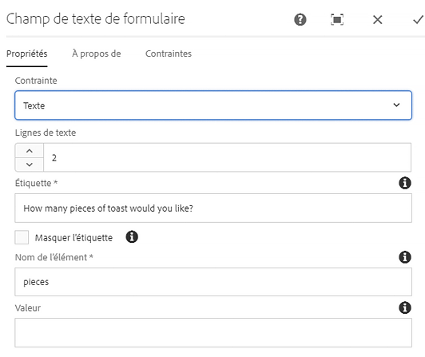
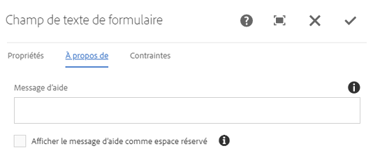
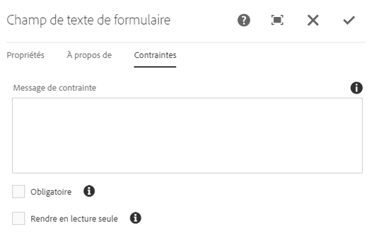

# Composant de texte de formulaire{#form-text-component}

Le composant Texte de formulaire principal permet l&#39;entrée de texte de formulaire pour envoi.

## Utilisation {#usage}

Le composant Texte de formulaire permet l&#39;envoi de différents types de texte et est conçu pour être utilisé avec le composant de conteneur [de formulaires](form-container.md). Le type de validation de texte, d&#39;étiquettes et d&#39;aide peut être défini par l&#39;éditeur de contenu dans [la boîte de dialogue Configurer](#configure-dialog).

## Version et compatibilité {#version-and-compatibility}

La version actuelle du composant de texte de formulaire est v 2, qui a été introduite avec la version 2.0.0 des composants principaux en janvier 2018 et est décrite dans ce document.

Le tableau suivant détaille toutes les versions prises en charge du composant, les versions AEM avec lesquelles les versions du composant sont compatibles et les liens vers la documentation pour les versions précédentes.

| Version du composant | AEM 6.3 | AEM 6.4 | AEM 6.5 |
|--- |--- |--- |--- |
| v2 | Compatible | Compatible | Compatible |
| [v1](form-text-v1.md) | Compatible | Compatible | Compatible |

Pour plus d&#39;informations sur les versions et les versions des composants principaux, consultez les versions des composants de Document [principaux](versions.md).

## Exemple de sortie de composant {#sample-component-output}

Voici un exemple tiré de [We. Retail](https://helpx.adobe.com/experience-manager/6-5/sites/developing/using/we-retail.html).

### Capture d’écran {#screenshot}


### HTML {#html}

```
<div class="text aem-GridColumn aem-GridColumn--default--12">
   <div class="cmp-form-text">
      <label for="form-text-2146967">How many pieces of toast would you like?
      </label>
   <input class="cmp-form-text__text" type="number" id="form-text-2146967" name="pieces">
   </div>
</div>
```

### JSON {#json}

```
"text":{  
                     "columnClassNames":"aem-GridColumn aem-GridColumn--default--12",
                     "id":"form-text-2146967",
                     "title":"How many pieces of toast would you like?",
                     "name":"pieces",
                     "value":"",
                     "helpMessage":"",
                     "type":"number",
                     "readOnly":false,
                     "required":false,
                     "requiredMessage":"",
                     "constraintMessage":"",
                     "rows":2,
                     "defaultValue":"",
                     ":type":"core/wcm/components/form/text/v2/text"
                  }
```

### Détails techniques {#technical-details}

Vous trouverez la documentation technique la plus récente sur le composant [de texte de formulaire sur github](https://github.com/adobe/aem-core-wcm-components/tree/master/content/src/content/jcr_root/apps/core/wcm/components/form/text/v2/text).

Vous trouverez plus d&#39;informations sur le développement des composants principaux dans la documentation destinée aux développeurs de composants [principaux](developing.md).

## Configurer le dialogue {#configure-dialog}

La boîte de dialogue Configurer permet à l&#39;auteur de contenu de définir le type de texte à saisir, ainsi que les valeurs et étiquettes par défaut.

### Onglet principal {#main-tab}



* **Contrainte**
Le type de texte à saisir et sera validé par rapport à
   * **Texte**
   * **Zone de texte**
   * **Courriel**
   * **Téléphone**
   * **Date**
   * **Nombre**
   * **Mot de passe**
* **Lignes
de texte** Nombre de lignes à afficher dans la zone de texte (affiché uniquement lorsque **la contrainte** est définie sur **Zone de texte**)
* **Libellé Libellé**
qui s&#39;affiche pour le champ
* **Masquer le libellé de l&#39;affichage**
Requis si l&#39;étiquette est requise uniquement à des fins d&#39;accessibilité et ne part pas d&#39;informations visuelles supplémentaires sur le champ
* **Nom**
de l&#39;élément Nom du champ envoyé avec les données du formulaire
* **Valeur Valeur** par défaut préremplie dans le champ

### A propos de l&#39;onglet {#about-tab}



* **Message d&#39;aide** Signaler à l&#39;utilisateur ce qu&#39;il peut entrer dans le champ
* **Afficher le message d&#39;aide comme espace réservé**
Pour afficher le message d&#39;aide à l&#39;intérieur de l&#39;entrée de formulaire lorsqu&#39;il est vide et non ciblé

### Onglet Contraintes {#constraints-tab}



* **Message de contrainte**
   * Message affiché sous forme d’info-bulle lors de l’envoi du formulaire si la valeur ne valide pas le type sélectionné
   * Non affiché pour **les types de contraintes de zone** **de texte** et de texte
* **Obligatoire**
Si l&#39;utilisateur sélectionné doit remplir une valeur avant d&#39;envoyer le formulaire
* **Effectuer la lecture uniquement** Si l&#39;utilisateur sélectionné ne peut pas modifier la valeur du champ

## Créer un dialogue {#design-dialog}

Il n&#39;existe pas de dialogue de conception pour le composant Texte de formulaire.