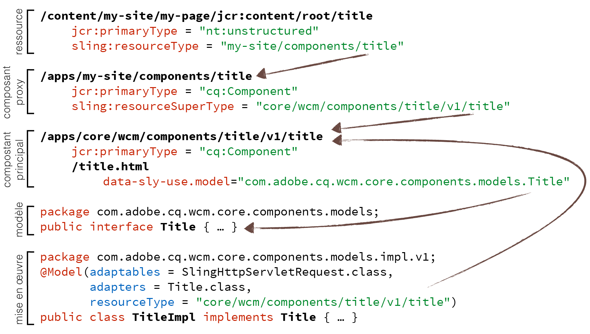
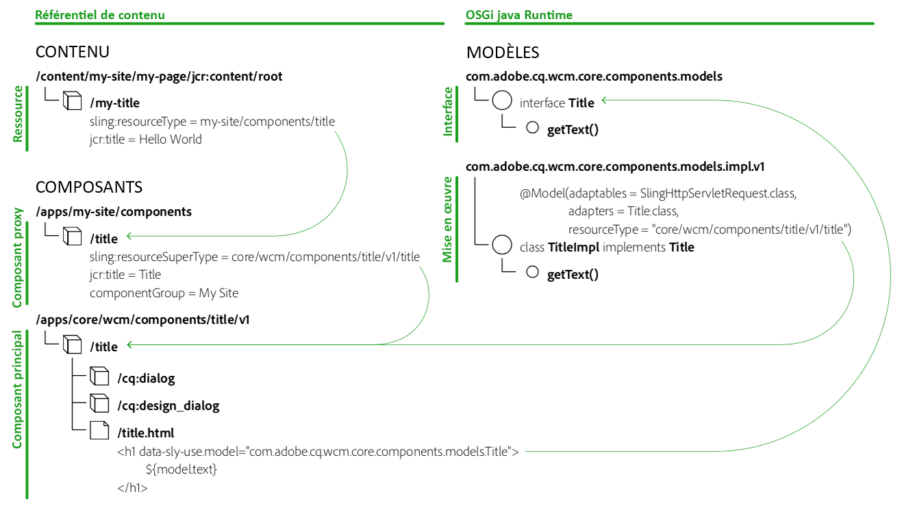

# Instructions relatives aux composants {#component-guidelines}

Les [composants principaux](developing.md) suivent des modèles d&#39;implémentations modernes qui sont très différents des composants de base.

Cette page explique ces modèles et à quel moment les utiliser pour créer vos propres composants. La première section [Modèles généraux de composants](guidelines.md) s’applique à n’importe quel type de composant, tandis que la deuxième section [Modèles de composants réutilisables](guidelines.md) s’applique aux composants destinés à être réutilisés sur plusieurs sites ou projets, comme les composants principaux d’une instance.

## Modèles généraux de composants {#general-component-patterns}

Les instructions de cette section sont recommandées pour tout type de composant, que le composant soit spécifique à un projet unique ou qu’il soit censé être largement réutilisé sur plusieurs sites ou projets.

### Composants configurables {#configurable-components}

Les composants peuvent avoir des boîtes de dialogue avec diverses options. Ces boîtes de dialogue doivent être utilisées pour rendre les composants souples et configurables et éviter de mettre en œuvre plusieurs composants qui sont principalement des variantes les uns des autres.

En règle générale, si une structure filaire ou une conception contient des variantes d’éléments similaires, ces variantes ne doivent pas être implémentées comme des composants différents, mais comme un composant avec des options pour choisir entre les variantes.

Pour aller plus loin, si les composants sont réutilisés sur plusieurs sites ou projets, reportez-vous à la section [Fonctionnalités préconfigurables](#pre-configurable-capabilities).

### Séparation des préoccupations {#separation-of-concerns}

Le maintien de la logique (ou du modèle) d’un composant distinct du modèle de balisage (ou affichage) est généralement une bonne pratique. Il existe plusieurs méthodes pour obtenir ce résultat. Toutefois, il est recommandé d’utiliser des [modèles Sling](https://sling.apache.org/documentation/bundles/models.html) pour la logique et le [modèle de langage HTML](https://docs.adobe.com/content/help/en/experience-manager-htl/using/overview.html) (HTL) pour le balisage, comme le font aussi les composants principaux.

Les modèles Sling sont un ensemble d’annotations Java permettant d’accéder facilement aux variables nécessaires à partir des POJO. Ils offrent par conséquent une méthode simple, puissante et efficace pour implémenter la logique Java pour les composants.

HTL a été conçu pour être un langage de modèle sécurisé et simple adapté à AEM. Il peut appeler de nombreuses formes de logique, ce qui le rend très souple.

## Modèles de composants réutilisables {#reusable-component-patterns}

Les instructions de cette section peuvent également être utilisées pour tout type de composant, mais elles sont plus logiques pour les composants destinés à être réutilisés sur plusieurs sites ou projets, comme les composants principaux d’une instance. Ces instructions peuvent donc être ignorées pour les composants qui ne sont utilisés que sur un seul site ou projet.

### Fonctionnalités préconfigurables {#pre-configurable-capabilities}

Outre la boîte de dialogue de modification utilisée par les auteurs de pages, les composants peuvent également avoir une boîte de dialogue de conception pour les auteurs de modèles afin de les préconfigurer. L’[éditeur de modèles](https://docs.adobe.com/content/help/en/experience-manager-cloud-service/sites/authoring/features/templates.html) permet de configurer toutes ces préconfigurations, appelées « Stratégies ».

Pour rendre les composants aussi réutilisables que possible, ils doivent être fournis avec des options significatives pour la préconfiguration. Cela permet d’activer ou de désactiver les fonctionnalités des composants pour répondre aux besoins spécifiques des différents sites.

### Modèle de composant proxy {#proxy-component-pattern}

Comme chaque ressource de contenu possède une propriété `sling:resourceType` qui référence le composant pour son rendu, il est généralement recommandé que ces propriétés pointent vers des composants spécifiques au site au lieu de pointer vers des composants partagés par plusieurs sites. Ceci offre davantage de souplesse et évite la restructuration du contenu si un site nécessite un comportement différent pour un composant, car cette personnalisation peut alors être obtenue sur le composant spécifique au site sans affecter les autres sites.

Toutefois, pour que les composants spécifiques au projet ne dupliquent aucun code, chacun d’entre eux doit faire référence au composant parent partagé avec la propriété `sling:resourceSuperType`. Ces composants spécifiques au projet qui font principalement référence aux composants parents sont appelés « composants proxy ». Les composants proxy peuvent être complètement vides s’ils héritent entièrement de la fonctionnalité ou ils peuvent redéfinir certains aspects du composant.

### Contrôle de version des composants {#component-versioning}

Les composants doivent être maintenus entièrement compatibles. Toutefois, des modifications qui ne peuvent pas être toujours compatibles sont parfois nécessaires. Une solution à ces besoins contradictoires consiste à introduire le contrôle de version des composants en ajoutant un numéro dans leur chemin d’accès au type de ressource et dans les noms complets de classe Java de leurs implémentations. Ce numéro de version représente une version majeure définie par les [directives de contrôle de version sémantique](https://semver.org/), qui n’est incrémentée que pour les modifications non rétrocompatibles.

Les modifications incompatibles aux aspects suivants des composants entraîneront une nouvelle version :

* Modèles Sling (suivant les directives de contrôle de version sémantique)
* Scripts et modèles HTL
* Balises HTML et sélecteurs CSS
* Représentation JSON
* Boîtes de dialogue

Pour plus d’informations, reportez-vous au document [Stratégies de contrôle de version](https://github.com/adobe/aem-core-wcm-components/wiki/Versioning-Policies) dans GitHub.

Le contrôle de version des composants crée une forme de contrat qui est importante pour les mises à niveau car elle clarifie le moment où il est nécessaire de restructurer un élément. Consultez aussi la section [Compatibilité de la mise à niveau des personnalisations](customizing.md#upgrade-compatibility-of-customizations), qui explique quels sont les différents types de personnalisations requis pour une mise à niveau.

Pour éviter des migrations de contenu complexes, il est important de ne jamais pointer directement vers les composants versionnés des ressources de contenu. En règle générale, une `sling:resourceType` du contenu ne doit jamais comporter de numéro de version, ou la mise à niveau des composants nécessite que le contenu soit également restructuré. Le meilleur moyen pour éviter cela est de suivre le [modèle de composant proxy](#proxy-component-pattern) décrit ci-dessus.

### Interfaces de modèles {#model-interfaces}

Il s’agit de l’instruction `data-sly-use` du code HTL de pointer vers une interface Java, tandis que l’implémentation du modèle Sling s’enregistre également auprès du type de ressource du composant.

Lorsqu’elle est combinée avec le [modèle de composant proxy](#proxy-component-pattern) décrit ci-dessus, cette forme de liaison double offre des points d’extension suivants :

1. Un site peut redéfinir l’implémentation d’un modèle Sling en l’enregistrant auprès du type de ressource du composant proxy, sans avoir à tenir compte du fichier HTL qui peut toujours pointer vers l’interface.
1. Un site peut redéfinir le balisage HTL d’un composant, sans avoir à tenir compte de la logique d’implémentation vers lequel il doit pointer.

## Assemblage {#putting-it-all-together}

Vous trouverez ci-dessous un aperçu de la structure entière de liaison de type de ressource, en prenant l’exemple du composant principal du titre. Il illustre la manière dont un composant proxy spécifique au site permet de résoudre le contrôle des composants, afin d’éviter que la ressource de contenu contienne un numéro de version. Il indique ensuite comment le fichier `title.html` [HTL](https://docs.adobe.com/content/help/en/experience-manager-htl/using/overview.html) du composant utilise l’interface du modèle, tandis que l’implémentation est liée à la version spécifique du composant via les annotations du [modèle Sling](https://sling.apache.org/documentation/bundles/models.html).

Vous trouverez ci-dessous un autre aperçu qui n’affiche pas les détails du POJO d’implémentation, mais révèle la manière dont les [modèles et stratégies associés](https://docs.adobe.com/content/help/en/experience-manager-65/developing/platform/templates/page-templates-editable.html) sont référencés.

La propriété `cq:allowedTemplates` indique les modèles qui peuvent être utilisés pour un site et la propriété `cq:template` indique pour chaque page quel est le modèle associé. Chaque modèle est composé de trois parties :

* **structure** : contient les ressources dont la présence sera forcée sur chaque page et que l’auteur de la page ne pourra pas supprimer, comme les composants d’en-tête et de pied de page.
* **initial** : contient le contenu initial qui sera dupliqué sur la page lors de sa création.
* **policies** : contient pour chaque composant le mappage à une stratégie, qui correspond à la préconfiguration du composant. Ce mappage permet de réutiliser les stratégies dans les modèles et donc de les gérer de manière centralisée.

## Archétype de projet AEM {#aem-project-archetype}

[The AEM Project Archetype](overview.md) creates a minimal Adobe Experience Manager project as a starting point for your own projects, including an example of custom HTL components with SlingModels for the logic and proper implementation of the Core Components with the recommended proxy pattern.

**À lire aussi :**

* [Utilisation des composants principaux](using.md) : rendez opérationnels les composants principaux de votre propre projet.
* [Personnalisation des composants principaux](customizing.md) : pour savoir comment appliquer un style aux composants principaux et les personnaliser.
