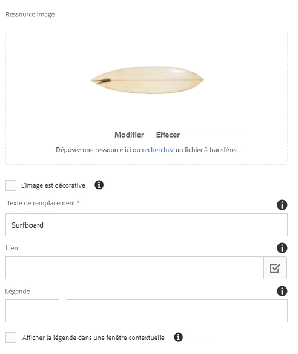
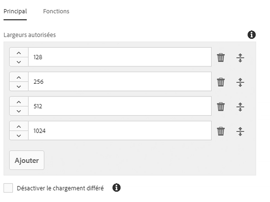

# Composant d&#39;image (v 1){#image-component-v}

Le composant d&#39;image de composant de base est un composant d&#39;image adaptative qui permet d&#39;effectuer des modifications en place.

## Utilisation {#usage}

Le composant Image permet un placement facile des fichiers d&#39;image et offre une modification statique. Il présente une sélection d&#39;image adaptative avec chargement différé et recadrage pour l&#39;auteur du contenu.

Les largeurs d&#39;image autorisées ainsi que le recadrage et les paramètres supplémentaires peuvent être définis par l&#39;auteur du modèle dans le dialogue [de conception](image-v1.md#main-pars_title_1995166862). L&#39;éditeur de contenu peut télécharger ou sélectionner des fichiers dans la [boîte de dialogue de configuration](image-v1.md#main-pars_title_55926120) et recadrer l&#39;image dans la boîte de dialogue [Modifier](image-v1.md#main-pars_title). Pour plus de commodité, une simple modification statique de l&#39;image est également disponible.

## Version et compatibilité {#version-and-compatibility}

Ce document décrit la version v 1 du composant Image, introduite à l&#39;origine avec la version 1.0.0 des composants principaux avec AEM 6.3.

Le tableau suivant répertorie la compatibilité de la version v 1 du composant Image.

| Version d’AEM | Composant d&#39;image v 1 |
|--- |--- |
| 6.3 | Compatible |
| 6.4 | Compatible |

>[!CAUTION]
>
>Ce document décrit la version v 1 du composant Image.
>
>Pour plus d&#39;informations sur la version actuelle du composant Image, voir [le document Composant](image.md) Image.

## Exemple de sortie de composant {#sample-component-output}

Voici un exemple tiré de [We. Retail](https://helpx.adobe.com/experience-manager/6-4/sites/developing/using/we-retail.html).

### Capture d’écran {#screenshot}


### HTML {#html}

```
<div class="cmp cmp-image aem-GridColumn aem-GridColumn--default--12">
 
        <noscript data-cmp-image="{&#34;smartImages&#34;:[],&#34;smartSizes&#34;:[],&#34;lazyEnabled&#34;:true}">
            
        </noscript>

</div>
```

### JSON {#json}

```
"image": {
              "columnClassNames": "aem-GridColumn aem-GridColumn--default--12",
              "smartSizes": [],
              "smartImages": [],
              "lazyEnabled": true,
              "src": "/content/we-retail/us/en/equipment/equipment/jcr%3acontent/root/responsivegrid/image.img.jpeg",
              ":type": "weretail/components/content/image"
            }
```

>[!NOTE]
>
>L&#39;exportation JSON à partir des composants principaux nécessite la version 1.1.0 des composants principaux. Pour plus d&#39;informations, consultez les [informations de compatibilité des composants principaux v 1](versions.md#main-pars_title_236368006) .

## Configurer le dialogue {#configure-dialog}

Outre la boîte [de dialogue](image-v1.md#main-pars_title) de modification et la boîte de dialogue [de conception standard](image-v1.md#main-pars_title_1995166862), le composant d&#39;image propose un dialogue de configuration dans lequel l&#39;image elle-même est définie avec sa description et ses propriétés de base.



* **Ressource image**
   * Déposez un fichier depuis l&#39;explorateur [de ressources](https://helpx.adobe.com/experience-manager/6-3/sites/authoring/using/author-environment-tools.html#main-pars_title) ou appuyez sur l&#39;option **de navigation** à télécharger à partir d&#39;un système de fichiers local.
   * Appuyez ou cliquez **sur Effacer** pour désélectionner l&#39;image actuellement sélectionnée.
   * Appuyez ou cliquez **sur Modifier** pour [gérer les rendus de la ressource](https://helpx.adobe.com/experience-manager/6-3/assets/using/managing-assets-touch-ui.html#main-pars_title_19) dans l&#39;éditeur de ressources.

* **L&#39;image est décorative** - vérifier si l&#39;image doit être ignorée par les technologies d&#39;assistance et ne nécessite donc pas de texte alternatif. Cela s&#39;applique uniquement aux images décoratives.
* **Texte de remplacement** - Alternative textuelle de la signification ou de la fonction de l&#39;image, pour les malvoyants.
* **Lien**
   * Liez l&#39;image à une autre ressource.
   * Utilisez le dialogue de sélection pour créer un lien vers une autre ressource AEM.
   * Si vous ne créez pas de lien vers une ressource AEM, saisissez l&#39;URL absolue. Les URL non solutionnées seront interprétées comme par rapport à AEM.

* **Légende** - D&#39;autres informations sur l&#39;image, affichées sous l&#39;image, sont par défaut.
* **Afficher la légende en tant que fenêtre contextuelle** : lorsqu&#39;elle est cochée, la légende ne s&#39;affiche pas sous l&#39;image, mais comme fenêtre contextuelle affichée par certains navigateurs lorsque vous passez la souris sur l&#39;image.

## Modifier le dialogue {#edit-dialog}

La boîte de dialogue Modifier permet à l&#39;auteur du contenu de recadrer, de modifier le plan de lancement et de zoomer sur l&#39;image.


* Commencer recadrage

   

   Cette option ouvre une liste déroulante pour les proportions de recadrage prédéfinies.

   * Choisissez l&#39;option Main **libre** pour définir votre propre recadrage.
   * Choisissez l&#39;option **Supprimer le recadrage** pour afficher la ressource d&#39;origine.
   Une fois qu&#39;une option de recadrage est sélectionnée, utilisez les poignées bleue pour dimensionner le recadrage sur l&#39;image.

   

* Rotation à droite

   

   Utilisez cette option pour faire pivoter l&#39;image de 90 ° vers la droite (dans le sens horaire).

* Lancer une Map

   

   Utilisez cette option pour appliquer un mappage de lancement à l&#39;image. Cette option permet d&#39;ouvrir une nouvelle fenêtre permettant à l&#39;utilisateur de sélectionner la forme de la carte :

   * **Ajouter une map rectangulaire**
   * **Ajouter une map circulaire**
   * **Ajouter une map polygonal**

      * Par défaut, un triangle est ajouté. Cliquez deux fois sur une ligne de la forme pour ajouter une nouvelle poignée de redimensionnement bleu d&#39;un nouveau côté.
   Lorsqu&#39;une forme de mappage est sélectionnée, elle est superposée sur l&#39;image pour le redimensionnement. Faites glisser et déposez les poignées de redimensionnement bleu pour ajuster la forme.

   

   Après avoir dimensionné le mappage de lancement, cliquez dessus pour ouvrir une barre d&#39;outils flottante afin de définir le chemin du lien.

   * **Chemin**
      * Utilisation de l&#39;option Sélecteur de chemin pour sélectionner un chemin dans AEM
      * Si le chemin d&#39;accès ne figure pas dans AEM, utilisez l&#39;URL absolue. Les chemins non absolus seront interprétés par rapport à AEM.

      * **Texte**
de remplacement Description de la destination du chemin
      * **Cible**
         * **Même onglet**
         * **Nouvel onglet**
         * **Cadre parent**
         * **Cadre supérieur**
   Appuyez ou cliquez sur la coche bleue à enregistrer, le x noir à annuler et la corbeille rouge permet de supprimer la carte.

   

* Réinitialiser le zoom

   

   Si l&#39;image a déjà été agrandie, utilisez cette option pour réinitialiser le niveau de zoom.

* Ouvrir le curseur de zoom

   

   Utilisez cette option pour afficher un curseur permettant de contrôler le niveau de zoom de l&#39;image.

   

L&#39;éditeur statique peut également être utilisé pour modifier l&#39;image. En raison des limitations de l&#39;espace, seules les options de base sont disponibles en ligne. Pour des options de modification complètes, utilisez le mode Plein écran.


>[!NOTE]
>
>Les opérations de modification d&#39;image (recadrage, basculement, rotation) ne sont pas prises en charge pour les images GIF. Aucune modification de ce type apportée en mode d&#39;édition aux fichiers GIF n&#39;est conservée.

## Créer un dialogue {#design-dialog}

Le dialogue de conception permet à l&#39;auteur du modèle de définir le recadrage, le téléchargement et la rotation de l&#39;auteur du contenu lors de l&#39;utilisation de ce composant.

### Principal {#main}

Sur l&#39;onglet **Principal** , vous pouvez définir une liste de largeurs autorisées en pixels pour que l&#39;image charge automatiquement la largeur la plus appropriée dans la liste.



Appuyez ou cliquez sur le bouton Ajouter pour ajouter une autre taille.

* Utilisez les poignées de capture pour réorganiser l&#39;ordre des tailles.
* Utilisez l&#39;icône Supprimer pour supprimer une largeur.

Par défaut, le chargement des images est différé jusqu&#39;à ce qu&#39;ils deviennent visibles. Sélectionnez l&#39;option **Désactiver le chargement différé** pour charger les images au chargement de la page.

### Fonctionnalités {#features}

Sur l&#39;onglet **Fonctionnalités** , vous pouvez définir les options disponibles pour les auteurs de contenu lors de l&#39;utilisation du composant, y compris les options de transfert, d&#39;orientation et de recadrage.

* Source

   

   Sélectionnez l&#39;option **Autoriser le téléchargement de fichiers à partir du système** de fichiers pour permettre aux auteurs de contenu de télécharger des images à partir de son ordinateur local. Pour forcer les auteurs de contenu à sélectionner uniquement des fichiers à partir d&#39;AEM, désactivez cette option.

* Orientation

   

   * **Rotation** : utilisez cette option pour permettre à l&#39;auteur de contenu d&#39;utiliser l&#39;option **Pivoter à droite** .
   * **Utiliser**
cette option pour permettre à l&#39;auteur de contenu d&#39;utiliser les options **Retourner horizontalement** et **Retourner verticalement** .
   >[!CAUTION]
   >
   >L&#39;option **Retourner** est désactivée par défaut. L&#39;activation de ces boutons affichera les **boutons Retourner verticalement** et **Retourner horizontalement** dans la boîte de dialogue Modifier le composant d&#39;image. Toutefois, cette fonction n&#39;est actuellement pas prise en charge par AEM et les modifications effectuées à l&#39;aide de ces options ne seront pas conservées.

<!-- 
Comment Type: remark
Last Modified By: Chris Bohnert (bohnert)
Last Modified Date: 2017-11-20T05:51:34.378-0500

<p>Added caution based on CQDOC-11457. Hid the flip options in the procedure using the <strong>Draft</strong> option so that when this feature is implemented in CQ-4221539, the <strong>Draft</strong> property can simply be removed along with the caution.</p>
-->

* Recadrage

   

   Sélectionnez l&#39;option **Autoriser le recadrage** pour permettre à l&#39;auteur du contenu de recadrer l&#39;image dans le composant dans la boîte de dialogue Modifier.
   * Cliquez **sur Ajouter** pour ajouter un rapport L/H de recadrage prédéfini.
   * Saisissez un nom descriptif qui s&#39;affiche dans la liste déroulante **Début du recadrage** .
   * Entrez le rapport numérique de l&#39;aspect.
   * Utilisez les poignées de glissement pour réorganiser l&#39;ordre des proportions.
   * Utilisez l&#39;icône de corbeille pour supprimer un rapport L/H.
   >[!CAUTION]
   >
   >Notez que dans AEM, les proportions de recadrage sont définies comme **hauteur/largeur**. Cette valeur diffère de la définition conventionnelle de largeur/hauteur et est effectuée pour des raisons de compatibilité héritées. Les auteurs de contenu ne connaîtront aucune différence tant que vous fournissez un nom clair du rapport dans la mesure où le nom s&#39;affiche dans l&#39;interface utilisateur et non le ratio lui-même.

## Détails techniques {#technical-details}

Vous trouverez la documentation technique la plus récente sur le composant [Image sur github](https://github.com/adobe/aem-core-wcm-components/tree/master/content/src/content/jcr_root/apps/core/wcm/components/image/v1/image).

Le projet de composants principaux peut être téléchargé depuis github.

Vous trouverez plus d&#39;informations sur le développement des composants principaux dans la documentation destinée aux développeurs de composants [principaux](developing.md).
