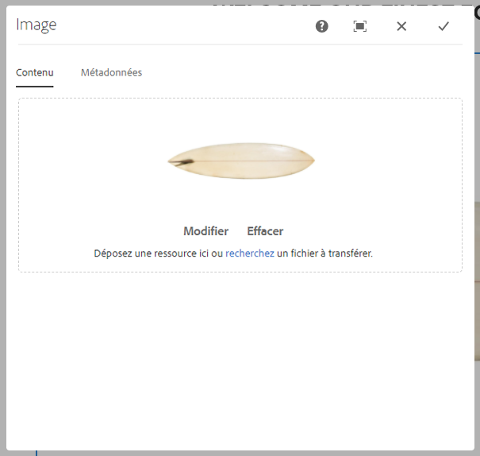
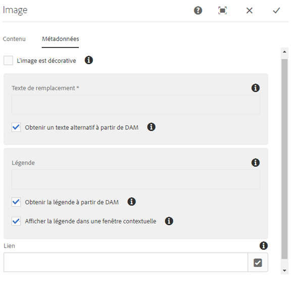
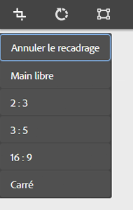
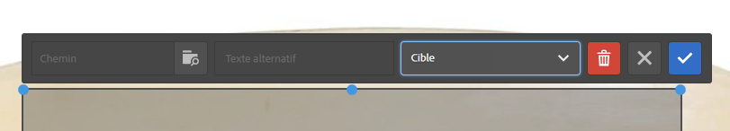
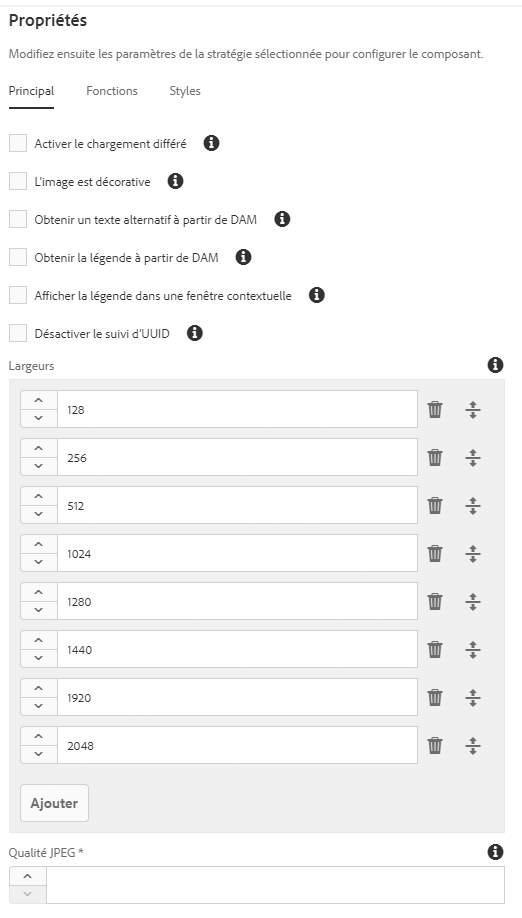
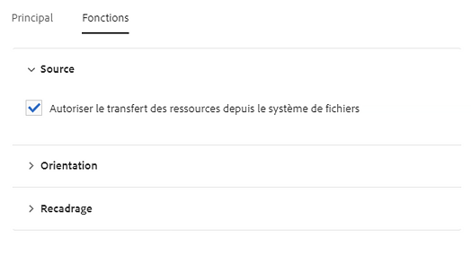
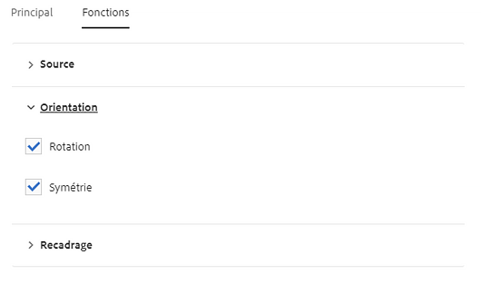
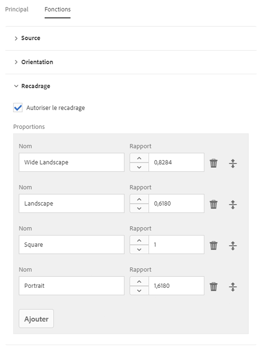

# Composant d’image{#image-component}

Le composant d’image des composants principaux est un composant d’image adaptatif qui permet d’effectuer des modifications statiques.

## Utilisation {#usage}

Le composant d’image comprend une sélection des images adaptatives et un comportement réactif avec chargement différé pour le visiteur de la page, ainsi qu’un positionnement et un recadrage des images faciles pour l’auteur du contenu.

Les largeurs d’image ainsi que le recadrage et les paramètres supplémentaires peuvent être définis par l’auteur du modèle dans la [boîte de dialogue de conception](#design-dialog). L’éditeur de contenu peut télécharger ou sélectionner des ressources dans la [boîte de dialogue de configuration](#configure-dialog) et recadrer l’image dans la [boîte de dialogue de modification](#edit-dialog). Pour plus de commodité, une simple modification statique de l’image est également disponible.

## Fonctions réactives {#responsive-features}

Le composant d’image s’accompagne de fonctions réactives efficaces prêtes à l’emploi. Au niveau du modèle de page, la [boîte de dialogue de conception](#design-dialog) permet de définir les largeurs par défaut du fichier image. Le composant d’image charge alors automatiquement la largeur correcte à afficher en fonction de la taille de la fenêtre du navigateur. Lorsque la fenêtre est redimensionnée, le composant d’image charge dynamiquement la taille d’image correcte, instantanément. Les développeurs de composants n’ont pas à définir des requêtes multimédias personnalisées, puisque le composant d’image est déjà optimisé pour charger le contenu.

En outre, le composant d’image prend en charge le chargement différé afin de différer le chargement du fichier image réel jusqu’à ce qu’il soit visible dans le navigateur, ce qui augmente la réactivité des pages.

## Version et compatibilité {#version-and-compatibility}

La version actuelle du composant d’image est v2, qui a été introduite avec la version 2.0.0 des composants principaux en janvier 2018. Elle est décrite dans ce document.

Le tableau ci-après présente en détail toutes les versions prises en charge du composant, les versions AEM avec lesquelles les versions du composant sont compatibles et les liens vers la documentation pour les versions précédentes.

| Version du composant | AEM 6.3 | AEM 6.4 | AEM 6.5 |
|--- |--- |--- |--- |
| v2 | Compatible | Compatible | Compatible |
| [v1](image-v1.md) | Compatible | Compatible | Compatible |

Pour plus d’informations sur les versions et les publications des composants principaux, voir le document sur les [versions des composants principaux](versions.md).

## Prise en charge SVG {#svg-support}

Les composants SVG (Scalable Vector Graphics) sont pris en charge par le composant d’image.

* Les opérations de glisser-déplacer d’une ressource SVG à partir de DAM et le téléchargement d’un fichier SVG depuis un système de fichiers local sont pris en charge.
* La servlet d’image adaptative diffuse le fichier SVG d’origine en flux continu (les transformations sont ignorées).
* Pour une image SVG, les « images intelligentes » et les « tailles intelligentes » sont définies sur un tableau vide dans le modèle d’image.

### Sécurité {#security}

Pour des raisons de sécurité, l’éditeur d’image ne fait jamais appel au fichier SVG d’origine. Il est appelé par `` Cela empêche le navigateur d’exécuter les scripts incorporés dans le fichier SVG.

>[!CAUTION]
>
>SVG support requires release 2.1.0 of the Core Components or higher along with [service pack 2](https://helpx.adobe.com/experience-manager/6-4/release-notes/sp-release-notes.html) for AEM 6.4 or [service pack 3](https://helpx.adobe.com/experience-manager/6-3/release-notes/sp3-release-notes.html) for AEM 6.3 or higher to support [new image editor features](https://helpx.adobe.com/experience-manager/6-4/sites/developing/using/image-editor.html) within AEM.

## Exemple de sortie de composant {#sample-component-output}

Pour tester le composant d’image et voir des exemples de ses options de configuration, ainsi que la sortie HTML et JSON, consultez la [bibliothèque de composants](http://opensource.adobe.com/aem-core-wcm-components/library/image.html).

### Détails techniques {#technical-details}

The latest technical documentation about the Image Component can be found on GitHub.

Vous trouverez plus d’informations sur le développement des composants principaux dans la [documentation destinée aux développeurs de composants principaux](developing.md).

>[!NOTE]
>
>Depuis la version 2.1.0 des composants principaux, le composant d’image prend en charge les [microdonnées schema.org](https://schema.org).

## Boîte de dialogue de configuration {#configure-dialog}

Outre la [boîte de dialogue de modification](#edit-dialog) et la [boîte de dialogue de conception](#design-dialog) standard, le composant d’image propose une boîte de dialogue de configuration dans laquelle l’image elle-même est définie avec sa description et ses propriétés de base.

### Onglet Ressources {#asset-tab}

* **Ressource image**
   * Drop an asset from the [asset browser](https://helpx.adobe.com/experience-manager/6-5/sites/authoring/using/author-environment-tools.html) or tap the **browse** option to upload from a local file system.
   * Appuyez ou cliquez sur **Effacer** pour désélectionner l’image actuellement sélectionnée.
   * Tap or click **Edit** to [mange the renditions of the asset](https://helpx.adobe.com/experience-manager/6-5/assets/using/managing-assets-touch-ui.html) in the asset editor.

### Onglet Métadonnées {#metadata-tab}

* **L’image est décorative**
Vérifiez si l’image doit être ignorée par les dispositifs d’assistance et ne requiert donc pas de texte de remplacement. Cela s’applique uniquement aux images décoratives.
* **Texte alternatif**
Alternative textuelle de la signification ou de la fonction de l’image, pour les malvoyants.
   * Obtenir un texte alternatif à partir de DAM : lorsque cette option est cochée, le texte alternatif de l’image est renseigné avec la valeur des métadonnées `dc:description` dans DAM.

* **Légende**
Des informations supplémentaires sur l’image sont affichées par défaut sous l’image.
   * **Obtenir une légende à partir de DAM**
Lorsque cette option est cochée, le texte de légende de l’image est renseigné avec la valeur des métadonnées `dc:title` dans DAM.
   * **Afficher la légende dans une fenêtre contextuelle**
Si cette option est activée, la légende ne s’affiche pas sous l’image, mais dans une fenêtre contextuelle dans certains navigateurs lorsque vous pointez sur l’image.

* **Lien**
   * Liez l’image à une autre ressource.
   * Utilisez la boîte de dialogue de sélection pour créer un lien vers une autre ressource AEM.
   * Si vous ne créez pas de lien vers une ressource AEM, saisissez l’URL absolue. Les URL non absolues seront interprétées comme relatives à AEM.

## Boîte de dialogue de modification {#edit-dialog}

La boîte de dialogue de modification permet à l’auteur du contenu de recadrer, de modifier la carte de lancement et de zoomer sur l’image.

* Commencer recadrage

   

   Cette option ouvre une liste déroulante pour les proportions de recadrage prédéfinies.

   * Choisissez l’option **Main libre** pour définir votre propre recadrage.
   * Choisissez l’option **Supprimer le recadrage** pour afficher la ressource d’origine.
   Une fois qu’une option de recadrage est sélectionnée, utilisez les poignées bleues pour dimensionner le recadrage sur l’image.

   

* Rotation à droite

   

   Utilisez cette option pour faire pivoter l’image de 90° vers la droite (dans le sens horaire).

* Rotation horizontale

   

   Utilisez cette option pour retourner l’image horizontalement ou faire pivoter l’image de 180° sur l’axe Y.

* Rotation verticale

   

   Utilisez cette option pour retourner l’image verticalement ou faire pivoter l’image de 180° sur l’axe X.

* Lancer une Map

   >[!CAUTION]
   >
   >The Launch Map feature requires release 2.1.0 of the Core Components or higher along with [service pack 2](https://helpx.adobe.com/experience-manager/6-4/release-notes/sp-release-notes.html) for AEM 6.4 or [service pack 3](https://helpx.adobe.com/experience-manager/6-3/release-notes/sp3-release-notes.html) for AEM 6.3 or higher to support [new image editor features](https://helpx.adobe.com/experience-manager/6-4/sites/developing/using/image-editor.html) within AEM.

   

   Utilisez cette option pour appliquer une carte de lancement à l’image. Cette option ouvre une nouvelle fenêtre permettant à l’utilisateur de sélectionner la forme de la carte :

   * **Ajouter une map rectangulaire**
   * **Ajouter une map circulaire**
   * **Ajouter une map polygonal**
      * Par défaut, une carte en triangle est ajoutée. Cliquez deux fois sur une ligne de la forme pour ajouter une nouvelle poignée de redimensionnement bleue d’un nouveau côté.
   Lorsqu’une forme de carte est sélectionnée, elle est superposée sur l’image pour le redimensionnement. Faites glisser les poignées de redimensionnement bleues pour ajuster la forme.

   

   Après avoir dimensionné la carte de lancement, cliquez dessus pour ouvrir une barre d’outils flottante afin de définir le chemin du lien.

   * **Chemin**
      * Utilisez l’option Sélecteur de chemin pour sélectionner un chemin dans AEM.
      * Si le chemin d’accès ne figure pas dans AEM, utilisez l’URL absolue. Les chemins non absolus seront interprétés par rapport à AEM.
   * **Texte alternatif**
Autre description de la destination du chemin.
   * **Cible**
      * **Même onglet**
      * **Nouvel onglet**
      * **Cadre parent**
      * **Cadre supérieur**
   Appuyez ou cliquez sur la coche bleue pour enregistrer, le x noir pour annuler et la corbeille rouge pour supprimer la carte.

   

* Réinitialiser le zoom

   

   Si l’image a déjà été agrandie, utilisez cette option pour réinitialiser le niveau de zoom.

* Ouvrir le curseur de zoom

   

   Utilisez cette option pour afficher un curseur permettant de contrôler le niveau de zoom de l’image.

   

L’éditeur statique peut également être utilisé pour modifier l’image. En raison d’un espace limité, seules les options de base sont disponibles en ligne. Pour des options de modification complètes, utilisez le mode Plein écran.

>[!NOTE]
>
>Les opérations de modification d’image (recadrage, pivotement, rotation) ne sont pas prises en charge pour les images GIF. Aucune modification de ce type apportée en mode d’édition aux fichiers GIF n’est conservée.

## Boîte de dialogue de conception {#design-dialog}

La boîte de dialogue de conception permet à l’auteur du modèle de définir le recadrage, le téléchargement et la rotation dont dispose l’auteur du contenu lors de l’utilisation de ce composant.

### Onglet principal {#main-tab}

Dans l’onglet **Principal**, vous pouvez définir une liste de largeurs en pixels pour l’image ; le composant chargera automatiquement la largeur la plus appropriée en fonction de la taille du navigateur. Il s’agit d’une partie importante des [fonctions réactives](#responsive-features) du composant d’image.

En outre, vous pouvez définir quelles options de composant générales sont automatiquement activées ou désactivées lorsque l’auteur ajoute le composant à une page.

* **Activer le chargement différé**
Définissez si l’option de chargement différé est activée automatiquement lors de l’ajout du composant d’image à une page.
* **L’image est décorative**
Définissez si l’option d’image décorative est activée automatiquement lors de l’ajout du composant d’image à une page.
* **Obtenir un texte alternatif de DAM**
Définissez si l’option permettant de récupérer le texte de remplacement de DAM est automatiquement activée lors de l’ajout du composant d’image à une page.
* **Obtenir une légende à partir de DAM**
Définissez si l’option permettant de récupérer la légende à partir de DAM est automatiquement activée lors de l’ajout du composant d’image à une page.
* **Afficher la légende dans une fenêtre contextuelle**
Définissez si l’option permettant d’afficher la légende d’image est automatiquement activée lors de l’ajout du composant d’image à une page.
* **Désactiver le suivi d’UUID**
Cochez cette option pour désactiver le suivi de l’UUID de la ressource d’image.

* **Largeurs**
Définit une liste de largeurs en pixels pour l’image ; le composant charge automatiquement la largeur la plus appropriée en fonction de la taille du navigateur.
   * Appuyez ou cliquez sur le bouton **Ajouter** pour ajouter une autre taille.
      * Utilisez les poignées de capture pour réorganiser l’ordre des tailles.
      * Utilisez l’icône **Supprimer** pour supprimer une largeur.
   * Par défaut, le chargement des images est retardé jusqu’à ce qu’elles deviennent visibles.
      * Sélectionnez l’option **Désactiver le chargement différé** pour charger les images au chargement de la page.
* **Qualité JPEG**
Facteur de qualité (exprimé par un pourcentage compris entre 0 et 100) pour les images JPEG transformées (mises à l’échelle ou recadrées, par exemple).

>[!CAUTION]
>
>L’option Qualité JPEG est disponible depuis la version 2.2.0 des composants principaux.

>[!NOTE]
>
>Depuis la version 2.2.0 des composants principaux, le composant d’image ajoute l’attribut UUID unique `data-asset-id` à la ressource d’image afin de permettre le suivi et l’analyse du nombre de vues reçues par les ressources individuelles.

### Onglet Fonctionnalités {#features-tab}

Sur l’onglet **Fonctionnalités**, vous pouvez définir les options disponibles pour les auteurs de contenu lors de l’utilisation du composant, y compris les options de téléchargement, d’orientation et de recadrage.

* Source

   

   Sélectionnez l’option **Autoriser le transfert des ressources depuis le système de fichiers** pour permettre aux auteurs de contenu de télécharger des images à partir de leur ordinateur local. Pour forcer les auteurs de contenu à sélectionner uniquement des ressources à partir d’AEM, désactivez cette option.

* Orientation

   

* **Rotation**
Utilisez cette option pour permettre à l’auteur de contenu d’utiliser l’option **Rotation à droite**.
* **Retourner**
Utilisez cette option pour permettre à l’auteur de contenu d’utiliser les options **Rotation horizontale** et **Rotation verticale**.

   >[!CAUTION]
   >
   >L’option **Retourner** est désactivée par défaut. L’activation de cette option affichera les boutons **Rotation verticale** et **Rotation horizontale** dans la boîte de dialogue de modification du composant d’image. Toutefois, cette fonction n’est actuellement pas prise en charge par AEM et les modifications effectuées à l’aide de ces options ne seront pas conservées.

<!-- 
Comment Type: remark
Last Modified By: Chris Bohnert (bohnert)
Last Modified Date: 2017-11-20T05:51:34.378-0500

Added caution based on CQDOC-11457. Hid the flip options in the procedure using the <strong>Draft</strong> option so that when this feature is implemented in CQ-4221539, the <strong>Draft</strong> property can simply be removed along with the caution.

 -->

* Recadrage

   

   Sélectionnez l’option **Autoriser le recadrage** pour permettre à l’auteur du contenu de recadrer l’image dans le composant au sein de la boîte de dialogue de modification.
   * Cliquez sur **Ajouter** pour ajouter des proportions de recadrage prédéfinies.
   * Saisissez un nom descriptif. Celui-ci s’affichera dans la liste déroulante **Commencer recadrage**.
   * Entrez les proportions.
   * Utilisez les poignées de glissement pour réorganiser l’ordre des proportions.
   * Utilisez l’icône de corbeille pour supprimer des proportions.
   >[!CAUTION]
   >
   >Remarque : Dans AEM, les proportions de recadrage sont définies en tant que **hauteur/largeur**. Cela diffère de la définition conventionnelle de la largeur/hauteur. Cela a été créée pour des raisons de compatibilité héritée. Les auteurs de contenu ne verront aucune différence tant que vous indiquez le nom clair des proportions, car le nom s’affiche dans l’interface utilisateur et non les proportions.

### Onglet Styles {#styles-tab-1}

Le composant d’image prend en charge le [système de style](authoring.md#component-styling) AEM.