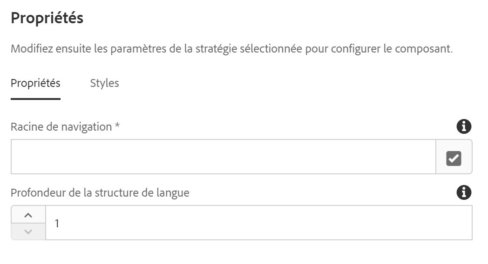
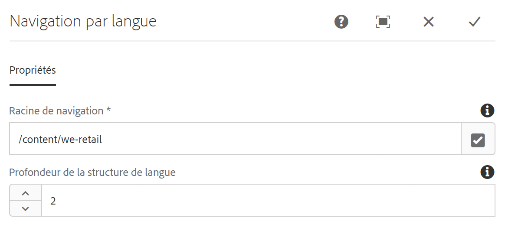

# Composant de navigation par langue {#language-navigation-component}

Le composant de navigation par langue fournit une navigation par langue/pays pour un site, de sorte que les visiteurs puissent accéder à la même page dans un autre paramètre régional.

## Utilisation {#usage}

Souvent, les sites web sont proposés en plusieurs langues pour différentes zones géographiques. Le composant de navigation par langue permet à un visiteur d’afficher la même page dans différentes langues/différents paramètres régionaux. Ainsi, si vous consultez la version suisse allemande du site web, vous pouvez facilement passer à la version en anglais (États-Unis) de la même page. Le composant Navigation par langue gère la compréhension de la structure linguistique du site et recherche automatiquement la page correspondante.

La [boîte de dialogue de modification](#edit-dialog) permet la définition de la racine de navigation globale d’un site ainsi que la profondeur de la structure de navigation. À l’aide de [la boîte de dialogue de conception](#design-dialog), l’auteur du modèle peut définir les valeurs par défaut des mêmes options.

## Version et compatibilité {#version-and-compatibility}

La version actuelle du composant de navigation par langue est v1, qui a été introduite avec la version 2.0.0 des composants principaux en janvier 2018. Elle est décrite dans ce document.

Le tableau ci-après présente en détail toutes les versions prises en charge du composant, les versions AEM avec lesquelles les versions du composant sont compatibles et les liens vers la documentation pour les versions précédentes.

| Version du composant | AEM 6.3 | AEM 6.4 | AEM 6.5 |
|--- |--- |--- |--- |
| v1 | Compatible | Compatible | Compatible |

Pour plus d’informations sur les versions et les publications des composants principaux, voir le document sur les [versions des composants principaux](versions.md).

## Exemple de sortie de composant {#sample-component-output}

To experience the Language Navigation Component as well as see examples of its configuration options as well as HTML and JSON output, visit the [Component Library](http://opensource.adobe.com/aem-core-wcm-components/library/language-navigation/language-structure/us/en/language-navigation.html).

## Détails techniques {#technical-details}

Vous trouverez la documentation technique la plus récente sur le composant [de navigation dans la langue sur github](https://github.com/adobe/aem-core-wcm-components/blob/master/content/src/content/jcr_root/apps/core/wcm/components/languagenavigation/v1/languagenavigation).

Vous trouverez plus d’informations sur le développement des composants principaux dans la [documentation destinée aux développeurs de composants principaux](developing.md).

## Boîte de dialogue de conception {#design-dialog}

La boîte de dialogue de modification permet de définir la racine de navigation globale d’un site ainsi que la profondeur de la structure de navigation.

En règle générale, ces configurations doivent être effectuées uniquement au niveau du modèle de page. Toutefois, elles peuvent être modifiées au niveau de la page dans la [boîte de dialogue de modification](#edit-dialog).

### Onglet Propriétés {#properties-tab}



* **Racine de navigation**
   * C’est là que doit commencer la navigation par langue du site.
   * La structure linguistique du site commence au niveau suivant sous cette racine.
* **Profondeur de la structure de langue**
   * Il s’agit du nombre de niveaux de l’arborescence de contenu sous la **racine de navigation** qui représentent la structure linguistique du site. Exemples :
      * `1` signifie généralement que vous avez le choix de la langue.
      * `2` signifie généralement que vous avez le choix de la langue et du pays.
      * `3` signifie généralement que vous avez le choix de la langue, du pays et de la région.

#### Exemple {#example}

Imaginons que votre contenu ressemble à ceci :

```
/content
+-- we-retail
   +-- language-masters
   +-- us
      +-- en
      \-- es
   \-- ch
      +-- de
      +-- fr
      \-- it
+-- wknd-events
\-- wknd-shop
```

Pour le site We.Retail, il est probable que vous souhaitiez placer le composant Navigation par langue sur un modèle de page dans le cadre de l’en-tête. Once part of the template, you can set the **Navigation Root** of the component to `/content/we-retail` since that is where your localized content for that site begins. Vous devriez également définir la **Profondeur de la structure de langue** sur `2` puisqu’il s’agit d’une structure à deux niveaux (pays puis langue).

Avec la valeur **Racine de navigation**, le composant Langue sait que la navigation commence après `/content/we-retail` et il peut générer des options de navigation par langue en reconnaissant les deux niveaux suivants dans l’arborescence de contenu en tant que structure de navigation de langue du site (comme défini par la valeur **Profondeur de la structure de langue**).

Quelle que soit la page consultée par un utilisateur, le composant Navigation par langue trouve la page correspondante dans une autre langue, en connaissant l’emplacement de la page actuelle et en remontant à la racine, puis en transmettant la page correspondante.

### Onglet Styles {#styles-tab}

Le composant Navigation par langue prend en charge le [système de style](authoring.md#component-styling) AEM.

## Boîte de dialogue de modification {#edit-dialog}

En règle générale, le composant Navigation par langue doit uniquement être ajouté et configuré sur les modèles de page d’un site. Cependant, si le composant Navigation par langue doit être ajouté à une page de contenu individuelle, la boîte de dialogue de modification permet à un auteur de contenu de configurer les mêmes valeurs, comme décrit dans la [boîte de dialogue de conception](#design-dialog).


