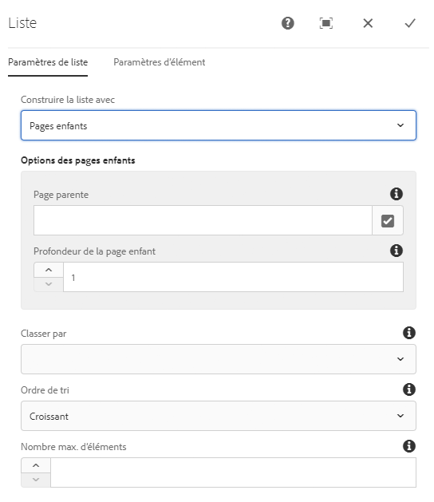
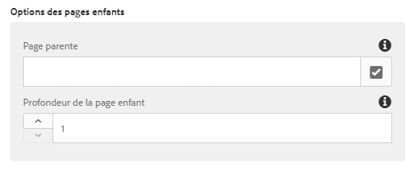
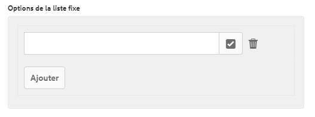
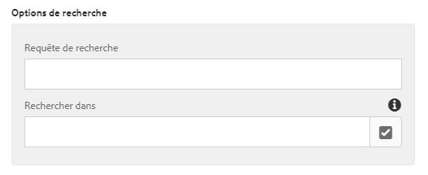
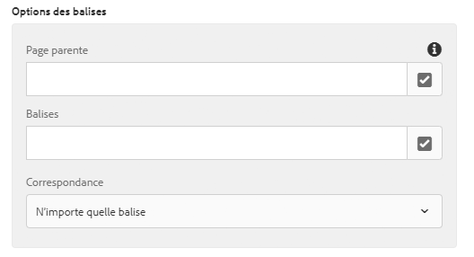
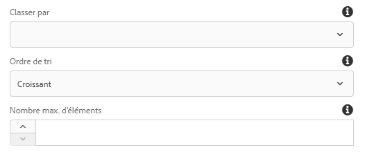
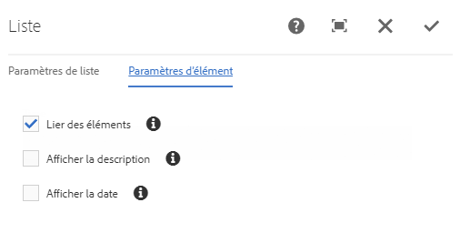
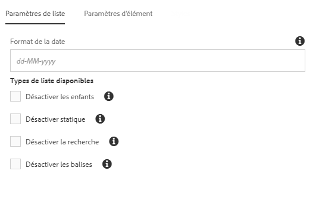
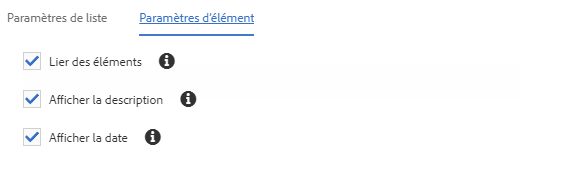

# Liste des composants{#list-component}

Le composant principal Liste permet de créer facilement des listes dynamiques et statiques.

## Utilisation {#usage}

Le composant Liste peut servir à créer, par exemple, une liste dynamique de pages enfants ou une liste statique d’éléments définis de manière arbitraire. Le type de liste disponible et les options de formatage peuvent être définis par l’auteur du modèle dans la [boîte de dialogue Conception](#design-dialog). L’éditeur de contenu peut sélectionner les types de liste disponibles et formater les éléments de liste dans la [boîte de dialogue Modifier](#edit-dialog).

## Version et compatibilité {#version-and-compatibility}

La version actuelle du composant Liste est v2, qui a été introduite avec la version 2.0.0 des composants principaux en janvier 2018 et est décrite dans ce document.

Le tableau suivant détaille toutes les versions prises en charge du composant, les versions AEM avec lesquelles les versions du composant sont compatibles et les liens vers la documentation pour les versions précédentes.

| Composant Version | AEM 6.3 | AEM 6.4 | AEM 6.5 |
|--- |--- |--- |--- |
| v2 | Compatible | Compatible | Compatible |
| [v1](list-v1.md) | Compatible | Compatible | Compatible |

Pour plus d’informations sur les versions et les mises à jour des composants principaux, consultez le document sur les [versions des composants principaux](versions.md).

## Exemple de sortie de composant {#sample-component-output}

Pour tester le composant de liste, des exemples d’options de configuration, ainsi que des sorties HTML et JSON, consultez la [Bibliothèque de composants](http://opensource.adobe.com/aem-core-wcm-components/library/list.html).

### Détails techniques {#technical-details}

The latest technical documentation about the List Component [can be found on GitHub](https://github.com/adobe/aem-core-wcm-components/blob/master/content/src/content/jcr_root/apps/core/wcm/components/list/v2/list).

Vous trouverez plus d’informations sur le développement des composants principaux dans la [documentation destinée aux développeurs de composants principaux](developing.md).

## Boîte de dialogue Modifier{#edit-dialog}

La boîte de dialogue Modifier permet à l’auteur du contenu de configurer la liste et les éléments de la liste.

### Onglet Paramètres de liste {#list-settings-tab}

La liste peut être générée de différentes manières.

* [Pages enfants](#child-pages)
* [Liste fixe](#fixed-list)
* [Rechercher](#search-options)
* [Balises](#tags)

Quelle que soit la création de la liste, il existe des [Options de tri](#sort-options) qui peuvent toujours être configurées.

Selon la manière dont l’auteur du contenu choisit de construire la liste, les options de configuration supplémentaires changent.

#### Pages enfants {#child-pages}

La liste peut être créée des pages enfants de la page active ou d’une autre page.

* **Page parente**
   * Page dont les pages enfants doivent faire la liste.
   * Laissez vide pour utiliser la page active.

* **Profondeur-enfant**
Combien de niveaux dans la hiérarchie doivent être utilisés.

#### Liste fixe {#fixed-list}

La liste peut être créée à l’aide d’une liste fixe d’éléments.

Appuyez ou cliquez sur le bouton **Ajouter** pour insérer un nouvel élément dans la liste.

* Entrez le texte de l’élément dans la liste ou utilisez la **boîte de dialogue Sélection** pour choisir un élément dans AEM.
* Utilisez la poignée de glisser-déplacer pour réorganiser les éléments de la liste.
* Utilisez l’icône de corbeille pour supprimer les éléments de la liste.

#### Recherche {#search-options}

La liste peut être créée à l’aide des résultats d’une recherche de contenu AEM.

* **Requête de recherche**
Chaîne pour laquelle une recherche de texte intégral est exécutée afin de générer les éléments de la liste.
* **Recherche dans**
L’emplacement où la recherche doit être exécutée.
   * Utilisation de la **boîte de dialogue Sélection** pour choisir l’emplacement dans AEM.
   * Utilisez la page active si laissée vide.

#### Balises {#tags}

La liste peut être créée à l’aide de pages qui correspondent à certaines balises sous un emplacement particulier.

* **Page parente**
Où la correspondance des balises doit commencer.
   * Utilisation de **boîte de dialogue Sélection** pour choisir l’emplacement dans AEM.
   * Utilisez la page active si laissée vide.
* **Balises**
Les balises qui doivent correspondre.
   * Utilisation de la **boîte de dialogue Parcourir** pour sélectionner les balises.
* **Correspondance**
Définit quel type de correspondance doit qualifier une page à inclure dans la liste.
   * **n’importe quelle balise**
   * **toutes les balises**

#### Options de tri {#sort-options}

Quelle que soit la manière dont vous choisissez de créer la liste, certaines options de tri peuvent toujours être définies.

* **Trier par**
Comment les éléments doivent être triés.
   * **Titre**
   * **Date de dernière modification**
* **Ordre du tri**
Ordre dans lequel les éléments doivent être triés.
   * **croissant**
   * **décroissant**
* **Nombre maximal d’éléments**
Nombre maximal d’éléments affichés dans la liste.
   * Laissez vide pour renvoyer tous les éléments.

### Onglet Paramètres d&#39;élément {#item-settings-tab}

A l’aide de l’onglet Paramètres d’élément, la mise en forme des éléments de liste peut être configurée.

* **Éléments de lien**
Éléments de lien vers la page correspondante.
* **Afficher la description**
Afficher les descriptions de l’élément de lien.
* **Afficher la date**
Permet d’afficher la date de modification de l’élément de lien.

## Boîte de dialogue Conception {#design-dialog}

La boîte de dialogue Conception permet à l’auteur du modèle de définir les types de listes à autoriser aux auteurs de contenu ainsi que les paramètres d’éléments disponibles.

### Paramètres de liste {#list-settings}

Dans l’onglet **Paramètres de liste**, le format de date peut être défini et le type de liste devrait être disponible dans le composant aux auteurs de contenu.

* **Format de la date**
Format à utiliser pour l’affichage de la date de la dernière modification.
* **Désactivation des enfants**
Désactive le type de liste enfant dans le composant.
* **Désactiver statique**
Désactive le type de liste statique dans le composant.
* **Désactiver la recherche**
Désactive le type de liste de recherche dans le composant.
* **Désactiver les balises**
Désactive le type de liste des balises dans le composant.

### Paramètres d’élément {#item-settings}

Dans l’onglet **Paramètres d’élément**, les options de formatage des éléments de liste individuels qui doivent être disponibles dans le composant pour les auteurs de contenu peuvent être définies.

* **Éléments de lien**
Activez l’option Éléments de lien dans la [boîte de dialogue Modifier](#edit-dialog).
* **Afficher les descriptions**
Activez l’option Afficher les descriptions dans la [boîte de dialogue Modifier](#edit-dialog).
* **Afficher la date**
Activez l’option Afficher la date dans la [boîte de dialogue Modifier](#edit-dialog).

### Onglet Styles {#styles-tab}

Le composant Image prend en charge le [système de style](authoring.md#component-styling) AEM.