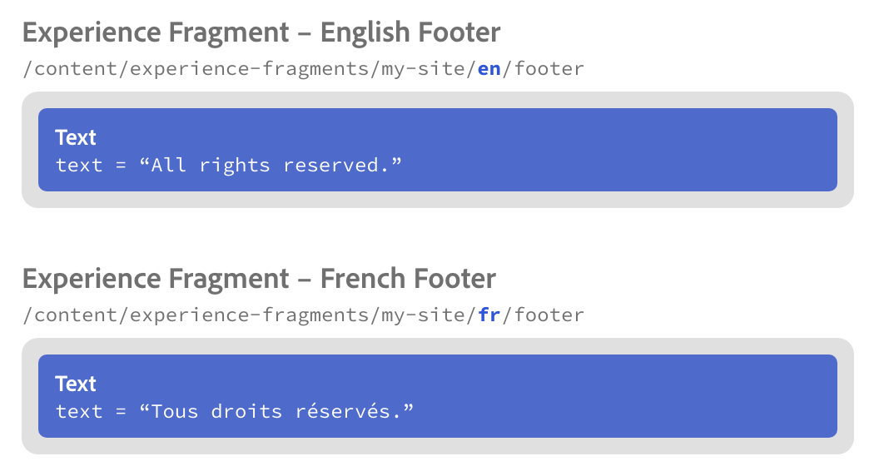
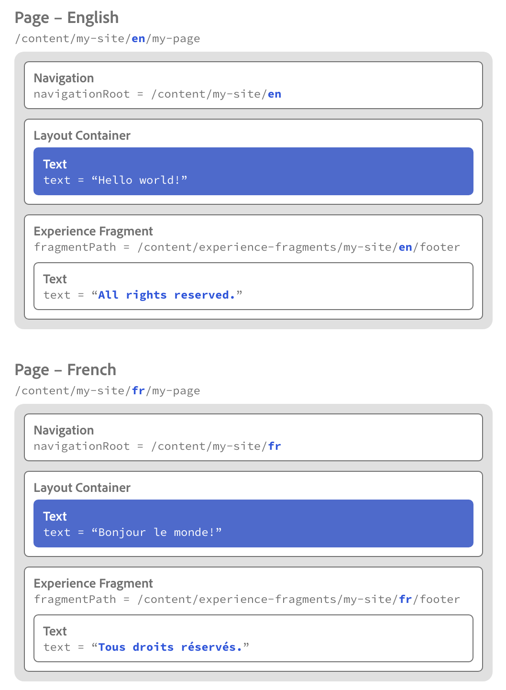

# Fonctions de localisation des composants principaux {#localization-features-of-the-core-components}

De nombreux sites Web exigent que le contenu soit diffusé dans un format localisé dans plusieurs langues et géographies. Les composants principaux sélectionnés disposent d’une résolution de référence intelligente afin de faciliter la création d’un modèle unifié pour l’ensemble du contenu localisé qui s’adapte automatiquement en fonction de la structure de votre site localisé.

## Exemple - Page localisée avec navigation et pieds de page {#example}

La plupart des sites nécessitent qu’un pied de page soit présent sur toutes les pages. Ces pieds de page sont généralement cohérents dans tout le contenu de la page. Toutefois, pour une page de contenu localisée, une version localisée de cet en-tête ou pied de page doit être affichée.

De même, un composant de navigation doit généralement être affiché sur toutes les pages. Toutefois, il devra également refléter le contenu des pages localisées.

A l’aide des fonctionnalités de localisation du composant [principal de](navigation.md) navigation et du composant [principal de fragment d’](experience-fragment.md) expérience, ainsi que des modèles [modifiables d’AEM](https://docs.adobe.com/content/help/en/experience-manager-64/authoring/siteandpage/templates.html), cela devient une tâche simple. L'exemple pourrait être étendu à l'utilisation du composant [Navigation](language-navigation.md) linguistique.

## La structure du contenu {#content-structure}

Toutes les fonctionnalités de localisation d’AEM et de ses composants principaux reposent sur une structure de contenu claire et logique pour votre contenu localisé.

Supposons que votre site soit simplement appelé `my-site` et se trouve ici :

```
/content/my-site
```

Disons aussi que vous créez votre site en anglais et que vous le proposez aussi en français. Ainsi, si vous avez une page simple appelée `my-page` elle se trouve dans deux branches de localisation dans l'arborescence de contenu de votre site :

```
/content
\-- my-site
   +-- en
       \-- my-page
   \-- fr
       \-- my-page
```

C'est sous ces branches de localisation que vous allez créer des pages de sites supplémentaires.

Les pieds de page sont généralement créés à l’aide de fragments d’expérience. Vous aurez donc besoin d’une version en anglais et en français, tout comme vos pages. Toutefois, les fragments d’expérience ne sont pas des pages, mais des parties de pages qui peuvent être réutilisées sur plusieurs pages. Ils ne vivent donc pas directement sous `/content` le reste de vos pages. Au lieu de cela, ils vivent sous leur propre dossier, mais comme ils doivent également être localisés, leur structure doit refléter la structure de localisation de votre site.

```
/content
+-- experience-fragments
   +-- en
      \-- footer
   \-- fr
      \-- footer
\-- my-site
   +-- en
      \-- my-page
   \-- fr
      \-- my-page
```

C’est grâce à la structure de localisation en miroir que les composants principaux peuvent trouver le contenu localisé nécessaire pour une page correspondante.

## Pied de page - Fragment d’expérience {#xf-footer}

Le composant Fragment d’expérience est très flexible et convient parfaitement à un en-tête ou un pied de page.

Comme notre site Web hypothétique est offert en anglais et en français, nous devrons créer deux fragments d’expérience, tous deux appelés `footer` [dans les emplacements que nous avons décrits précédemment.](#content-structure)



## Modèle de page {#template}

Comme le pied de page s’affiche sur chaque page, nous devrons ajouter le fragment d’expérience à notre modèle de page standard.

Notre modèle est simplement appelé `my-template` et se trouve avec nos autres modèles :

```
/conf/my-site/settings/wcm/templates/my-template
```

To this template we will add the basic components that we want our pages to be based on.

* [Composant Navigation](navigation.md)
   * The Navigation Component will appear at the top of every page.
   * Dans le composant de navigation, nous définissons la racine de navigation, indiquant au composant où commence la structure de navigation du site.
   * Based on the navigation root, the component can find the corresponding localized content automatically.
* [Composant de conteneur](container.md)
   * Every page will contain an editable Container Component so that authors can place additional content on the page.
* [Fragment d’expérience](experience-fragment.md)
   * We point the Experinece Fragment Component to the fragment path in our authoring language of the fragment that represents the footer.
   * Based on that fragment's path and the structure of the experience fragments that mirrors the localized page structure, the component can find the corresponding localized content automatically.
   

## Pages {#pages}

By doing the hard work in setting up the site structure and template, the content author simply needs to add the necessary content to the pages. Thanks to the templates and the localization logic of the components, the navigation and footers will be automatically added to the page and localized.

For example, the author would only need to add content such as a text component to the English and French pages (represented in blue below).

The Navigation Component and Experience Fragment Component come from the page template and know to automatically display the correct content based on the localization structure and the location of the page itself (represented in white below).



## Fitting It All Together {#fitting-it-all-together}

Here is the complete picture of how these simple, but powerful elements work together to deliver localized pages for the content authors.


