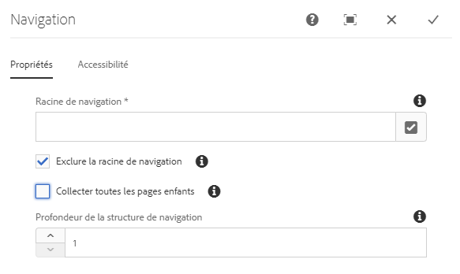

# Composant Navigation{#navigation-component}

Le composant Navigation permet aux utilisateurs de parcourir facilement une structure de site globalisée.

## Utilisation {#usage}

Les listes de composants de navigation répertorient une arborescence de pages afin que les utilisateurs d'un site puissent facilement naviguer dans la structure du site.

Le composant de navigation peut détecter automatiquement la structure de site globalisée de votre site et [s'adapter automatiquement à une page localisée.](#localized-site-strucutre) En outre, elle peut prendre en charge toute structure arbitraire de site en utilisant [des pages de redirection d'ombre](#shadow-structure) pour représenter une autre structure autre que la structure de contenu principale.

La boîte de dialogue de [modification](#edit-dialog) permet à l’auteur de contenu de définir la page racine de navigation ainsi que la profondeur de navigation. La boîte de dialogue de [conception](#design-dialog) permet à l’auteur du modèle de définir les valeurs par défaut de la racine de navigation et de la profondeur.

## Prise en charge de la structure localisée du site {#localized-site-structure}

Souvent, les sites web sont proposés en plusieurs langues pour différentes zones géographiques. En règle générale, chaque page localisée contiendra un élément de redirection qui est inclus dans le modèle de page. Le composant de navigation vous permet de le placer une fois sur un modèle pour toutes les pages de votre site. Il s'adapte ensuite automatiquement aux pages localisées individuelles en fonction de la structure de votre site globalisé.

### Exemple {#example-localization}

Imaginons que votre contenu ressemble à ceci :

```
/content
+-- we-retail
   +-- language-masters
      +-- de
         \-- experience
            \-- arctic-surfing-in-lofoten
      +-- en
         \-- experience
            \-- arctic-surfing-in-lofoten
      +-- es
      +-- fr
      \-- it
   +-- us
      +-- en
         \-- experience
            \-- arctic-surfing-in-lofoten
      \-- es
   \-- ch
      +-- de
         \-- experience
            \-- arctic-surfing-in-lofoten
      +-- fr
      \-- it
+-- wknd-events
\-- wknd-shop
```

Pour le site We. Retail, il est probable que vous souhaitiez placer le composant Navigation sur un modèle de page dans le cadre de l'en-tête. Once part of the template, you can set the **Navigation Root** of the component to `/content/we-retail/language-masters/en` since that is where your master content for that site begins. Vous souhaitez peut-être également définir **la Profondeur** de la structure de navigation `2` puisque vous ne souhaitez probablement pas que l'intégralité de l'arborescence de contenu soit affichée par le composant, mais plutôt les deux premiers niveaux afin qu'elle serve d'aperçu.

Avec **la valeur Racine** de navigation, le composant Navigation sait que la `/content/we-retail/language-masters/en` navigation démarre et qu'elle peut générer des options de navigation en répétant deux niveaux vers le bas (comme défini par la **valeur Profondeur** de la structure de navigation).

Quelle que soit la page localisée consultée par un utilisateur, le composant Navigation peut trouver la page localisée correspondante en connaissant l'emplacement de la page actuelle, en travaillant à l'arrière jusqu'à la racine, puis en transmettant la page correspondante.

Ainsi, si un visiteur consulte `/content/ch/de/experience/arctic-surfing-in-lofoten`, le composant sait comment générer la structure de navigation sur la base `/content/we-retail/language-masters/de`de. De même, si le visiteur consulte `/content/us/en/experience/arctic-surfing-in-lofoten`, le composant sait comment générer la structure de navigation en fonction `/content/we-retail/language-masters/en`de.

## Prise en charge de la structure du site ombre {#shadow-structure}

Parfois, il est nécessaire de créer un menu de navigation pour le visiteur différent de la structure réelle du site. Une promotion doit peut-être mettre en surbrillance certains contenus du menu en réorganisant la liste du contenu. En utilisant des pages ombrées qui redirigent simplement vers d'autres pages de contenu, le composant de navigation peut générer n'importe quelle structure de navigation arbitraire nécessaire.

Pour ce faire, vous devez :

1. Créez des pages ombrées comme des pages vides représentant la structure de votre site. On parle généralement de structure de site d'ombre.
1. Définissez les **valeurs de redirection** dans le calcul des liens des pages sur ces pages pour qu'elles pointent vers les pages de contenu réelles.
1. Définissez l'option **Masquer dans la navigation** dans les propriétés de la page des pages ombrées.
1. Définissez **la valeur Racine** de navigation du composant de navigation pour qu'elle pointe vers la racine de la nouvelle structure du site d'ombre.

Le composant de navigation affichera ensuite le menu en fonction de la structure du site d'ombre. Les liens rendus par le composant correspondent aux pages de contenu réelles que les pages d'ombre redirigent vers les pages ombrées et non vers celles-ci. En outre, le composant affiche les noms des pages réelles et met correctement en surbrillance la page active, même lorsque la navigation est basée sur des pages ombrées. Le composant de navigation rend les pages ombrées complètement transparentes pour le visiteur.

>[!NOTE]
>Les pages d'ombre rendent vos options de navigation beaucoup plus flexibles, mais gardez à l'esprit que la maintence de cette structure est ensuite totalement manuelle. Si vous réorganisez le contenu réel du site ou ajoutez/supprimez le contenu, vous devrez mettre à jour manuellement la structure d'ombre si nécessaire.

>[!NOTE]
>Lors du rendu d'une structure de site d'ombre, seules les pages ombrées sont réaffirmées par la logique de navigation. La logique ne récurrent pas la structure des destinations de redirection.

## Version et compatibilité {#version-and-compatibility}

La version actuelle du composant de navigation est v1, qui a été introduite avec la version 2.0.0 des composants principaux en janvier 2018 et est décrite dans ce document.

Le tableau ci-après présente en détail toutes les versions prises en charge du composant, les versions AEM avec lesquelles les versions du composant sont compatibles et les liens vers la documentation pour les versions précédentes.

| Version du composant | AEM 6.3 | AEM 6.4 | AEM 6.5 |
|--- |--- |--- |--- |
| v1 | Compatible | Compatible | Compatible |

Pour plus d’informations sur les versions et les publications des composants principaux, voir le document sur les [versions des composants principaux](versions.md).

## Exemple de sortie de composant {#sample-component-output}

To experience the Navigation Component as well as see examples of its configuration options as well as HTML and JSON output, visit the [Component Library](http://opensource.adobe.com/aem-core-wcm-components/library/navigation.html).

## Détails techniques {#technical-details}

Vous trouverez la documentation technique la plus récente sur le composant [de navigation sur github](https://github.com/adobe/aem-core-wcm-components/blob/master/content/src/content/jcr_root/apps/core/wcm/components/navigation/v1/navigation).

Vous trouverez plus d’informations sur le développement des composants principaux dans la [documentation destinée aux développeurs de composants principaux](developing.md).

>[!NOTE]
>
>À compter de la version 2.1.0 des composants principaux, le composant Navigation prend en charge [les microdonnées schema.org](https://schema.org).

## Boîte de dialogue de modification {#edit-dialog}

Dans la boîte de dialogue de modification, l’auteur du contenu peut définir la page racine pour la navigation et la profondeur de la structure de navigation.

### Onglet Propriétés {#properties-tab}



* **Racine de navigation**
La page racine qui sera utilisée pour générer l’arborescence de navigation.
* **Exclure la racine de navigation**
Excluez la racine de navigation de l’arborescence créée, incluez seulement les descendants.
* **Collecter toutes les pages enfants**
Rassemblez toutes les pages qui sont des descendants de la racine de navigation.
* **Profondeur de la structure de navigation**
Définit le nombre de niveaux vers le bas de l’arborescence de navigation que le composant doit afficher par rapport à la racine de navigation (disponible uniquement lorsque **toutes les pages** enfants n’ont pas été sélectionnées).

### Onglet Accessibilité {#accessibility-tab}


Dans l'onglet **Accessibilité** , les valeurs peuvent être définies pour [les libellés d'accessibilité](https://www.w3.org/WAI/standards-guidelines/aria/) ARIA pour le composant.

* **Libellé** - Valeur d'un attribut d'étiquette ARIA pour le composant

## Boîte de dialogue de conception {#design-dialog}

La boîte de dialogue de conception permet à l’auteur du modèle de définir les valeurs par défaut de la page racine de navigation et de la profondeur de navigation présentée aux auteurs de contenu.

### Onglet Propriétés {#properties-tab-design}


* **Racine de navigation**
La valeur par défaut de la page racine de la structure de navigation, qui sera utilisée pour générer l’arborescence de navigation et la valeur par défaut lorsque l’auteur du contenu ajoute le composant à la page.
* **Exclure la racine de navigation**
La valeur par défaut de l’option pour exclure la racine de navigation dans l’arborescence produite.
* **Collecter toutes les pages enfants**
La valeur par défaut de la collecte de toutes les pages qui sont des descendants de la racine de navigation.
* **Profondeur de la structure de navigation**
Valeur par défaut de la profondeur de la structure de navigation.

### Onglet Styles {#styles-tab}

Le composant de navigation prend en charge le [système de style](authoring.md#component-styling) AEM.
