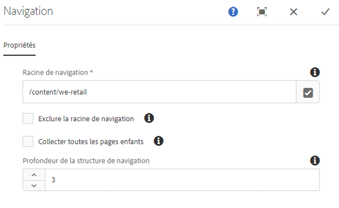
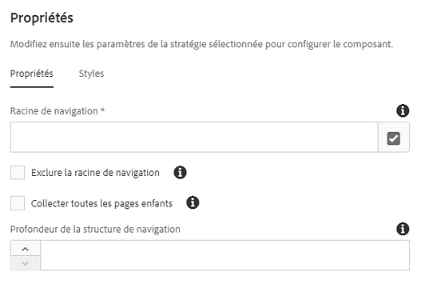

# Composant Navigation{#navigation-component}

Le composant Navigation permet aux utilisateurs de parcourir facilement une structure de site globalisée.

## Utilisation {#usage}

Le composant Navigation permet toute hiérarchie de navigation qui peut être générée à partir des copies live d’un plan directeur, à partir des copies de langue d’un gabarit de langue ou d’une arborescence simple de pages. Il permet aux utilisateurs de la page de parcourir facilement une structure de site.

La boîte de dialogue [Modifier](#edit-dialog) permet à l’auteur de contenu de définir la page racine de navigation ainsi que la profondeur de navigation. La boîte de dialogue [Conception](#design-dialog) permet à l’auteur du modèle de définir les valeurs par défaut de la racine de navigation et de la profondeur.

## Version et compatibilité {#version-and-compatibility}

La version actuelle du composant de navigation est v1, qui a été introduite avec la version 2.0.0 des composants principaux en janvier 2018 et est décrite dans ce document.

Le tableau suivant détaille toutes les versions prises en charge du composant, les versions AEM avec lesquelles les versions du composant sont compatibles et les liens vers la documentation pour les versions précédentes.

| Composant Version | AEM 6.3 | AEM 6.4 | AEM 6.5 |
|--- |--- |--- |--- |
| v1 | Compatible | Compatible | Compatible |

Pour plus d’informations sur les versions et les mises à jour des composants principaux, consultez le document sur les [versions des composants principaux](versions.md).

## Exemple de sortie de composant {#sample-component-output}

To experience the Navigation Component as well as see examples of its configuration options as well as HTML and JSON output, visit the [Component Library](http://opensource.adobe.com/aem-core-wcm-components/library/navigation.html).

## Détails techniques {#technical-details}

The latest technical documentation about the Navigation Component [can be found on GitHub](https://github.com/adobe/aem-core-wcm-components/blob/master/content/src/content/jcr_root/apps/core/wcm/components/navigation/v1/navigation).

Vous trouverez plus d’informations sur le développement des composants principaux dans la [documentation destinée aux développeurs de composants principaux](developing.md).

>[!NOTE]
>
>A compter de la version 2.1.0 des composants principaux, le composant Navigation prend en charge [les microdonnées schema.org](https://schema.org).

## Boîte de dialogue Modifier {#edit-dialog}

Dans la boîte de dialogue Modifier, l’auteur du contenu peut définir la page racine pour la navigation et la profondeur de la structure de navigation.

* **Racine de navigation**
La page racine qui sera utilisée pour générer l’arborescence de navigation.
* **Exclure la racine de navigation**
Excluez la racine de navigation de l’arborescence créée, incluez seulement les descendants.
* **Collecter toutes les pages enfants**
Rassemblez toutes les pages qui sont des descendants de la racine de navigation.
* **Profondeur de la structure de navigation**
Définit le nombre de niveaux vers le bas de l’arborescence de navigation que le composant doit afficher par rapport à la racine de navigation (disponible uniquement lorsque **toutes les pages** enfants n’ont pas été sélectionnées).

## Boîte de dialogue Conception {#design-dialog}

La boîte de dialogue Conception permet à l’auteur du modèle de définir les valeurs par défaut de la page racine de navigation et de la profondeur de navigation présentée aux auteurs de contenu.

### Onglet Propriétés {#properties-tab}

* **Racine de navigation**
La valeur par défaut de la page racine de la structure de navigation, qui sera utilisée pour générer l’arborescence de navigation et la valeur par défaut lorsque l’auteur du contenu ajoute le composant à la page.
* **Exclure la racine de navigation**
La valeur par défaut de l’option pour exclure la racine de navigation dans l’arborescence produite.
* **Collecter toutes les pages enfants**
La valeur par défaut de la collecte de toutes les pages qui sont des descendants de la racine de navigation.
* **Profondeur de la structure de navigation**
Valeur par défaut de la profondeur de la structure de navigation.

### Onglet Styles {#styles-tab}

Le composant de navigation prend en charge le [système de style](authoring.md#component-styling) AEM.