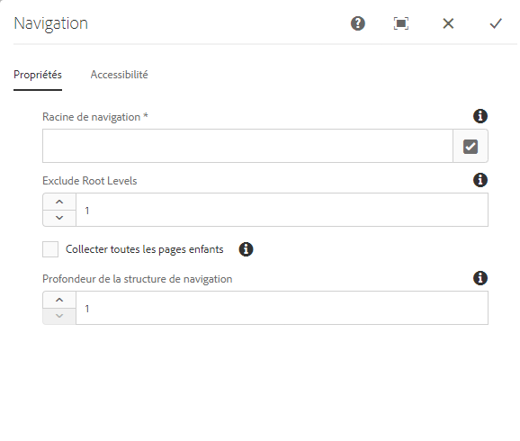
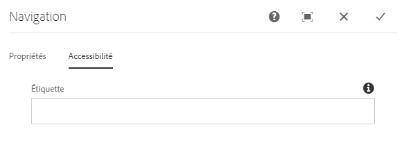
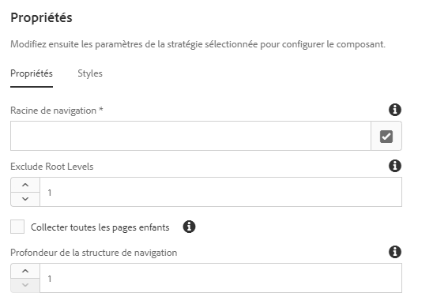

# Composant Navigation{#navigation-component}

Le composant Navigation permet aux utilisateurs de parcourir facilement une structure de site globalisée.

## Utilisation {#usage}

Les listes de composants de navigation répertorient une arborescence de pages afin que les utilisateurs d’un site puissent facilement naviguer dans la structure du site.

Le composant de navigation peut détecter automatiquement la structure de site globalisée de votre site et [s’adapter automatiquement à une page localisée.](#localized-site-structure) En outre, elle peut prendre en charge toute structure arbitraire de site en utilisant [des pages de redirection fantômes](#shadow-structure) pour représenter une structure autre que la structure de contenu principale.

La boîte de dialogue de [modification](#edit-dialog) permet à l’auteur de contenu de définir la page racine de navigation ainsi que la profondeur de navigation. La boîte de dialogue de [conception](#design-dialog) permet à l’auteur du modèle de définir les valeurs par défaut de la racine de navigation et de la profondeur.

## Prise en charge de la structure de site localisée {#localized-site-structure}

Souvent, les sites web sont proposés en plusieurs langues pour différentes zones géographiques. En règle générale, chaque page localisée contient un élément de navigation inclus dans le modèle de page. Le composant de navigation permet de le placer une fois sur un modèle pour toutes les pages du site. Il s’adapte ensuite automatiquement aux pages localisées individuelles en fonction de la structure de site globalisée.

* Pour un exemple du fonctionnement de la fonction de localisation du composant de navigation, reportez-vous à [la section ci-dessous](#example-localization).
* Pour un exemple de la façon dont les fonctions de localisation des composants principaux fonctionnent ensemble, reportez-vous à la page [Fonctions de localisation de la page Composants principaux](localization.md).

### Exemple {#example-localization}

Imaginons que votre contenu ressemble à ceci :

```
/content
+-- we-retail
   +-- language-masters
      +-- de
         \-- experience
            \-- arctic-surfing-in-lofoten
      +-- en
         \-- experience
            \-- arctic-surfing-in-lofoten
      +-- es
      +-- fr
      \-- it
   +-- us
      +-- en
         \-- experience
            \-- arctic-surfing-in-lofoten
      \-- es
   \-- ch
      +-- de
         \-- experience
            \-- arctic-surfing-in-lofoten
      +-- fr
      \-- it
+-- wknd-events
\-- wknd-shop
```

Pour le site We.Retail, il est probable que vous souhaitiez placer le composant de navigation sur un modèle de page dans le cadre de l’en-tête. Une fois qu’il fait partie du modèle, vous pouvez définir la **racine de navigation** du composant sur `/content/we-retail/language-masters/en` puisque c’est là où commence le contenu principal de ce site. Il peut également être judicieux de définir **la profondeur de la structure de navigation** sur `2` puisque vous ne souhaitez probablement pas que l’intégralité de l’arborescence de contenu soit affichée par le composant, mais plutôt les deux premiers niveaux afin de servir d’aperçu.

Avec **la valeur racine de navigation**, le composant de navigation sait que la `/content/we-retail/language-masters/en`navigation démarre et qu’elle peut générer des options de navigation en effectuant une récurrence de la structure du site deux niveaux vers le bas (comme défini par la valeur de **profondeur de la structure de navigation**).

Quelle que soit la page localisée consultée par un utilisateur, le composant de navigation par langue est capable de trouver la page localisée correspondante en connaissant l’emplacement de la page actuelle et en remontant à la racine, puis en revenant à la page correspondante.

Ainsi, si un visiteur consulte `/content/ch/de/experience/arctic-surfing-in-lofoten`, le composant sait comment générer la structure de navigation sur la base de `/content/we-retail/language-masters/de`. De même, si le visiteur consulte `/content/us/en/experience/arctic-surfing-in-lofoten`, le composant sait comment générer la structure de navigation en fonction de `/content/we-retail/language-masters/en`.

## Prise en charge de la structure de site fantôme {#shadow-structure}

Parfois, il est nécessaire de créer un menu de navigation pour le visiteur différent de la structure réelle du site. Par exemple, une promotion peut mettre en surbrillance certains contenus du menu en réorganisant la liste du contenu. En utilisant des pages fantômes qui redirigent simplement vers d’autres pages de contenu, le composant de navigation peut générer n’importe quelle structure de navigation arbitraire nécessaire.

Pour ce faire, vous devez :

1. Créez des pages d’ombre sous forme de pages vides représentant la structure de votre site. On parle généralement de structure de site fantôme.
1. Set the **Redirect** values in the page properties on these pages to point to the actual content pages.
1. Définir l’option **Masquer dans la navigation** dans les propriétés de page des pages fantômes.
1. Définir la valeur de **racine de navigation** du composant de navigation pour qu’elle pointe vers la racine de la nouvelle structure du site fantôme.

Le composant de navigation affichera alors le menu en fonction de la structure du site fantôme. Les liens rendus par le composant correspondent aux pages de contenu réelles vers lesquelles les pages fantômes redirigent et non les pages fantômes elles-mêmes. En outre, le composant affiche les noms des pages réelles et met correctement en surbrillance la page active, même lorsque la navigation est basée sur des pages fantômes. Le composant de navigation rend les pages fantômes complètement transparentes pour le visiteur.

>[!NOTE]
>Les pages d’ombre rendent vos options de navigation beaucoup plus flexibles, mais gardez à l’esprit que la maintenance de cette structure est alors entièrement manuelle. Si vous réorganisez le contenu réel du site ou ajoutez/supprimez du contenu, vous devrez mettre à jour manuellement la structure fantôme si nécessaire.

>[!NOTE]
>Lors du rendu d’une structure de site fantôme, seules les pages fantômes sont répétées par la logique de navigation. La logique ne répète pas la structure des destinations de redirection.

## Version et compatibilité {#version-and-compatibility}

La version actuelle du composant de navigation est v1, qui a été introduite avec la version 2.0.0 des composants principaux en janvier 2018 et est décrite dans ce document.

Le tableau ci-après présente en détail toutes les versions prises en charge du composant, les versions AEM avec lesquelles les versions du composant sont compatibles et les liens vers la documentation pour les versions précédentes.

| Version du composant | AEM 6.3 | AEM 6.4 | AEM 6.5 |
|--- |--- |--- |--- |
| v1 | Compatible | Compatible | Compatible |

Pour plus d’informations sur les versions et les publications des composants principaux, voir le document sur les [versions des composants principaux](versions.md).

## Exemple de sortie de composant {#sample-component-output}

Pour tester le composant Navigation et obtenir des exemples d’options de configuration, ainsi que des sorties HTML et JSON, consultez la [Bibliothèque de composants](http://opensource.adobe.com/aem-core-wcm-components/library/navigation.html).

## Détails techniques {#technical-details}

The latest technical documentation about the Navigation Component [can be found on GitHub](https://github.com/adobe/aem-core-wcm-components/blob/master/content/src/content/jcr_root/apps/core/wcm/components/navigation/v1/navigation).

Vous trouverez plus d’informations sur le développement des composants principaux dans la [documentation destinée aux développeurs de composants principaux](developing.md).

>[!NOTE]
>
>À compter de la version 2.1.0 des composants principaux, le composant Navigation prend en charge [les microdonnées schema.org](https://schema.org).

## Boîte de dialogue de modification {#edit-dialog}

Dans la boîte de dialogue de modification, l’auteur du contenu peut définir la page racine pour la navigation et la profondeur de la structure de navigation.

### Onglet Propriétés {#properties-tab}



* **Racine** de navigation : page racine, qui sera utilisée pour générer l'arborescence de navigation.
* **Exclure les niveaux** racine - Souvent, la racine ne doit pas être incluse dans la navigation. Cette option vous permet de spécifier le nombre de niveaux à partir de la racine que vous souhaitez exclure. Par exemple :
   * 0 = afficher le niveau racine
   * 1 = exclure le niveau racine
   * 2 = exclure la racine et 1 niveau supérieur
   * etc.
* **Collecte de toutes les pages** enfants : collecte toutes les pages qui sont des descendants de la racine de navigation.
* **Profondeur** de la structure de navigation : définit le nombre de niveaux dans l'arborescence de navigation que le composant doit afficher par rapport à la racine de navigation (disponible uniquement lorsque l'option **Collecter toutes les pages** enfants n'est pas sélectionnée).

### Onglet Accessibilité {#accessibility-tab}



Dans l’onglet **Accessibilité**, les valeurs peuvent être définies pour les libellés d’[accessibilité ARIA](https://www.w3.org/WAI/standards-guidelines/aria/) du composant.

* **Libellé** - Valeur d’un attribut de libellé ARIA pour le composant

## Boîte de dialogue de conception {#design-dialog}

La boîte de dialogue de conception permet à l’auteur du modèle de définir les valeurs par défaut de la page racine de navigation et de la profondeur de navigation présentée aux auteurs de contenu.

### Onglet Propriétés {#properties-tab-design}



* **Racine** de navigation : valeur par défaut de la page racine de la structure de navigation, qui sera utilisée pour générer l’arborescence de navigation et par défaut lorsque l’auteur du contenu ajoute le composant à la page.
* **Exclure les niveaux** racine - Souvent, la racine ne doit pas être incluse dans la navigation. Cette option vous permet de spécifier la valeur par défaut du nombre de niveaux à partir de la racine que vous souhaitez exclure. Par exemple :
   * 0 = afficher le niveau racine
   * 1 = exclure le niveau racine
   * 2 = exclure la racine et 1 niveau supérieur
   * etc.
* **Collecte de toutes les pages** enfants : valeur par défaut de l’option de collecte de toutes les pages qui sont des descendants de la racine de navigation.
* **Profondeur** de la structure de navigation - Valeur par défaut de la profondeur de la structure de navigation.

### Onglet Styles {#styles-tab}

Le composant de navigation prend en charge le [système de style](authoring.md#component-styling) AEM.
