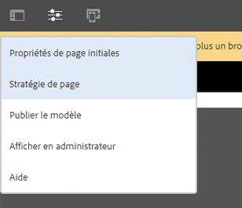
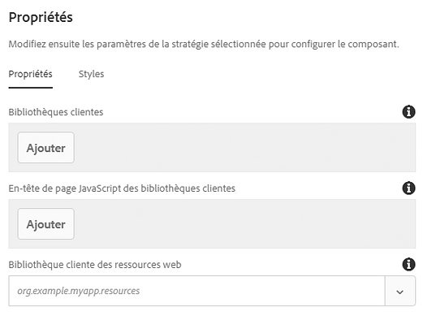

# Composant de page{#page-component}

The Page Component is an extensible page component designed to work with the [template editor](https://helpx.adobe.com/experience-manager/6-5/sites/authoring/using/templates.html) and allows page header/footer and structure components to be assembled with the template editor.

## Utilisation {#usage}

Le composant de page sert de base à toutes les pages conçues avec les composants principaux ainsi que les modèles modifiables. En utilisant le composant de page, les en-têtes, les pieds de page et la structure de la page peuvent être définis dans un modèle à l’aide des autres composants principaux.

Grâce à la [boîte de dialogue de conception](#design-dialog), les bibliothèques côté client personnalisées peuvent être définies pour la page. Contrairement aux autres composants dont la boîte de dialogue de modification est accessible directement à partir de ceux-ci, puisque le composant est la page elle-même, la [boîte de dialogue de modification](#edit-dialog) du composant de page est la fenêtre des propriétés de la page.

## Version et compatibilité {#version-and-compatibility}

La version actuelle du composant de page est v2, qui a été introduite avec la version 2.0.0 des composants principaux en janvier 2018. Elle est décrite dans ce document.

Le tableau ci-après présente en détail toutes les versions prises en charge du composant, les versions AEM avec lesquelles les versions du composant sont compatibles et les liens vers la documentation pour les versions précédentes.

| Version du composant | AEM 6.3 | AEM 6.4 | AEM 6.5 |
|---|---|---|---|
| [v2](page-v1.md) | Compatible | Compatible | Compatible |
| v1 | Compatible | Compatible | Compatible |

Pour plus d’informations sur les versions et les publications des composants principaux, voir le document sur les [versions des composants principaux](versions.md).

>[!NOTE]
>
>To enable redirect at `cq:Page` level for verison 2 of the page component and AEM 6.3, [service pack 2](https://helpx.adobe.com/experience-manager/6-3/release-notes/sp2-release-notes.html) or later is required. Cette redirection n’était pas disponible dans les versions précédentes.

## Exemple de sortie de composant {#sample-component-output}

Voici un exemple extrait de [We.Retail](https://helpx.adobe.com/experience-manager/6-5/sites/developing/using/we-retail.html).

### Capture d’écran {#screenshot}

### Détails techniques {#technical-details}

La documentation technique la plus récente sur le composant de page [se trouve sur GitHub](https://github.com/adobe/aem-core-wcm-components/blob/master/content/src/content/jcr_root/apps/core/wcm/components/page/v2/page).

Vous trouverez plus d’informations sur le développement des composants principaux dans la [documentation destinée aux développeurs de composants principaux](developing.md).

## Boîte de dialogue de modification{#edit-dialog}

Because the component represents the entire page, settings that would normally be in an edit dialog are found in the [Page Properties](https://helpx.adobe.com/experience-manager/6-5/sites/authoring/using/editing-page-properties.html) window.

## Boîte de dialogue de conception {#design-dialog}

Étant donné que le composant représente la page entière, la boîte de dialogue de conception est accessible via **les informations de page -&gt; Stratégie de page** lors de la modification du modèle de page.

>[!NOTE]
>
>Dans les versions précédentes d’AEM, la **Stratégie de page** était appelée **Conception de page**.

### Onglet Propriétés {#properties-tab}

À l’aide de la fenêtre Conception de page, vous pouvez définir les bibliothèques clientes à charger ainsi que la bibliothèque de ressources Web pour la page.

* **Bibliothèques clientes**
Cette option définit les catégories de bibliothèque clientes à charger. JavaScript est ajouté à la fin du corps et le CSS est ajouté à l’en-tête de la page.
* **En-tête de page JavaScript des bibliothèques clientes**
Ceci définit les catégories de bibliothèque clientes JavaScript à charger dans l’en-tête de la page.
   * Les catégories définies ici et qui sont aussi présentes dans le champ **Bibliothèques clientes** ont le code JavaScript chargé dans l’en-tête de la page et non dans la fin du corps.
   * Aucun CSS ne sera chargé, sauf si la catégorie est également présente dans le champ **Bibliothèques clientes**.

* **Bibliothèque de ressources web**
Catégorie de bibliothèque cliente utilisée pour distribuer des ressources Web telles que des favicons.

Les bibliothèques peuvent être configurées pour les champs **Bibliothèques clientes** et **En-tête de page JavaScript des bibliothèques clientes** de la manière suivante :

* Pour ajouter un nouveau champ, appuyez ou cliquez sur le bouton **Ajouter** sous les champs.
* Pour supprimer un champ, cliquez ou appuyez sur l’icône de corbeille à côté du champ à supprimer.
* Pour réorganiser l’ordre de chargement, cliquez ou appuyez et faites glisser la poignée à côté du champ à déplacer.

For more information about using client-side libraries see [Using Client Side Libraries](https://helpx.adobe.com/experience-manager/6-5/sites/developing/using/clientlibs.html).

>[!CAUTION]
>
>La possibilité de définir séparément les bibliothèques clientes pour l’en-tête de page a été introduite avec la version 2.2.0 des composants principaux.

### Onglet Styles {#styles-tab}

Le composant Page prend en charge le [système de style](authoring.md#component-styling) AEM.