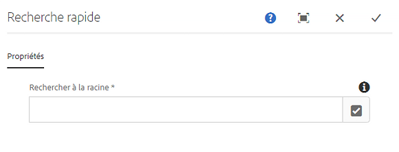
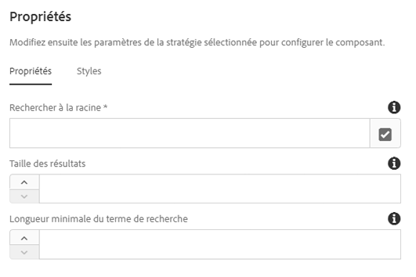

# Composant Recherche rapide{#quick-search-component}

Le composant Recherche rapide fournit des fonctionnalités de recherche à un site Web et présente les résultats de recherche afin que les visiteurs puissent facilement trouver le contenu correspondant et afficher les résultats.

## Utilisation {#usage}

Le composant Recherche rapide permet aux visiteurs du site de rechercher du contenu, d’afficher les résultats en place et de naviguer facilement vers les pages correspondantes. De nouveaux résultats sont extraits dynamiquement lorsque l’utilisateur fait défiler les résultats de la recherche.

La [boîte de dialogue de modification](#edit-dialog) permet à l’auteur de contenu de définir l’emplacement où doit commencer la recherche dans l’arborescence de contenu. À l’aide de la [boîte de dialogue de conception](#design-dialog), l’auteur du modèle peut définir la valeur par défaut pour laquelle la recherche doit commencer dans l’arborescence de contenu, ainsi qu’une taille de jeu de résultats maximale et une durée minimale de recherche.

## Version et compatibilité {#version-and-compatibility}

La version actuelle du composant Recherche rapide est v1, qui a été introduite avec la version 2.0.0 des composants principaux en janvier 2018 et est décrite dans ce document.

Le tableau ci-après présente en détail toutes les versions prises en charge du composant, les versions AEM avec lesquelles les versions du composant sont compatibles et les liens vers la documentation pour les versions précédentes.

| Version du composant | AEM 6.3 | AEM 6.4 | AEM 6.5 |
|--- |--- |--- |--- |
| v1 | Compatible | Compatible | Compatible |

Pour plus d’informations sur les versions et les publications des composants principaux, voir le document sur les [versions des composants principaux](versions.md).

## Exemple de sortie de composant {#sample-component-output}

Voici un exemple tiré de [We.Retail](https://helpx.adobe.com/experience-manager/6-5/sites/developing/using/we-retail.html).

### Capture d’écran {#screenshot}


### HTML {#html}

```
<section class="cmp-search" role="search" data-cmp-is="search" data-cmp-min-length="3" data-cmp-results-size="10">
    <form class="cmp-search__form" data-cmp-hook-search="form" method="get" action="/content/we-retail/us/en/equipment.searchresults.json/_jcr_content/root/responsivegrid/search" autocomplete="off">
        <div class="cmp-search__field">
            <i class="cmp-search__icon" data-cmp-hook-search="icon"></i>
            <span class="cmp-search__loading-indicator" data-cmp-hook-search="loadingIndicator"></span>
            <input class="cmp-search__input" data-cmp-hook-search="input" type="text" name="fulltext" placeholder="Search" role="combobox" aria-autocomplete="list" aria-haspopup="true" aria-invalid="false">
            <button class="cmp-search__clear" data-cmp-hook-search="clear">
                <i class="cmp-search__clear-icon"></i>
            </button>
        </div>
    </form>
    <div class="cmp-search__results" data-cmp-hook-search="results" role="listbox" aria-multiselectable="false"></div>
    
<script data-cmp-hook-search="itemTemplate" type="x-template">
    <a class="cmp-search__item" data-cmp-hook-search="item">
        <span class="cmp-search__item-title" data-cmp-hook-search="itemTitle"></span>
    </a>
</script>
</section>
```

### JSON {#json}

```
"search":{  
                     "columnClassNames":"aem-GridColumn aem-GridColumn--default--12",
                     "relativePath":"/jcr:content/root/responsivegrid/search",
                     "resultsSize":10,
                     "searchTermMinimumLength":3,
                     ":type":"core/wcm/components/search/v1/search"
                  }
```

### Détails techniques {#technical-details}

>[!NOTE]
>
>La protection du composant Recherche ou de toute application basée sur AEM par rapport aux attaques DOS doit être implémentée à un niveau supérieur, par exemple à l’aide `mod_security` du dispatcher.

Vous trouverez la documentation technique la plus récente sur le composant Recherche rapide [sur GitHub](https://github.com/adobe/aem-core-wcm-components/blob/master/content/src/content/jcr_root/apps/core/wcm/components/search/v1/search).

Vous trouverez plus d’informations sur le développement des composants principaux dans la [documentation destinée aux développeurs de composants principaux](developing.md).

## Boîte de dialogue de modification {#edit-dialog}

La boîte de dialogue de modification permet à l’auteur de contenu de définir l’emplacement où doit commencer la recherche dans l’arborescence de contenu.



**Racine de recherche** - Page racine d’où lancer la recherche. La racine de recherche peut être un gabarit principal, une page principale ou une page normale.

## Boîte de dialogue de conception {#design-dialog}

À l’aide de la boîte de dialogue de conception, l’auteur du modèle peut définir la valeur par défaut pour laquelle, dans l’arborescence de contenu, la recherche doit commencer, ainsi qu’une taille de jeu de résultats maximale et la longueur minimale du terme. La boîte de dialogue de conception permet à l’auteur du modèle de définir quelles options de mise en forme de texte sont disponibles pour les auteurs de contenu.

### Onglet Propriétés {#properties-tab}



* **Racine de recherche**
La valeur par défaut de la racine de recherche lorsqu’un auteur de contenu place le composant Recherche rapide sur une page de contenu.
* **Taille des résultats**
Le nombre maximal de résultats extraits par une requête de recherche.
* **Longueur minimale du terme de recherche**
Longueur minimale du terme de recherche pour lancer la recherche.

>[!NOTE]
>
>La **Taille des résultats** et la **Longueur minimum du terme de recherche** ne peuvent être définies qu’en mode conception et, par conséquent, au niveau du modèle, ce qui signifie que les auteurs de contenu ne peuvent pas modifier ces valeurs.

>[!CAUTION]
>
>La **Taille des résultats** et la **Longueur minimale du terme de recherche** peuvent avoir un impact sur les performances si elles sont trop élevées ou trop faibles, respectivement.

### Onglet Styles {#styles-tab}

Le composant Recherche rapide prend en charge le [système de style](authoring.md#component-styling) AEM.