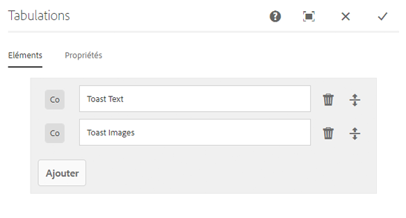
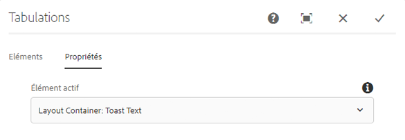
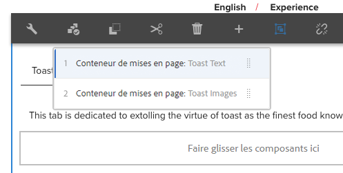

# Composant Onglets

Le composant Onglets Composant principal permet l&#39;organisation de contenu sur plusieurs onglets.

## Utilisation {#usage}

Le composant Onglets permet à l&#39;auteur de contenu d&#39;organiser le contenu de la page dans plusieurs onglets.

Le [dialogue Modifier](#edit-dialog) permet à l&#39;auteur de contenu de définir plusieurs onglets et de définir l&#39;onglet actif. A l&#39;aide de [la boîte de dialogue de conception](#design-dialog), l&#39;auteur du modèle peut définir les composants qui peuvent être ajoutés aux onglets et personnaliser les styles.

>[!NOTE]
>
>Les composants de panneau imbriqués (onglets dans les onglets) sont pris en charge.
>
>Les composants de l&#39;onglet simple (non imbriqués) peuvent être localisés/sélectionnés à l&#39;aide de [l&#39;arborescence de contenu](https://helpx.adobe.com/experience-manager/6-5/sites/authoring/using/author-environment-tools.html), mais les onglets imbriqués ne peuvent pas l&#39;être.

## Version et compatibilité {#version-and-compatibility}

La version actuelle du composant Onglets est v 1, qui a été introduite avec la version 2.2.0 des composants principaux d&#39;octobre 2018 et est décrite dans ce document.

Le tableau suivant détaille toutes les versions prises en charge du composant, les versions AEM avec lesquelles les versions du composant sont compatibles et les liens vers la documentation pour les versions précédentes.

| Version du composant | AEM 6.3 | AEM 6.4 | AEM 6.5 |
|--- |--- |--- |--- |
| v1 | Compatible | Compatible | Compatible |

Pour plus d&#39;informations sur les versions et les versions des composants principaux, consultez les versions des composants de Document [principaux](versions.md).

## Exemple de sortie de composant {#sample-component-output}

Voici un exemple tiré de [We. Retail](https://helpx.adobe.com/experience-manager/6-5/sites/developing/using/we-retail.html).

### Capture d’écran {#screenshot}

### Bibliothèque de composants

Pour tester le composant Onglets ainsi que des exemples d&#39;options de configuration, ainsi que des sorties HTML et JSON, consultez la bibliothèque [de composants](http://opensource.adobe.com/aem-core-wcm-components/library/tabs.html).

### Détails techniques {#technical-details}

Vous trouverez la documentation technique la plus récente sur le composant [Onglets sur github](https://github.com/adobe/aem-core-wcm-components/blob/master/content/src/content/jcr_root/apps/core/wcm/components/tabs/v1/tabs).

Vous trouverez plus d&#39;informations sur le développement des composants principaux dans la documentation destinée aux développeurs de composants [principaux](developing.md).

## Modifier le dialogue {#edit-dialog}

La boîte de dialogue Modifier permet à l&#39;auteur de contenu de créer, renommer et réorganiser les onglets et de définir l&#39;onglet actif.

### Onglet Eléments {#items-tab}

Utilisez le bouton **Ajouter** pour ouvrir le sélecteur de composants afin de choisir le composant à ajouter sous forme d&#39;onglet. Une fois ajouté, une entrée est ajoutée à la liste qui contient les colonnes suivantes :

* **Icône** - Icône du type de composant de l&#39;onglet pour une identification facile dans la liste. Placez le pointeur de la souris sur pour afficher le nom complet du composant sous forme d&#39;info-bulle.
* **Description** : description utilisée comme texte de l&#39;onglet, par défaut au nom du composant sélectionné pour l&#39;onglet.
* **Supprimer** : appuyez ou cliquez sur pour supprimer l&#39;onglet du composant de tabulation.
* **Réorganiser** : appuyez sur ou cliquez et faites glisser pour réorganiser l&#39;ordre des onglets.

### Onglet Propriétés {#properties-tab}

Dans l&#39;onglet **Propriétés** , l&#39;auteur du contenu peut définir quel onglet est actif lorsque la page est chargée. Avec l&#39;option **Par défaut** , le premier onglet est sélectionné.

## Sélectionner un panneau {#select-panel}

L&#39;auteur du contenu peut utiliser l&#39;option **Sélectionner un panneau** de la barre d&#39;outils de composants pour changer de panneau pour le modifier et réorganiser facilement l&#39;ordre des onglets.

Lorsque vous sélectionnez l&#39;option **Sélectionner un panneau** dans la barre d&#39;outils de composant, les onglets configurés s&#39;affichent sous forme de liste déroulante.

* La liste est triée par ordre de tabulation attribué et reflète la numérotation.
* Le type de composant de l&#39;onglet est affiché en premier, suivi de la description de l&#39;onglet dans la police plus claire.

* Lorsque vous appuyez ou cliquez sur une entrée dans la liste déroulante, la vue de l&#39;éditeur est commutée dans cet onglet.
* Vous pouvez réorganiser les onglets en place à l&#39;aide des poignées de glissement.

>[!NOTE]
>
>Les onglets ne sont pas sélectionnables par l&#39;auteur en mode **d&#39;édition** . Utilisez [**le mode Aperçu**](https://helpx.adobe.com/experience-manager/6-5/sites/authoring/using/editing-content.html) ou **[l&#39;option Affichage comme publié](https://helpx.adobe.com/experience-manager/6-5/sites/authoring/using/editing-content.html)** pour interagir avec les onglets en tant que lecteurs du contenu publié.

## Créer un dialogue {#design-dialog}

Le dialogue de conception permet à l&#39;auteur du modèle de définir quels composants peuvent être ajoutés en tant qu&#39;éléments au composant des onglets et de définir les styles personnalisés disponibles pour l&#39;auteur du contenu.

### Onglet Composants autorisés {#allowed-components-tab}

L&#39;onglet **Composants** autorisés permet de définir quels composants peuvent être ajoutés en tant qu&#39;éléments au composant des onglets par l&#39;auteur du contenu.

L&#39;onglet Composants autorisés fonctionne de la même manière que l&#39;onglet du même nom lors [de la définition de la stratégie et des propriétés d&#39;un conteneur de dispositions dans l&#39;éditeur de modèles.](https://helpx.adobe.com/experience-manager/6-5/sites/authoring/using/templates.html)

### Onglet Styles {#styles-tab}

Le composant Onglets prend en charge le système [de style AEM](authoring.md#component-styling).