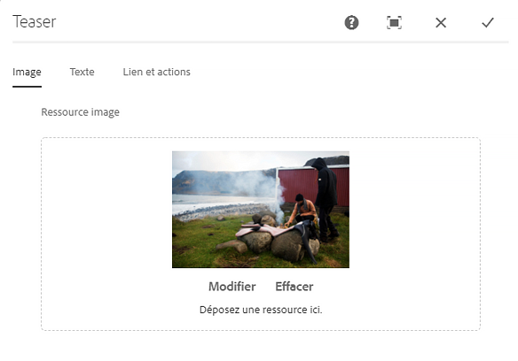
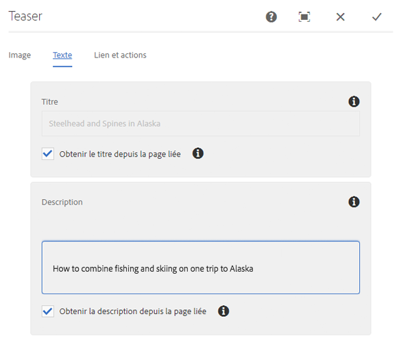
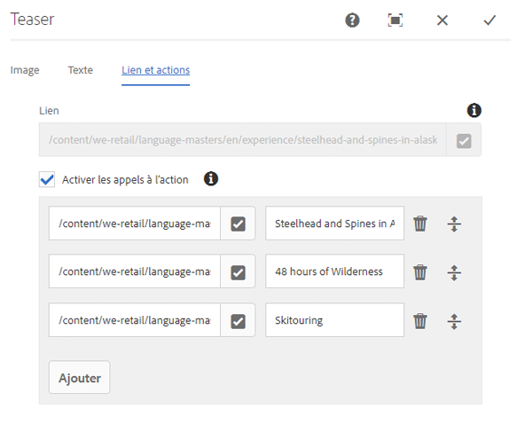
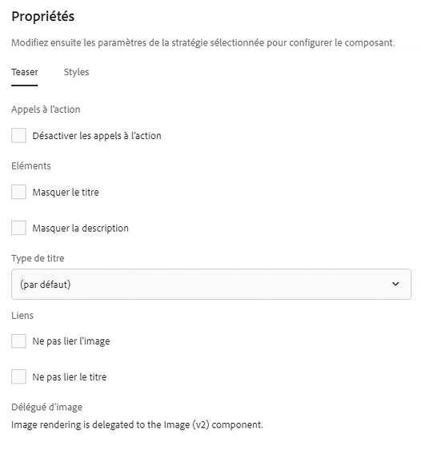

# Composant Teaser{#teaser-component}

Le composant de Teaser Component Core peut afficher une image, un titre, un texte enrichi et éventuellement un lien vers un contenu supplémentaire.

## Utilisation {#usage}

Le composant Teaser permet à l&#39;auteur de contenu de créer facilement un teaser vers un contenu supplémentaire à l&#39;aide d&#39;une image, d&#39;un titre ou d&#39;un texte enrichi et de lier un contenu supplémentaire ou d&#39;autres actions.

L&#39;auteur du modèle peut utiliser la boîte de dialogue [de conception](#design-dialog) pour définir si les options de création d&#39;appel à actions et d&#39;ajout de liens sont disponibles et désactive différentes options d&#39;affichage. L&#39;auteur du contenu peut utiliser la [boîte de dialogue Configurer](#configure-dialog) pour définir une image, définir des CTAS, définir des titres et descriptions et configurer des liens vers le teaser individuel. Vous pouvez accéder à la [boîte de dialogue](image.md#edit-dialog) [Modifier du composant](image.md) d&#39;image pour modifier l&#39;image de teaser.

## Version et compatibilité {#version-and-compatibility}

La version actuelle du composant Teaser est v 1, qui a été introduite avec la version 2.1.0 des composants principaux de juillet 2018 et est décrite dans ce document.

Le tableau suivant détaille toutes les versions prises en charge du composant, les versions AEM avec lesquelles les versions du composant sont compatibles et les liens vers la documentation pour les versions précédentes.

| Version du composant | AEM 6.3 | AEM 6.4 | AEM 6.5 |
|---|---|---|---|
| v1 | Compatible | Compatible | Compatible |

## Exemple de sortie de composant {#sample-component-output}

Voici un exemple tiré de [We. Retail](https://helpx.adobe.com/experience-manager/6-5/sites/developing/using/we-retail.html).

### Capture d’écran {#screenshot}

### Bibliothèque de composants

Pour tester le composant Teaser ainsi que des exemples d&#39;options de configuration, ainsi que des sorties HTML et JSON, consultez la [bibliothèque Composant](http://opensource.adobe.com/aem-core-wcm-components/library/teaser.html).

### Détails techniques {#technical-details}

Vous trouverez la documentation technique la plus récente sur le composant [Teaser sur github](https://github.com/adobe/aem-core-wcm-components/blob/master/content/src/content/jcr_root/apps/core/wcm/components/teaser/v1/teaser).

Vous trouverez plus d&#39;informations sur le développement des composants principaux dans la documentation destinée aux développeurs de composants [principaux](developing.md).

## Configurer le dialogue {#configure-dialog}

L&#39;auteur du contenu peut utiliser la boîte de dialogue Configurer pour définir les propriétés du teaser individuel. Il existe également un dialogue [Modifier](#edit-dialog) pour modifier l&#39;image de teaser si celle-ci est sélectionnée.

### Image {#image}

* **Ressource image**
   * Déposez un fichier depuis l&#39;explorateur [de ressources](https://helpx.adobe.com/experience-manager/6-5/sites/authoring/using/author-environment-tools.html) ou appuyez sur l&#39;option **de navigation** à télécharger à partir d&#39;un système de fichiers local.
   * Appuyez ou cliquez **sur Effacer** pour désélectionner l&#39;image actuellement sélectionnée.
   * Appuyez ou cliquez **sur Modifier** pour [gérer les rendus de la ressource](https://helpx.adobe.com/experience-manager/6-5/assets/using/managing-assets-touch-ui.html) dans l&#39;éditeur de ressources.

### Texte {#text}

* **Titre**
Définit un titre à afficher comme titre pour le teaser.
* **Obtenir le titre de la page
liée** Lorsque cette option est cochée, le titre est renseigné avec le titre de la page liée.
* **Description**
Définit une description à afficher sous forme de sous-titre du teaser.
* **Obtenir la description de la page
liée** Lorsque cette option est cochée, la description est renseignée avec la description de la page liée.

### Liens et actions {#links-actions}

* **Lien de lien**
appliqué au teaser. Utilisez le navigateur de chemins pour sélectionner la cible du lien.
* **Activez l&#39;option Appel à des actions**
lorsqu&#39;elle est cochée, active la définition d&#39;appel à actions. Le premier lien Appel à action de la liste est utilisé comme lien pour d&#39;autres éléments de teaser.

## Modifier le dialogue {#edit-dialog}

Le composant Teaser délègue le rendu d&#39;image au composant [Image](image.md). Par conséquent, [la boîte de dialogue]Modifier (image. md # edit-dialog du composant d&#39;image est accessible à l&#39;auteur du contenu pour manipuler l&#39;image de teaser).

## Créer un dialogue {#design-dialog}

Le dialogue de conception permet à l&#39;auteur du modèle de définir les options de teaser que l&#39;auteur du contenu a définies lors de l&#39;utilisation de ce composant.

### Onglet Teaser {#teaser-tab}

* **Appels à l’action**
   * **Désactivation des appels à actions**
Masquer l&#39;option **Appel à actions** pour les auteurs de contenu
* **Eléments**
   * **Masquer le titre**
      * Masque l&#39;option **Titre** pour les auteurs de contenu
      * Lorsqu&#39;il est sélectionné, **le type** de titre est masqué
   * **Masquer la description**
Masquer l&#39;option **Description** pour les auteurs de contenu
* **Type
de titre** Définit la balise H à utiliser par le titre du teaser.
* **Liens**
   * **Ne pas lier l&#39;image**
lorsque cette option est sélectionnée, l&#39;image de teaser n&#39;est pas liée
   * **Ne pas lier le titre**
Lorsque sélectionné, le titre du teaser n&#39;est pas lié

### Onglet Styles {#styles-tab}

Le composant Teaser prend en charge le système [de style AEM](authoring.md#component-styling).
