# Composant Texte (v1){#text-component-v}

Le composant Texte est un composant d’édition et de composition de texte enrichi qui propose une édition statique.

## Utilisation {#usage}

Le composant Texte propose un puissant éditeur de texte enrichi qui permet d’apporter facilement des modifications de texte dans un éditeur en ligne simplifié, ainsi qu’un format plein écran.

La [boîte de dialogue de modification](text-v1.md#main-pars_title) permet de modifier en ligne les options limitées avec des fonctionnalités complètes disponibles dans la boîte de dialogue de modification en plein écran. À l’aide de la [boîte de dialogue de conception](text-v1.md#main-pars_title_1995166862), les options de mise en forme de texte telles que les en-têtes, les caractères spéciaux et les styles de paragraphe peuvent être configurées pour le modèle de l’auteur du contenu.

## Version et compatibilité {#version-and-compatibility}

Ce document décrit la version v1 du composant Texte, introduite à l’origine avec la version 1.0.0 des composants principaux avec AEM 6.3.

Le tableau suivant répertorie la compatibilité de la version v1 du composant Texte.

| Version d’AEM | Composant Texte v1 |
|--- |--- |
| 6.3 | Compatible |
| 6.4 | Compatible |

>[!CAUTION]
>
>Ce document décrit la version v1 du composant Texte.
>
>Pour plus d’informations sur la version actuelle du composant Texte, voir le document [Composant Texte](text.md).

## Exemple de sortie de composant {#sample-component-output}

Voici un exemple tiré de [We.Retail](https://helpx.adobe.com/experience-manager/6-4/sites/developing/using/we-retail.html).

### Capture d’écran {#screenshot}

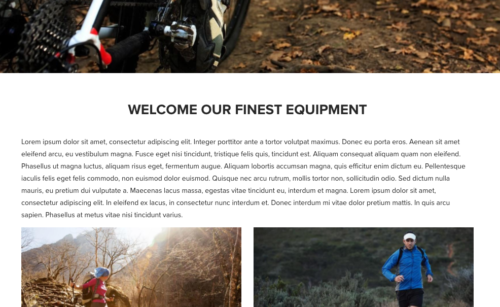

### HTML {#html}

```
<div class="cmp cmp-text aem-GridColumn aem-GridColumn--default--12">
<p>Lorem ipsum dolor sit amet, consectetur adipiscing elit. Integer porttitor ante a tortor volutpat maximus. Donec eu porta eros. Aenean sit amet eleifend arcu, eu vestibulum magna. Fusce eget nisi tincidunt, tristique felis quis, tincidunt est. Aliquam consequat aliquam quam non eleifend. Phasellus ut magna luctus, aliquam risus eget, fermentum augue. Aliquam lobortis accumsan magna, quis efficitur enim dictum eu. Pellentesque iaculis felis eget felis commodo, non euismod dolor euismod. Quisque nec arcu rutrum, mollis tortor non, sollicitudin odio. Sed dictum nulla mauris, eu pretium dui vulputate a. Maecenas lacus massa, egestas vitae tincidunt eu, interdum et magna. Lorem ipsum dolor sit amet, consectetur adipiscing elit. In eleifend ex lacus, in consectetur nunc interdum et. Donec interdum mi vitae dolor pretium mattis. In quis arcu sapien. Phasellus at metus vitae nisi tincidunt varius.<br />
</p>
</div>
```

### JSON {#json}

```
"text": {
              "columnClassNames": "aem-GridColumn aem-GridColumn--default--12",
              "text": "<p>Lorem ipsum dolor sit amet, consectetur adipiscing elit. Integer porttitor ante a tortor volutpat maximus. Donec eu porta eros. Aenean sit amet eleifend arcu, eu vestibulum magna. Fusce eget nisi tincidunt, tristique felis quis, tincidunt est. Aliquam consequat aliquam quam non eleifend. Phasellus ut magna luctus, aliquam risus eget, fermentum augue. Aliquam lobortis accumsan magna, quis efficitur enim dictum eu. Pellentesque iaculis felis eget felis commodo, non euismod dolor euismod. Quisque nec arcu rutrum, mollis tortor non, sollicitudin odio. Sed dictum nulla mauris, eu pretium dui vulputate a. Maecenas lacus massa, egestas vitae tincidunt eu, interdum et magna. Lorem ipsum dolor sit amet, consectetur adipiscing elit. In eleifend ex lacus, in consectetur nunc interdum et. Donec interdum mi vitae dolor pretium mattis. In quis arcu sapien. Phasellus at metus vitae nisi tincidunt varius.</p>\n",
              "richText": true,
              ":type": "weretail/components/content/text"
            }
```

>[!NOTE]
>
>L’exportation JSON à partir des composants principaux nécessite la version 1.1.0 des composants principaux. Pour plus d’informations, voir les [informations de compatibilité des composants principaux v1](versions.md#main-pars_title_236368006).

## Boîte de dialogue de modification {#edit-dialog}

La boîte de dialogue de modification propose les outils standard de mise en forme de texte enrichi qu’un utilisateur devrait utiliser pour composer du texte.

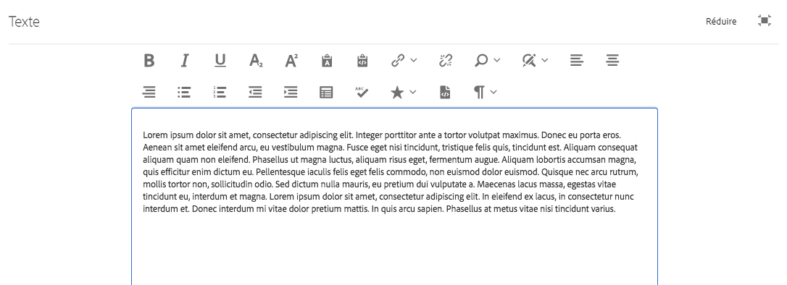

* Gras

   

   Utilisé pour appliquer une mise en forme gras au texte sélectionné ou au texte gras saisi après le curseur.

   **Ctrl + B** peut être utilisé comme raccourci clavier.

* Italique

   

   Utilisé pour appliquer une mise en forme en italique au texte sélectionné ou mettre en italique le texte saisi après le curseur.

   **Ctrl + I** peut être utilisé comme raccourci clavier.

* Souligné

   

   Utilisé pour appliquer une mise en forme soulignée au texte ou au texte souligné sélectionné après le curseur.

   **Ctrl + U** peut être utilisé comme raccourci clavier.

* Indice

   

   Utilisé pour mettre en forme le texte ou le texte sélectionné après le curseur comme indice.

* Exposant

   

   Utilisé pour mettre en forme le texte ou le texte sélectionné après le curseur comme exposant.

* Coller en tant que texte

   

   Colle le texte copié en tant que texte brut sans mise en forme.

   Lorsque vous sélectionnez cette option, une fenêtre s’ouvre où le texte peut être collé en tant que texte brut sans formatage en tant qu’aperçu avant d’être inséré dans le texte. Acceptez en appuyant ou en cliquant sur la coche, annulez en appuyant ou en cliquant sur le x.

   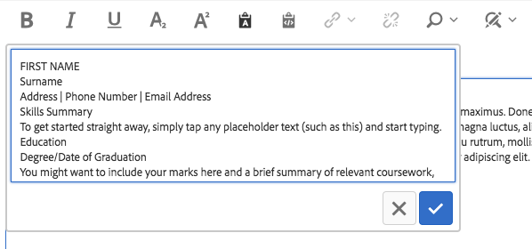

* Coller à partir de Word

   

   Lorsque vous sélectionnez cette option, une fenêtre s’ouvre où le texte peut être collé, en conservant sa mise en forme en tant qu’aperçu avant de l’insérer dans le texte. Acceptez en appuyant ou en cliquant sur la coche, annulez en appuyant ou en cliquant sur le x.

   

* Lien hypertexte

   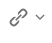

   Utilisez cette option pour convertir le texte sélectionné en hyperlien ou modifier un lien déjà défini. Cette option est uniquement active lorsque le texte est déjà sélectionné et ouvre une fenêtre avec des options supplémentaires pour définir le lien.

   

   * Saisissez l’emplacement.

      * Utilisation de la boîte de dialogue Ouvrir la sélection pour choisir un chemin dans AEM
      * Si le lien ne figure pas dans AEM, saisissez l’URL absolue (les chemins non absolus sont interprétés comme relatifs par rapport à AEM).
   * Saisissez un autre texte descriptif pour le lien.
   * Sélectionner le comportement des liens

      * Cible
      * Même onglet
      * Nouvel onglet
      * Cadre parent
      * Cadre supérieur
   Appuyez ou cliquez sur la coche pour appliquer le lien ou sur le x pour annuler.

* Dissocier

   

   Utilisez cette option pour supprimer un lien déjà appliqué au texte sélectionné. Cette option est uniquement active lorsqu’un lien est déjà sélectionné.

* Rechercher

   

   Utilisez cette option pour rechercher dans le texte les occurrences d’une chaîne de texte spécifiée. Cette option permet d’ouvrir une fenêtre pour définir les options de recherche.

   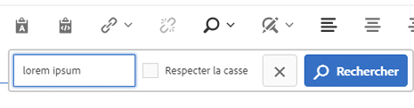

   Entrez le texte pour lequel vous souhaitez effectuer des recherches et appuyez ou cliquez sur **Rechercher** pour lancer la recherche. Appuyez ou cliquez sur le x pour annuler.

   Si vous souhaitez effectuer une correspondance exacte, sélectionnez l’option **Correspondance avec la casse** avant de lancer la recherche.

   Si une correspondance est trouvée, elle est mise en surbrillance et le dialogue de recherche est grisé. Appuyez ou cliquez à nouveau sur le bouton **Rechercher** dans la boîte de dialogue grisée pour rechercher l’occurrence suivante.

   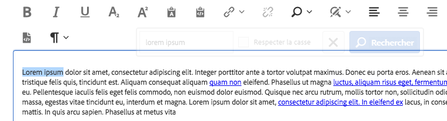

   Si aucune occurrence supplémentaire n’est trouvée, un message s’affiche et la recherche redémarre à partir du début du texte.

   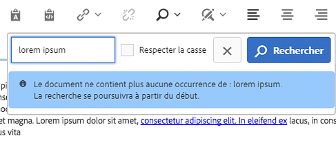

* Remplacer

   

   Utilisez cette option pour rechercher dans le texte des occurrences d’une chaîne de texte spécifiée et remplacer les correspondances par une autre chaîne. Cette option ouvre une fenêtre permettant de spécifier les options de recherche et de remplacement.

   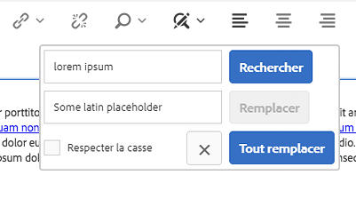

   Entrez le texte à rechercher ainsi que le texte avec lequel le remplacer.

   Appuyez ou cliquez sur **Rechercher** pour lancer la recherche. Cliquez ou appuyez sur le x pour annuler.

   Si vous souhaitez effectuer une correspondance exacte, sélectionnez l’option **Correspondance avec la casse** avant de lancer la recherche.

   Si une correspondance est trouvée, elle est mise en surbrillance et le dialogue de recherche est grisé. Cliquez à nouveau sur le bouton **Rechercher** dans la boîte de dialogue grisée pour rechercher l’occurrence suivante ou sélectionnez le bouton **Remplacer** pour remplacer le texte mis en surbrillance. Notez que le bouton **Remplacer** n’est actif qu’une fois qu’une correspondance est trouvée.

   Sélectionnez **Remplacer tout** pour remplacer toutes les occurrences du texte à la fois.

* Aligner le texte à gauche

   

   Utilisé pour aligner le texte sur la marge gauche.

* Texte centré

   

   Utilisé pour centrer le texte.

* Aligner le texte à droite

   

   Utilisé pour aligner le texte sur la marge droite.

* Puce

   

   Utilisé pour formater le texte sélectionné sous forme d’une liste à puces ou commencer l’insertion d’une liste à puces après le curseur.

   Pour mettre fin à une liste à puces, appuyez ou cliquez de nouveau sur le bouton **Puces** ou saisissez deux retours chariot.

* Numérotée

   

   Utilisé pour mettre en forme le texte sélectionné sous forme de liste numérotée ou commencer l’insertion d&#39;une liste numérotée après le curseur.

   Pour mettre fin à une liste numérotée, appuyez ou cliquez de nouveau sur le bouton **Numérotée** ou saisissez deux retours chariot.

* Retrait négatif

   

   Utilisé pour diminuer le niveau de mise en retrait du texte sélectionné ou du texte entré après le curseur.

   Uniquement actif si le texte ou la position sélectionnés du curseur est déjà mis en retrait.

* Retrait

   

   Utilisé pour augmenter le niveau de mise en retrait du texte ou du texte sélectionnés après le curseur.

* Tableau

   

   Utilisé pour insérer un tableau dans le texte. Cette option permet d’ouvrir une fenêtre pour indiquer les détails du tableau.

   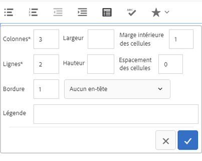

   * **Colonnes** - Nombre de colonnes du tableau (obligatoire).
   * **Lignes** - Nombre de lignes du tableau (obligatoire).
   * **Largeur** - Largeur totale du tableau.
   * **Hauteur** - Hauteur totale du tableau.
   * **Marge intérieure des cellules** - Espace autour du contenu de la cellule.
   * **Espacement des cellules** - Espacement entre les cellules.
   * **Bordure** - Poids des lignes de bordure du tableau.
   * Si pour l’en-tête du tableau :

      * La première ligne doit être utilisée
      * La première colonne doit être utilisée
      * La première ligne et la première colonne doivent être utilisées
      * Ou aucun en-tête ne doit être utilisé.
   * **Légende** - Légende du tableau.


* Vérifier l’orthographe

   

   Permet de vérifier l’orthographe du contenu du texte. Les fautes de frappe possibles sont soulignées avec des lignes rouges rompues.

* Caractères spéciaux

   

   Utilisé pour insérer des caractères spéciaux dans le texte. Cette option ouvre une fenêtre où les caractères disponibles sont affichés.

   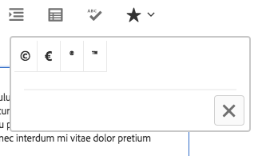

   Appuyez ou cliquez sur le caractère souhaité pour l’insérer dans le texte après le curseur. Plusieurs caractères peuvent être insérés. Appuyez ou cliquez sur le x pour fermer la fenêtre de sélection.

* Modification de la source

   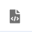

   Utilisé pour afficher et modifier la source HTML du texte.

   Appuyez ou cliquez sur l’icône **Modifier la source** pour modifier le contenu du texte à partir de la vue formatée pour afficher le code HTML brut. Dans ce mode, toutes les autres options de formatage sont désactivées. Appuyez ou cliquez de nouveau sur l’icône **Modifier la source** pour revenir à la vue formatée.

   >[!CAUTION]
   >
   >Comme c’est toujours le cas avec l’accès au code HTML brut, vous devez faire preuve de prudence lors de l’utilisation de l’option **Modifier la source**.
   >
   >
   >Le code HTML saisi via l’option **Modifier la source** est analysé pour les risques XSS et tous les scripts insérés sont supprimés et ne s’affichent pas sur la page produite. Cependant, le code HTML mal formé saisi dans l’option **Modifier la source** peut casser le modèle de la page, ce qui entraîne une mise en forme inattendue ou un rendu inutilisable de la page obtenue.

* Format de paragraphe

   

   Utilisé pour appliquer le formatage des paragraphes au texte sélectionné ou au texte inséré après le curseur. La sélection de cette option ouvre une liste déroulante à partir de laquelle le format de paragraphe est sélectionné.

   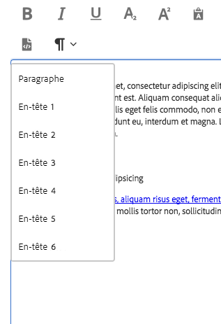

Le composant de texte peut également être modifié en ligne mais en raison des contraintes d’espace, toutes les options de formatage ne sont pas disponibles en ligne. Pour afficher toutes les options, passez en mode plein écran.


## Boîte de dialogue Conception {#design-dialog}

La boîte de dialogue Conception permet à l’auteur du modèle de définir quelles options de formatage de texte sont disponibles pour les auteurs de contenu.

### Fonctionnalités {#features}

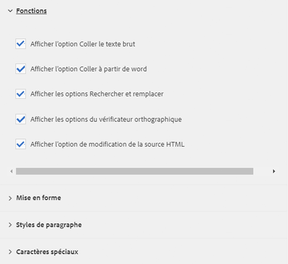

Les fonctionnalités suivantes peuvent être activées ou désactivées pour le composant.

* Coller du texte brut
* Coller à partir de Word
* Rechercher et remplacer
* Vérificateur orthographique
* Modification de la source

### Formatage {#formatting}

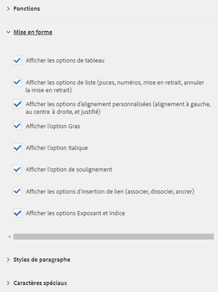

Les options de formatage suivantes peuvent être activées ou désactivées pour le composant.

* Tableau
* Listes
* Alignement
* Gras, italique, souligné
* Liens
* Indice/exposant

### Styles de paragraphe {#paragraph-styles}

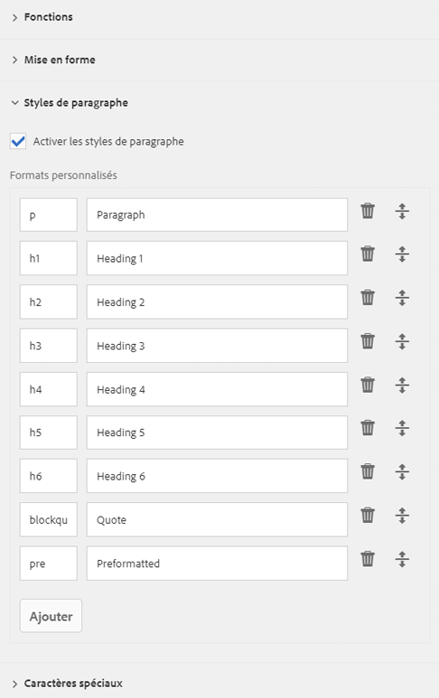

Les styles de paragraphe peuvent être activés ou désactivés pour le composant. Lorsque cette option est activée, les formats autorisés peuvent être définis.

* Appuyez ou cliquez sur le bouton **Ajouter** pour insérer un nouveau style.
* Entrez le code du style et une description qui s’affichera dans la boîte de dialogue de modification.
* Pour supprimer un style, appuyez ou cliquez sur le bouton **Supprimer**.
* Pour réorganiser l’ordre des formats, appuyez ou cliquez et faites glisser les poignées.

### Caractères spéciaux {#special-characters}

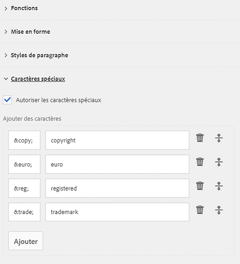

L’option permettant d’insérer des caractères spéciaux peut être activée ou désactivée pour le composant. Lorsque cette option est activée, les caractères autorisés peuvent être définis.

* Appuyez ou cliquez sur le bouton **Ajouter** pour insérer un nouveau caractère.
* Entrez le code HTML du caractère et une description qui s’afficheront dans la boîte de dialogue de modification.
* Pour supprimer un caractère, appuyez ou cliquez sur le bouton **Supprimer**.
* Pour réorganiser l’ordre des caractères, appuyez ou cliquez et faites glisser les poignées.

## Détails techniques {#technical-details}

Vous trouverez la documentation technique la plus récente sur le composant Texte [sur GitHub](https://github.com/adobe/aem-core-wcm-components/tree/master/content/src/content/jcr_root/apps/core/wcm/components/text/v1/text).

Le projet sur les composants principaux peut être téléchargé depuis GitHub.

Vous trouverez plus d’informations sur le développement des composants principaux dans la [documentation destinée aux développeurs de composants principaux](developing.md).
