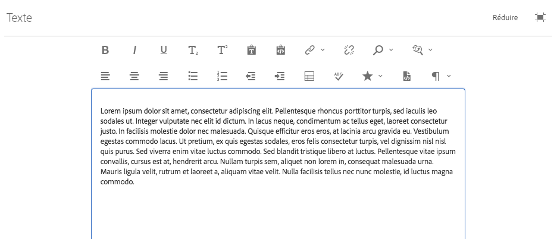
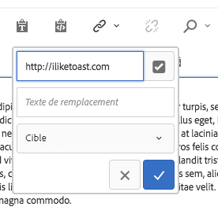
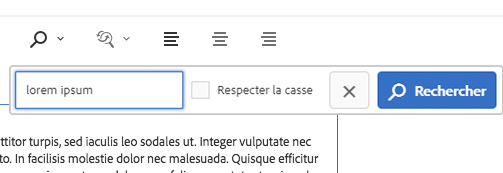
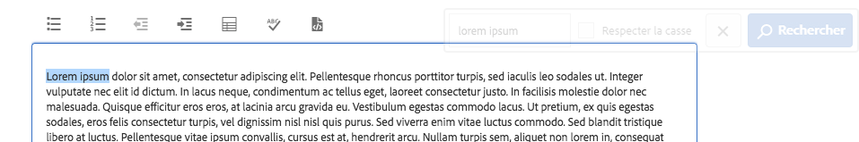
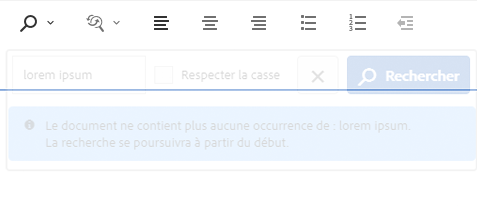
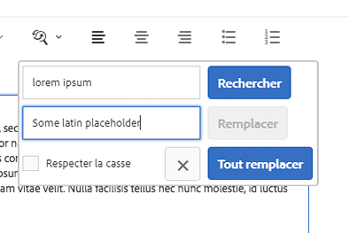
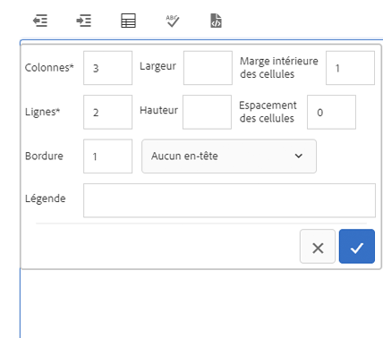
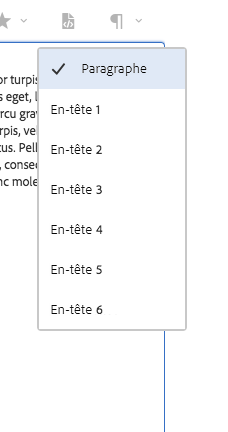

# Composant textuel{#text-component}

Component Component Text Component est un composant de modification et de composition de texte enrichi qui permet d&#39;effectuer des modifications en place.

## Utilisation {#usage}

Le composant Texte propose un puissant éditeur de texte enrichi qui permet d&#39;apporter facilement des modifications de texte dans un éditeur en ligne simplifié, ainsi qu&#39;un format plein écran.

La boîte de dialogue [Modifier la boîte de dialogue](#edit-dialog) permet de modifier en ligne les options limitées avec des fonctionnalités complètes disponibles dans la boîte de dialogue de modification en plein écran. A l&#39;aide de [la boîte de dialogue de conception](#design-dialog), les options de formatage de texte telles que les en-têtes, les caractères spéciaux et les styles de paragraphe peuvent être configurées pour le modèle de l&#39;auteur du contenu.

## Version et compatibilité {#version-and-compatibility}

La version actuelle du composant de texte est v 2, qui a été introduite avec la version 2.0.0 des composants principaux en janvier 2018 et est décrite dans ce document.

Le tableau suivant détaille toutes les versions prises en charge du composant, les versions AEM avec lesquelles les versions du composant sont compatibles et les liens vers la documentation pour les versions précédentes.

| Version du composant | AEM 6.3 | AEM 6.4 | AEM 6.5 |
|---|---|---|---|
| v2 | Compatible | Compatible | Compatible |
| [v1](text-v1.md) | Compatible | Compatible | Compatible |

Pour plus d&#39;informations sur les versions et les versions des composants principaux, consultez les versions des composants de Document [principaux](versions.md).

## Exemple de sortie de composant {#sample-component-output}

Voici un exemple tiré de [We. Retail](https://helpx.adobe.com/experience-manager/6-5/sites/developing/using/we-retail.html).

### Capture d’écran {#screenshot}

### Bibliothèque de composants

Pour tester le composant de texte ainsi que les exemples d&#39;options de configuration, ainsi que la sortie HTML et JSON, consultez la [bibliothèque Composant](http://opensource.adobe.com/aem-core-wcm-components/library/text.html).

### Détails techniques {#technical-details}

Vous trouverez la documentation technique la plus récente sur le composant [de texte sur github](https://github.com/adobe/aem-core-wcm-components/blob/master/content/src/content/jcr_root/apps/core/wcm/components/text/v2/text).

Vous trouverez plus d&#39;informations sur le développement des composants principaux dans la documentation destinée aux développeurs de composants [principaux](developing.md).

## Composant de texte et Éditeur de texte enrichi {#the-text-component-and-the-rich-text-editor}

Le composant de texte des composants principaux tire parti de l&#39;éditeur de texte enrichi AEM (AEM). RTE fournit aux auteurs de contenu une grande variété de fonctionnalités pour modifier leur contenu texte. RTE est très flexible dans sa configuration et offre plusieurs options. Pour plus d&#39;informations sur la configuration de RTE, reportez-vous aux articles [Configuration de l&#39;éditeur de texte enrichi](https://helpx.adobe.com/experience-manager/6-5/sites/administering/using/rich-text-editor.html) et [Configuration des modules externes Éditeur de texte enrichi](https://helpx.adobe.com/experience-manager/6-5/sites/administering/using/configure-rich-text-editor-plug-ins.html).

Le reste de cet article illustre la configuration standard du composant de texte des composants principaux avec la configuration RTE prête à l&#39;emploi.

>[!NOTE]
>
>Seules les options activées par [les configurations de l&#39;interface utilisateur de RTE](https://chl-author-preview.corp.adobe.com/content/help/en/experience-manager/6-5/sites/administering/using/rich-text-editor.html) sont disponibles dans le composant de texte.

## Modifier le dialogue {#edit-dialog}

La boîte de dialogue Modifier propose les outils standard de formatage de texte enrichi qu&#39;un utilisateur devrait utiliser pour composer du texte.

### Gras

Utilisé pour appliquer une mise en forme gras au texte sélectionné ou au texte gras saisi après le curseur.

**Ctrl + B** peut être utilisé comme raccourci clavier.

### Italique

Utilisé pour appliquer une mise en forme en italique au texte sélectionné ou mettre en italique le texte saisi après le curseur.

**Ctrl + Je** peut être utilisé comme raccourci clavier.

### Souligné

Utilisé pour appliquer une mise en forme soulignée au texte ou au texte souligné sélectionné après le curseur.

**Ctrl + U** peut être utilisé comme raccourci clavier.

### Indice

Utilisé pour mettre en forme le texte ou le texte sélectionné après le curseur comme indice.

### Exposant

Utilisé pour mettre en forme le texte ou le texte sélectionné après le curseur comme exposant.

### Coller en tant que texte

Colle le texte copié en tant que texte brut sans mise en forme.

Lorsque vous sélectionnez cette option, une fenêtre s&#39;ouvre lorsque le texte peut être collé en texte brut sans mise en forme pour être inséré dans le texte. Acceptez en appuyant ou en cliquant sur la coche, annulez en appuyant ou en cliquant sur le x.

### Coller à partir de Word

Lorsque vous sélectionnez cette option, une fenêtre s&#39;ouvre lorsque vous pouvez coller le texte en conservant sa mise en forme comme prévisualisation avant sa insertion dans le texte. Acceptez en appuyant ou en cliquant sur la coche, annulez en appuyant ou en cliquant sur le x.

### Lien hypertexte

Utilisez cette option pour convertir le texte sélectionné en hyperlien ou modifier un lien déjà défini. Cette option est uniquement active lorsque le texte est déjà sélectionné et ouvre une fenêtre avec des options supplémentaires pour définir le lien.

* Saisissez l&#39;emplacement
   * Utilisation de la boîte de dialogue Ouvrir la sélection pour choisir un chemin dans AEM
   * Si le lien ne figure pas dans AEM, saisissez l&#39;URL absolue (les chemins non absolus sont interprétés comme relatifs par rapport à AEM)
* Saisissez un autre texte descriptif pour le lien.
* Sélectionner le comportement des liens
   * Cible
   * Même onglet
   * Nouvel onglet
   * Cadre parent
   * Cadre supérieur
   Appuyez ou cliquez sur la coche pour appliquer le lien ou le x à annuler.

### Dissocier

Utilisez cette option pour supprimer un lien déjà appliqué au texte sélectionné. Cette option est uniquement active lorsqu&#39;un lien est déjà sélectionné.

### Recherche

Utilisez cette option pour rechercher le texte d&#39;occurrence d&#39;une chaîne de texte spécifiée. Cette option permet d&#39;ouvrir une fenêtre pour définir les options de recherche.

Entrez le texte pour lequel vous souhaitez effectuer des recherches et appuyez ou cliquez sur **Rechercher** pour lancer la recherche. Appuyez ou cliquez sur le x pour annuler.
Si vous souhaitez effectuer une correspondance exacte, sélectionnez l&#39;option **Correspondance avec la casse** avant de lancer la recherche.
Si une correspondance est trouvée, elle est mise en surbrillance et le dialogue de recherche est grisé. Appuyez ou cliquez à nouveau sur le **bouton Rechercher** dans le dialogue grisé pour rechercher l&#39;occurrence suivante.

Si aucune occurrence supplémentaire n&#39;est trouvée, un message s&#39;affiche et la recherche redémarre à partir du début du texte.

### Remplacer

Utilisez cette option pour rechercher dans le texte des occurrences d&#39;une chaîne de texte spécifiée et remplacer les correspondances par une autre chaîne. Cette option ouvre une fenêtre permettant de spécifier les options de recherche et de remplacement.

Entrez le texte à rechercher ainsi que le texte à remplacer.

Appuyez ou cliquez **sur Rechercher** pour lancer la recherche. Cliquez ou appuyez sur le x pour annuler.

Si vous souhaitez effectuer une correspondance exacte, sélectionnez l&#39;option **Correspondance avec la casse** avant de lancer la recherche.

Si une correspondance est trouvée, elle est mise en surbrillance et le dialogue de recherche est grisé. Cliquez à nouveau sur le **bouton Rechercher** dans le dialogue grisé pour rechercher l&#39;occurrence suivante ou sélectionner le bouton **Remplacer** pour remplacer le texte mis en surbrillance. Notez que le bouton **Remplacer** n&#39;est actif qu&#39;une fois qu&#39;une correspondance est trouvée.

Sélectionnez **Remplacer tout** pour remplacer toutes les occurrences du texte à la fois.

### Aligner le texte à gauche

Utilisé pour aligner le texte sur la marge gauche.

### Texte centré

Utilisé pour centrer le texte.

### Aligner le texte à droite

Utilisé pour aligner le texte sur la marge droite.

### Puce

Utilisé pour formater le texte sélectionné sous forme d&#39;une liste à puces ou commencer l&#39;insertion d&#39;une liste à puces après le curseur.

Pour mettre fin à une liste à puces, appuyez ou cliquez de nouveau sur le **bouton Puces** ou saisissez deux retours chariot.

### Numérotée

Utilisé pour mettre en forme le texte sélectionné sous forme de liste numérotée ou commencer l&#39;insertion d&#39;une liste numérotée après le curseur.

Pour mettre fin à une liste numérotée, appuyez ou cliquez de nouveau sur le **bouton Numéroté** ou saisissez deux retours chariot.

### Retrait négatif

Utilisé pour diminuer le niveau de retrait du texte ou du texte sélectionné après le curseur.

Uniquement actif si le texte ou la position sélectionné du curseur est déjà mis en retrait.

### Retrait

Utilisé pour augmenter le niveau de retrait du texte ou du texte sélectionné après le curseur.

### Tableau

Utilisé pour insérer un tableau dans le texte. Cette option permet d&#39;ouvrir une fenêtre pour indiquer les détails du tableau.

* **Colonnes**
Le nombre de colonnes du tableau (obligatoire)
* **Lignes**
Le nombre de rangées du tableau (obligatoire)
* **Largeur Largeur**
du tableau
* **Hauteur Hauteur**
du tableau
* **Marge intérieure**
de la cellule Espace autour du contenu de la cellule
* **Espacement**
des cellules Espacement entre les cellules
* **Bordure**
L&#39;épaisseur des lignes de bordure du tableau
* If for the header of the table :
   * La première ligne doit être utilisée
   * La première colonne doit être utilisée
   * La première ligne et la première colonne doivent être utilisées
   * Ou aucun en-tête ne doit être utilisé.
* **Légende**
La légende du tableau

### Vérifier l’orthographe

permet de vérifier l&#39;orthographe du contenu du texte. Les fautes de frappe possibles sont soulignées avec des lignes rouges rompues.

Vous trouverez plus d&#39;informations sur la vérification orthographique et la personnalisation des dictionnaires orthographiques dans le document [Configuration des modules](https://helpx.adobe.com/experience-manager/6-5/sites/administering/using/configure-rich-text-editor-plug-ins.html)enrichis de l&#39;éditeur de texte enrichi.

### Caractères spéciaux {#special-characters}

Utilisé pour insérer des caractères spéciaux dans le texte. Cette option ouvre une fenêtre où les caractères disponibles sont affichés.

Appuyez ou cliquez sur le caractère souhaité pour l&#39;insérer dans le texte après le curseur. Plusieurs caractères peuvent être insérés. Appuyez ou cliquez sur le x pour fermer la fenêtre de sélection.

### Modification de la source

Utilisé pour afficher et modifier la source HTML du texte.

Appuyez ou cliquez sur l&#39;icône **Modifier la** source pour modifier le contenu du texte à partir de la vue formatée pour afficher le code HTML brut. Dans ce mode, toutes les autres options de formatage sont désactivées. Appuyez ou cliquez de nouveau sur l&#39; **icône Modifier** la source pour revenir à la vue formatée.

>[!CAUTION]
>
>Comme toujours le cas avec l&#39;accès au code HTML brut, vous devez veiller à utiliser l&#39;option **Source Edit** !
>
>Le code HTML saisi via **la fonctionnalité Source Edit** est analysé pour les risques XSS et tous les scripts insérés sont supprimés et ne s&#39;affichent pas sur la page produite. Cependant, le code HTML mal formé saisi dans **la modification** source peut rompre le modèle de la page, ce qui entraîne une mise en forme inattendue ou un rendu inattendu de la page résultante.

>[!NOTE]
>
>Etant donné que le code HTML saisi via **la fonctionnalité Source de modification** est analysé pour les risques XSS et les scripts et les supprime automatiquement, le contenu persistant persistant peut différer de celui saisi dans **Source Edition**. Pour cette raison, pour enregistrer les modifications effectuées à l&#39;aide **de Source Edit**, vous devez d&#39;abord quitter **Source Edit** pour afficher le texte dans l&#39;éditeur normal avant l&#39;enregistrement.

### Format de paragraphe

Utilisé pour appliquer le formatage des paragraphes au texte sélectionné ou au texte inséré après le curseur. La sélection de cette option ouvre une liste déroulante à partir de laquelle le format de paragraphe est sélectionné.

Le composant de texte peut également être modifié en ligne mais en raison des contraintes d&#39;espace, toutes les options de formatage ne sont pas disponibles en ligne. Pour afficher toutes les options, passez en mode plein écran.

## Créer un dialogue {#design-dialog}

Le dialogue de conception permet à l&#39;auteur du modèle de définir quelles options de formatage de texte sont disponibles pour les auteurs de contenu.

### Onglet Plugins {#plugins-tab}

L&#39;onglet Plugins permet d&#39;activer et de désactiver diverses options de formatage de texte disponibles pour les auteurs de contenu.

### Fonctionnalités {#features}

Les fonctionnalités suivantes peuvent être activées ou désactivées pour le composant.

* Coller du texte brut
* Passé du mot
* Rechercher et remplacer
* Vérificateur orthographique
* Modification source

### Formatage {#formatting}

Les options de formatage suivantes peuvent être activées ou désactivées pour le composant.

* Tableau
* Listes
* Alignement
* Gras, italique, soulignement
* Liens
* Sous/exposant

### Styles de paragraphe {#paragraph-styles}

Les styles de paragraphe peuvent être activés ou désactivés pour le composant. Lorsque cette option est activée, les formats autorisés peuvent être définis.

* Appuyez sur le bouton **Ajouter** ou cliquez dessus pour insérer un nouveau style.
* Entrez le code du style et une description qui s&#39;affichera dans la boîte de dialogue Modifier.
* Pour supprimer un style de style ou cliquez sur le **bouton Supprimer** .
* Pour réorganiser l&#39;ordre des formats, appuyez ou cliquez et faites glisser les poignées.

### Configuration des caractères spéciaux {#configuring-special-characters}

L&#39;option permettant d&#39;insérer des caractères spéciaux peut être activée ou désactivée pour le composant. Lorsque cette option est activée, les caractères autorisés peuvent être définis.

* Appuyez sur le bouton **Ajouter** ou cliquez dessus pour insérer un nouveau caractère.
* Entrez le code HTML du caractère et une description qui s&#39;afficheront dans la boîte de dialogue Modifier.
* Pour supprimer un taquet de caractères ou cliquez sur le **bouton Supprimer** .
* Pour réorganiser l&#39;ordre des caractères, appuyez ou cliquez et faites glisser les poignées.

## Onglet Styles {#styles-tab}

Le composant de texte prend en charge le système [de style AEM](authoring.md#component-styling).