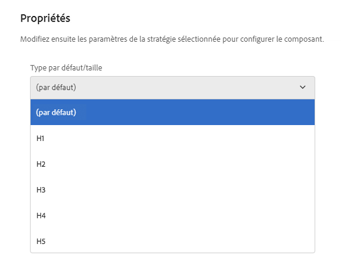

# Composant Title (v 1){#title-component-v}

Le composant de titre de composant principal est un composant d&#39;en-tête de section qui comporte des fonctions d&#39;édition statique.

## Utilisation {#usage}

Le composant Titre est conçu pour être utilisé comme titre ou en-tête d&#39;une section de contenu.

Les niveaux d&#39;en-tête disponibles peuvent être définis par l&#39;auteur du modèle dans la boîte de dialogue [de conception](title-v1.md#main-pars_title_1995166862). L&#39;éditeur de contenu peut sélectionner les niveaux d&#39;en-têtes disponibles dans la boîte de dialogue [Modifier](title-v1.md#main-pars_title). Pour plus de commodité, une simple modification en place du texte d&#39;en-tête est également disponible.

## Version et compatibilité {#version-and-compatibility}

Ce document décrit la version v 1 du composant Titre, introduite à l&#39;origine avec la version 1.0.0 des composants principaux avec AEM 6.3.

Le tableau suivant répertorie la compatibilité de la version v 1 du composant Titre.

| Version d’AEM | Composant de titre v 1 |
|--- |--- |
| 6.3 | Compatible |
| 6.4 | Compatible |

>[!CAUTION]
>
>Ce document décrit la version 1 du composant Titre.
>
>Pour plus d&#39;informations sur la version actuelle du composant Titre, voir [le document Composant](title.md) Titre.

## Exemple de sortie de composant {#sample-component-output}

Voici un exemple tiré de [We. Retail](https://helpx.adobe.com/experience-manager/6-4/sites/developing/using/we-retail.html).

### Capture d’écran {#screenshot}


### HTML {#html}

```
<div class="cmp cmp-title aem-GridColumn aem-GridColumn--default--12">
     <h2>Welcome! This is our finest equipment!</h2>
</div>
```

### JSON {#json}

```
"title": {
              "columnClassNames": "aem-GridColumn aem-GridColumn--default--12",
              ":type": "weretail/components/content/title",
              "jcr:title": "Welcome! This is our finest equipment!",
              "type": "h2"
            }
```

>[!NOTE]
>
>L&#39;exportation JSON à partir des composants principaux nécessite la version 1.1.0 des composants principaux. Pour plus d&#39;informations, consultez les [informations de compatibilité des composants principaux v 1](versions.md#main-pars_title_236368006) .

## Modifier le dialogue {#edit-dialog}

Le dialogue Modifier permet à l&#39;auteur de contenu de définir le texte du titre et de sélectionner le niveau de titre.

>[!NOTE]
>
>Une valeur vide pour le titre provoque l&#39;affichage du titre de la page.


L&#39;éditeur statique peut également être utilisé pour modifier le texte du composant de titre.


## Créer un dialogue {#design-dialog}

Le dialogue de conception permet à l&#39;auteur du modèle de définir le niveau d&#39;en-tête par défaut que les composants de titre auront lorsqu&#39;ils sont créés par les auteurs de contenu.



## Détails techniques {#technical-details}

Vous trouverez la documentation technique la plus récente sur le composant [de titre sur github](https://github.com/adobe/aem-core-wcm-components/tree/master/content/src/content/jcr_root/apps/core/wcm/components/title/v1/title).

Le projet de composants principaux peut être téléchargé depuis github.

Vous trouverez plus d&#39;informations sur le développement des composants principaux dans la documentation destinée aux développeurs de composants [principaux](developing.md).
