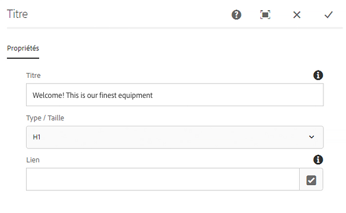
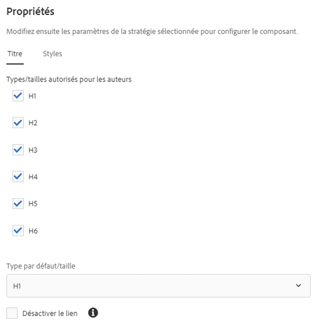

# Composant du titre{#title-component}

Le composant du titre des composants principaux est un composant d’en-tête de section qui comporte des fonctions d’édition statique.

## Utilisation {#usage}

Le composant du titre est conçu pour être utilisé comme titre ou en-tête d’une section de contenu. Les niveaux d’en-tête disponibles peuvent être définis par l’auteur du modèle dans la [boîte de dialogue de conception](#design-dialog). L’éditeur de contenu peut sélectionner les niveaux d’en-têtes disponibles dans la [boîte de dialogue de modification](#edit-dialog). Pour plus de commodité, une simple modification statique du texte d’en-tête est également disponible.

## Version et compatibilité {#version-and-compatibility}

La version actuelle du composant Titre est v2, qui a été introduite avec la version 2.0.0 des composants principaux en janvier 2018. Elle est décrite dans ce document.

Le tableau ci-après présente en détail toutes les versions prises en charge du composant, les versions AEM avec lesquelles les versions du composant sont compatibles et les liens vers la documentation pour les versions précédentes.

| Version du composant | AEM 6.3 | AEM 6.4 | AEM 6.5 |
|---|---|---|---|
| v2 | Compatible | Compatible | Compatible |
| [v1](title-v1.md) | Compatible | Compatible | Compatible |

Pour plus d’informations sur les versions et les publications des composants principaux, voir le document sur les [versions des composants principaux](versions.md).

## Exemple de sortie de composant {#sample-component-output}

Pour tester le composant du titre, des exemples d’options de configuration, ainsi que des sorties HTML et JSON, consultez la  [bibliothèque de composants](http://opensource.adobe.com/aem-core-wcm-components/library/title.html).

### Détails techniques {#technical-details}

La documentation technique la plus récente sur le composant de titre [se trouve sur GitHub](https://github.com/adobe/aem-core-wcm-components/blob/master/content/src/content/jcr_root/apps/core/wcm/components/title/v2/title).

Vous trouverez plus d’informations sur le développement des composants principaux dans la [documentation destinée aux développeurs de composants principaux](developing.md).

## Boîte de dialogue de modification{#edit-dialog}

La boîte de dialogue de modification permet à l’auteur de contenu de définir le texte du titre et de sélectionner le niveau de titre.

* **Titre** - Si ce cham est vide, le titre de la page est utilisé.
* **Type/Taille** - Définit le niveau d’en-tête du titre.
* **Lien** - Définit le contenu auquel le titre sera associé. Il peut s’agir d’un chemin d’accès à une page de contenu, d’une URL externe ou d’une ancre de page.

>[!CAUTION]
>
>La possibilité de définir un lien pour le titre a été introduite avec la version 2.2.0 des composants principaux.

L’éditeur statique peut également être utilisé pour modifier le texte du composant du titre.

## Boîte de dialogue de conception {#design-dialog}

La boîte de dialogue de conception permet à l’auteur du modèle de définir le niveau d’en-tête par défaut que les composants de titre auront lorsqu’ils sont créés par les auteurs de contenu.

### Onglet Tailles {#sizes-tab}

* **Types/tailles autorisés pour les auteurs** - Activez ou désactivez les types d’en-têtes qui seront disponibles pour les auteurs de contenu lorsqu’ils utilisent le composant du titre.
* **Type/Taille par défaut** - Définissez le type d’en-tête qui sera automatiquement attribué lorsqu’un auteur de contenu ajoute le composant du titre à une page.
* **Désactiver le lien** - Désactivez la prise en charge des liens dans le composant du titre pour interdire aux auteurs de contenu de lier des titres.

>[!CAUTION]
>
>La possibilité de définir un lien pour le titre a été introduite avec la version 2.2.0 des composants principaux.

### Onglet Styles {#styles-tab}

Le composant Titre prend en charge le [système de style](authoring.md#component-styling) AEM.