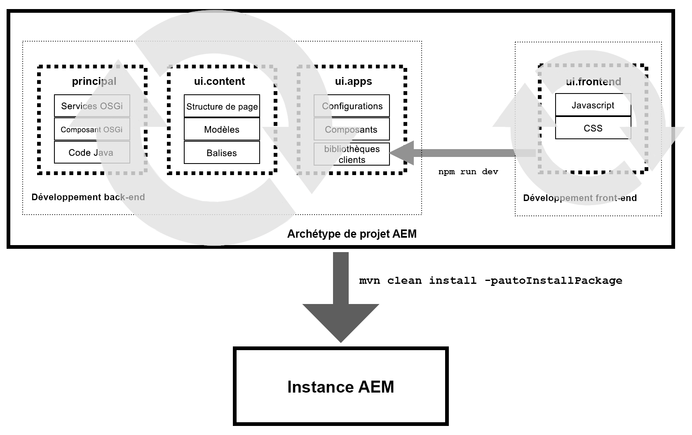

# ui.frontend Module of the AEM Project Archetype {#uifrontend-module}

L’archétype de projet AEM comprend un mécanisme de création frontale dédié facultatif basé sur Webpack. Le module ui.frontend devient ainsi l’emplacement central de toutes les ressources frontales du projet, y compris les fichiers JavaScript et CSS. Pour tirer pleinement parti de cette fonctionnalité utile et flexible, il est important de comprendre comment le développement frontal s’intègre dans un projet AEM.

## Projets AEM et développement frontal {#aem-and-front-end-development}

En termes beaucoup plus simples, les projets AEM peuvent être considérés comme constitués de deux parties distinctes mais connexes :

* Développement principal qui génère la logique d’AEM et produit des bibliothèques Java, des services OSGi, etc.
* Développement frontal qui guide la présentation et le comportement du site Web résultant et produit des bibliothèques JavaScript et CSS

Ces deux processus de développement étant axés sur différentes parties du projet, le développement dorsal et frontal peut se faire en parallèle.



Toutefois, tout projet qui en résulte doit utiliser les résultats de ces deux efforts de développement, c'est-à-dire le côté principal et le côté avant.

L’exécution `npm run dev` lance le processus de génération frontale qui rassemble les fichiers JavaScript et CSS stockés dans le module ui.frontend et produit deux bibliothèques clientes minifiées appelées `clientlib-site` et `clientlib-dependencies` et les dépose dans le module ui.apps. clientlibs peuvent être déployées dans AEM et vous permettent de stocker votre code client dans le référentiel.

Lorsque l’archétype de projet AEM entier est exécuté à l’aide de `mvn clean install -pautoinstallPackage` tous les artefacts de projet, y compris les clientlibs, sont ensuite poussés vers l’instance AEM.

>[!TIP]
>En savoir plus sur les clientlibs dans la documentation [de développement](https://helpx.adobe.com/experience-manager/6-5/sites/developing/using/clientlibs.html) AEM et [comment le module ui.frontend les utilise ci-dessous](#clientlib-generation).

## Processus de développement frontal possibles {#possible-workflows}

Le module de génération frontal est un outil utile et très flexible, mais n'impose aucune opinion particulière sur la manière dont il doit être utilisé. Vous trouverez ci-dessous deux exemples d’utilisation *possible* , mais les besoins de votre projet individuel peuvent dicter d’autres modèles d’utilisation.

### Utilisation du serveur de développement statique Webpack {#using-webpack}

Grâce à Webpack, vous pouvez mettre en forme et développer votre contenu en fonction de la sortie statique des pages Web AEM dans le module ui.frontend.

1. Aperçu de la page dans AEM à l’aide du mode d’aperçu de page ou transmission `wcmmode=disabled` de l’URL
1. Affichage de la source de la page et enregistrement au format HTML statique dans le module ui.frontend
1. [Démarrez webpack](#webpack-dev-server) et commencez à mettre en forme et à générer le code JavaScript et CSS requis.
1. Exécuter `npm run dev` pour générer les clientlibs

Dans ce flux, un développeur AEM peut exécuter les étapes 1 et 2 et transmettre le code HTML statique au développeur frontal qui se développe en fonction de la sortie HTML AEM.

>[!TIP]
>
>Vous pouvez également tirer parti de la bibliothèque [de](https://opensource.adobe.com/aem-core-wcm-components/library.html) composants pour capturer des échantillons de la sortie de balisage de chaque composant afin de travailler au niveau du composant plutôt qu’au niveau de la page.

### Utilisation de Storybook {#using-storybook}

Avec [Storybook](https://storybook.js.org) , vous pouvez effectuer un développement frontal atomique plus important. Bien que le livre d’événements ne soit pas inclus dans l’archétype du projet AEM, vous pouvez l’installer et stocker vos artefacts du livre d’événements dans le module ui.frontend. Une fois prêts pour les tests dans AEM, ils peuvent être déployés en tant que clientlibs en exécutant `npm run dev`.

>[!NOTE]
>
>[Le livre d’histoires](https://storybook.js.org) n’est pas inclus dans l’archétype du projet AEM. Si vous choisissez de l’utiliser, vous devez l’installer séparément.

### Détermination de l’annotation {#determining-markup}

Quel que soit le processus de développement frontal que vous décidez de mettre en oeuvre pour votre projet, les développeurs principaux et les développeurs principaux doivent d’abord s’entendre sur le balisage. En règle générale, AEM définit le balisage, qui est fourni par les composants principaux. [Cependant, il est possible de personnaliser cette fonctionnalité si nécessaire](https://docs.adobe.com/content/help/en/experience-manager-core-components/using/developing/customizing.html#customizing-the-markup).

## Le module ui.frontend {#ui-frontend-module}

L’archétype de projet AEM comprend un mécanisme de génération front-end dédié facultatif basé sur Webpack avec les fonctionnalités suivantes.

* Prise en charge complète de TypeScript, ES6 et ES5 (avec enveloppes Webpack applicables)
* Linting TypeScript et JavaScript à l’aide d’un jeu de règles TSLint
* Sortie ES5 pour la prise en charge des navigateurs hérités
* Extension métacaractère
   * Inutile d'ajouter des importations
   * Tous les fichiers JS et CSS peuvent désormais être ajoutés à chaque composant.
      * Les meilleures pratiques figurent sous `/clientlib/js`, `/clientlib/css` ou `/clientlib/scss`.
   * No `.content.xml` or `js.txt`/`css.txt` files are needed as everything is run through Webpack.
   * Extraction de tous les fichiers JS par l’application globale sous le dossier `/component/`.
      * Webpack permet aux fichiers CSS/SCSS d’être liés via des fichiers JS.
      * Ces fichiers sont extraits via les deux points d'entrée `sites.js` et `vendors.js`.
   * Les seuls fichiers consommés par AEM sont les fichiers de sortie `site.js` et `site.css` dans `/clientlib-site`, ainsi que `dependencies.js` et `dependencies.css` dans `/clientlib-dependencies`
* Blocs
   * Principal (js/css de site)
   * Fournisseurs (js/css de dépendances)
* Prise en charge complète de Sass/Scss (Sass est compilé dans CSS via Webpack)
* Serveur de développement WebPack statique avec proxy intégré à une instance locale d’AEM

>[!NOTE]
>
>Pour plus d'informations techniques sur le module ui.frontend, consultez la [documentation sur GitHub](https://github.com/adobe/aem-project-archetype/blob/master/src/main/archetype/ui.frontend/README.md).

## Installation {#installation}

1. Installez globalement [NodeJS](https://nodejs.org/en/download/) (v10+). Cela installera également npm.
1. Accédez à ui.frontend dans votre projet et exécutez `npm install`.

>[!NOTE]
>
>Vous devez avoir [exécuté l’archétype](overview.md) avec l’option `-DoptionIncludeFrontendModule=y` pour renseigner le dossier ui.frontend.

## Utilisation {#usage}

Les scripts npm suivants orientent le flux de travail front-end :

* `npm run dev` : version complète avec optimisation JS désactivée (shaking d’arborescence, etc.), cartes source activées et optimisation CSS désactivée.
* `npm run prod` : version complète avec optimisation JS activée (shaking d’arborescence, etc.), cartes source désactivées et optimisation CSS activée.
* `npm run start` - Démarre un serveur de développement de webpack statique pour le développement local avec des dépendances minimales sur AEM.

## Sortie {#output}

Le module ui.frontend compile le code sous le `ui.frontend/src` dossier et génère les fichiers CSS et JS compilés, ainsi que toutes les ressources sous un dossier nommé `ui.frontend/dist`.

* **Site** - `site.js`et un dossier `site.css` pour les images et les polices dépendantes de la disposition sont créés dans un dossier `resources/` `dist/`clientlib-site.
* **Dépendances** : `dependencies.js` et `dependencies.css` sont créés dans un `dist/clientlib-dependencies` dossier.

### JavaScript {#javascript}

* Optimisation : pour les versions de production, tous les JS qui ne sont pas utilisés ou appelés sont supprimés.

### CSS {#css}

* Indexation automatique : toutes les feuilles de style CSS sont exécutées via un pré-indexeur et les propriétés nécessitant une pré-indexation sont automatiquement ajoutées dans les feuilles de style CSS.
* Optimisation : lors de la publication, toutes les feuilles de style CSS sont exécutées via un optimiseur (cssnano) qui les normalise selon les règles par défaut suivantes :
   * Réduit l’expression calc CSS chaque fois que possible, assurant à la fois la compatibilité du navigateur et la compression.
Convertit entre des valeurs équivalentes de longueur, de temps et d’angle. Notez que, par défaut, les valeurs de longueur ne sont pas converties.
   * Supprime les commentaires dans les règles, les sélecteurs et les déclarations et autour de ceux-ci.
   * Supprime les doublons de règles, de règles at et de déclarations.
      * Notez que cela ne fonctionne que pour les doublons exacts.
   * Supprime les règles vides, les requêtes multimédias et les règles ayant des sélecteurs vides, car elles n’affectent pas la sortie.
   * Fusionne les règles adjacentes par sélecteurs et paires propriété/valeur se chevauchant.
   * Garantit qu’un seul @charset est présent dans le fichier CSS et le déplace en haut du document.
   * Remplace le mot-clé initial CSS par la valeur réelle, lorsque la sortie obtenue est plus petite.
   * Compresse les définitions SVG en ligne avec SVGO.
* Nettoyage : comprend une tâche de nettoyage explicite pour effacer à la demande les fichiers CSS, JS et Map générés.
* Mappage de source : version de développement uniquement

>[!NOTE]
>L’option de version front-end utilise des fichiers de configuration Webpack uniquement destinés au développement et à la production qui partagent un fichier de configuration commun. Les paramètres de développement et de production peuvent ainsi être modifiés indépendamment.

### Génération de bibliothèque cliente {#clientlib-generation}

Le processus de génération du module ui.frontend tire parti du module externe [aem-clientlib-generator](https://www.npmjs.com/package/aem-clientlib-generator) pour déplacer le CSS compilé, JS et toutes les ressources dans le module ui.apps. La configuration aem-clientlib-generator est définie dans `clientlib.config.js`. Les bibliothèques client suivantes sont générées :

* **clientlib-site** - `ui.apps/src/main/content/jcr_root/apps/<app>/clientlibs/clientlib-site`
* **clientlib-dependencies** - `ui.apps/src/main/content/jcr_root/apps/<app>/clientlibs/clientlib-dependencies`

### Inclusion de bibliothèques clientes sur des pages {#clientlib-inclusion}

`clientlib-site` et `clientlib-dependencies` les catégories sont incluses dans les pages via la configuration [Stratégie de](https://helpx.adobe.com/experience-manager/6-5/sites/developing/using/page-templates-editable.html#TemplateDefinitions) page dans le modèle par défaut. Pour afficher la stratégie, modifiez le modèle de page de **contenu &gt; Informations sur la page &gt; Stratégie** de page.

L’inclusion finale des bibliothèques client sur la page des sites est la suivante :

```
<HTML>
    <head>
        <link rel="stylesheet" href="clientlib-base.css" type="text/css">
        <script type="text/javascript" src="clientlib-dependencies.js"></script>
        <link rel="stylesheet" href="clientlib-dependencies.css" type="text/css">
        <link rel="stylesheet" href="clientlib-site.css" type="text/css">
    </head>
    <body>
        ....
        <script type="text/javascript" src="clientlib-site.js"></script>
        <script type="text/javascript" src="clientlib-base.js"></script>
    </body>
</HTML>
```

L’inclusion ci-dessus peut bien sûr être modifiée en mettant à jour la stratégie de page et/ou en modifiant les catégories et les propriétés d’intégration des bibliothèques clientes respectives.

### Serveur de développement Webpack statique {#webpack-dev-server}

Le module ui.frontend inclut un serveur webpack-dev-server qui fournit un rechargement en direct pour un développement frontal rapide en dehors d’AEM. La configuration utilise le module externe html-webpack-plugin pour injecter automatiquement CSS et JS compilés à partir du module ui.frontend dans un modèle HTML statique.

#### Fichiers importants {#important-files}

* `ui.frontend/webpack.dev.js`
   * Contient la configuration pour le webpack-dev-server et pointe vers le modèle HTML à utiliser.
   * Il contient également une configuration proxy pour une instance AEM s’exécutant sur localhost:4502.
* `ui.frontend/src/main/webpack/static/index.html`
   * Il s’agit du code HTML statique sur lequel le serveur s’exécutera.
   * Cela permet aux développeurs d’effectuer des modifications CSS/JS et de les voir immédiatement reflétées dans le balisage.
   * On suppose que l’annotation placée dans ce fichier reflète fidèlement l’annotation générée par les composants AEM.
   * Le balisage de ce fichier n’est pas automatiquement synchronisé avec le balisage du composant AEM.
   * Ce fichier contient également des références aux bibliothèques clientes stockées dans AEM, telles que CSS de composant principal et CSS de grille réactive.
   * Le serveur de développement webpack est configuré pour proxy ces CSS/JS incluent depuis une instance locale d’AEM en cours d’exécution, en fonction de la configuration trouvée dans `ui.frontend/webpack.dev.js`.

#### Utilisation {#using-webpack-server}

1. A partir de la racine du projet, exécutez la commande `mvn -PautoInstallSinglePackage clean install` d’installation du projet entier sur une instance AEM s’exécutant sur `localhost:4502`.
1. Naviguez dans le `ui.frontend` dossier.
1. Exécutez la commande suivante `npm run start` pour démarrer le serveur de développement webpack. Une fois lancé, il doit ouvrir un navigateur (`localhost:8080` ou le prochain port disponible).

Vous pouvez désormais modifier les fichiers CSS, JS, SCSS et TS et voir les modifications immédiatement répercutées dans le serveur de développement de webpack.
